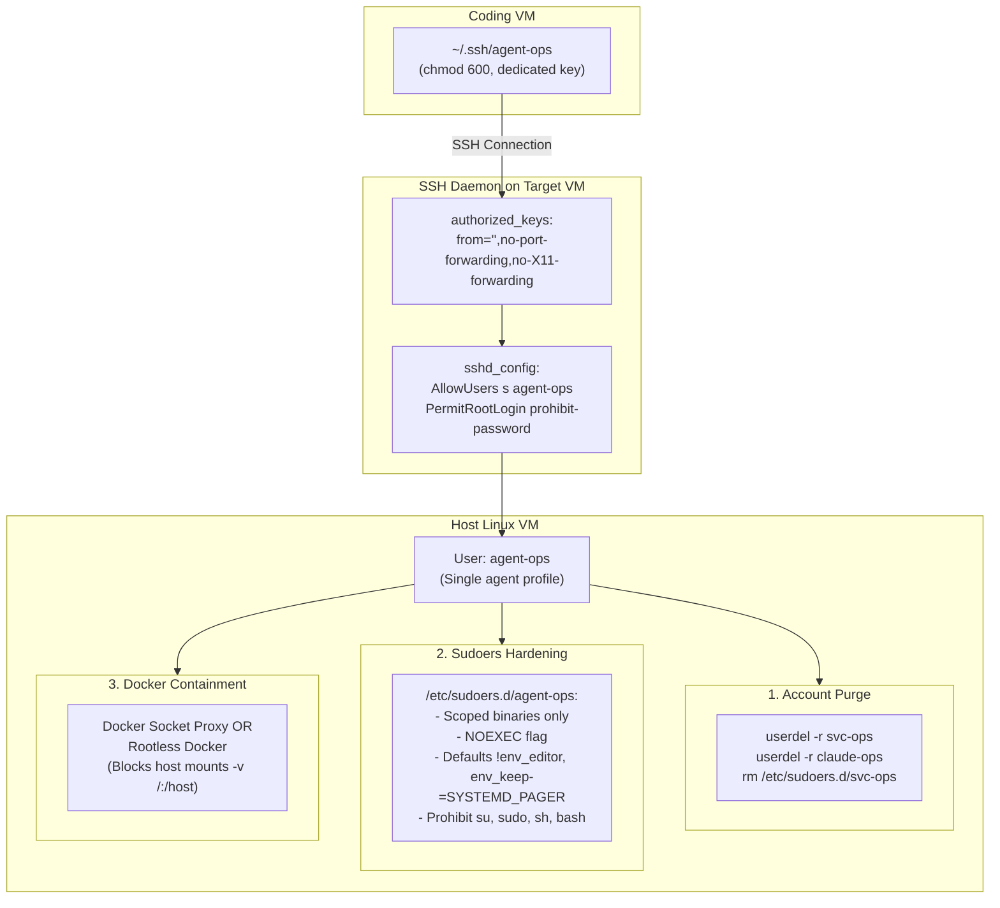

# Homelab Access: Single 'agent-ops' Migration, OMV Update Prohibition, and Root Escalation Hardening (Site-Neutral Architecture)

## Overview & Context from Recent Commits

The repository recently underwent a major architectural refactoring (commits `0abdab4` through `3b88286`):
- **Site Neutrality**: [`skills/homelab-access/SKILL.md`](file:///c:/Users/<you>/Documents/Code/agent-skills/skills/homelab-access/SKILL.md) was reduced to 102 lines and made strictly **site-neutral** (zero hostnames, usernames, IPs, or product names).
- **Executable MCP Server**: [`infra/mcp-servers/servers/homelab-mcp/`](file:///c:/Users/<you>/Documents/Code/agent-skills/infra/mcp-servers/servers/homelab-mcp/) (`homelab_mcp`) was introduced, providing executable tools (`homelab_plan`, `homelab_diagnose`, `homelab_run`, `homelab_verify`, `homelab_hosts`, `homelab_roles`, `homelab_boundaries`).
- **Configuration Boundary**: All site-specific topology and credentials live in `~/.config/homelab/homelab.yaml` (untracked), modeled by [`homelab.example.yaml`](file:///c:/Users/<you>/Documents/Code/agent-skills/infra/mcp-servers/servers/homelab-mcp/homelab.example.yaml). Code cleanliness is enforced by `test_no_site_facts_in_code`.

### How the Plan Differs from the Pre-Merge Assumption

> [!IMPORTANT]
> **No Hardcoded Site Facts in Tracked Files**:
> - Previously, the plan would have directly edited `skills/homelab-access/SKILL.md` to mention `agent-ops`, `omv`, and specific update rules.
> - **Under the new architecture, that would be a bug and a regression.** It would violate site-neutrality and trigger test failures in `test_no_site_facts_in_code`.
> - Instead:
>   1. **`homelab.example.yaml`** is updated to model the single-agent-role pattern and show how storage/NFS hosts declare update exclusions and safe capabilities.
>   2. **`skills/homelab-access/SKILL.md`** maintains its site-neutral stance while clarifying that storage hosts forbid updates and sites can configure a single dedicated agent role.
>   3. **The User's `homelab.yaml`** is provided with the exact concrete configuration for `omv` (NFS) and `agent-ops`.

---

## 1. OMV (Storage / NFS) Maintenance Rule

### Rationale
OMV now serves strictly as an NFS service on the main host. Any package updates (`apt upgrade`, `omv-upgrade`, `dist-upgrade`) or fleet maintenance operations on this host risk bouncing the NFS daemon or corrupting client mounts across all dependent services.

### Changes
1. **Config Layer ([`homelab.example.yaml`](file:///c:/Users/<you>/Documents/Code/agent-skills/infra/mcp-servers/servers/homelab-mcp/homelab.example.yaml))**:
   - Under `exclusions`: Explicitly declare that storage/NFS hosts are excluded from all fleet updates, package upgrades, and reboots.
     ```yaml
     exclusions:
       - host: storage
         from: "fleet updates and package maintenance"
         reason: "Serves storage/NFS to other hosts; updates or restarts disrupt dependent mounts and are strictly prohibited."
     ```
   - Under `login_capabilities`: Restrict storage host capabilities to read/monitoring only (e.g. `[docker_socket, read_journal]`), with no system update or package management capabilities.
   - Under `safety.deny_patterns`: Add package manager commands (`apt upgrade`, `apt-get upgrade`, `omv-upgrade`, `dist-upgrade`).
2. **Skill Layer ([`skills/homelab-access/SKILL.md`](file:///c:/Users/<you>/Documents/Code/agent-skills/skills/homelab-access/SKILL.md))**:
   - Under *Before you touch anything wide*, reinforce that storage/NFS hosts declare fleet exclusions that prohibit updates and reboots.
3. **User Site Config (`~/.config/homelab/homelab.yaml`)**:
   - Map `omv` with `exclusions` prohibiting updates and reboots.

---

## 2. Single AI Agent Account (`agent-ops`)

### Rationale
Previously, agents toggled between three accounts (`s`, `claude-ops`, `svc-ops`), creating confusion, audit gaps, and a major security vulnerability where having access to `svc-ops` gave instant unrestricted root. Migrating to a single `agent-ops` account simplifies access and enforces least privilege.

### Changes
1. **Config Layer ([`homelab.example.yaml`](file:///c:/Users/<you>/Documents/Code/agent-skills/infra/mcp-servers/servers/homelab-mcp/homelab.example.yaml))**:
   - Update the example role definition to demonstrate a single agent role:
     ```yaml
     roles:
       operator:
         user: agent-ops
         role_alias: ops
         capabilities: [docker_socket, service_control, read_journal]
         sudo:
           mode: scoped
           binaries: ["/usr/bin/systemctl", "/usr/local/bin/docker-compose"]
         notes: "Single dedicated agent account with scoped privileges."
     ```
   - Remove or deprecate the unrestricted `privileged` (`sudo: all`) role.
2. **Skill Layer ([`skills/homelab-access/SKILL.md`](file:///c:/Users/<you>/Documents/Code/agent-skills/skills/homelab-access/SKILL.md))**:
   - Clarify in the text that sites may define a single scoped agent role (e.g. `agent-ops`) rather than multiple accounts, and that `homelab_plan` picks the appropriate capabilities defined by the site.
3. **User Site Config (`~/.config/homelab/homelab.yaml`)**:
   - Replace `claude-ops` and `svc-ops` with `agent-ops`.
   - Update `ssh.identity` to `~/.ssh/agent-ops`.

---

## 3. Proposal: Fixing Profile Hopping & Unrestricted Root Escalation (Requirement 2.1)

### Threat Analysis
In the previous setup:
- The private SSH key gave access to `svc-ops`, which had `(ALL) NOPASSWD: ALL`. An attacker (or prompt-injected agent) could run `ssh svc-ops` to obtain full root on any VM.
- Furthermore, if an agent account has raw access to Docker socket (`docker` group or `sudo /usr/bin/docker`), it can mount host root via `docker run -v /:/hostroot alpine chroot /hostroot`, giving instant root even without sudo.
- Binaries like `systemctl` can escape to root via `$PAGER` (e.g., `less` spawning a shell).

### Multi-Layer Hardening Architecture



#### Layer 1: Complete Elimination of Legacy Root Profiles
1. On every Linux VM, execute:
   ```bash
   sudo userdel -r svc-ops
   sudo userdel -r claude-ops
   sudo rm -f /etc/sudoers.d/svc-ops /etc/sudoers.d/claude-ops
   ```
2. Audit `/etc/passwd` and verify no account other than `root` has UID 0 or `NOPASSWD: ALL` in `/etc/sudoers*`.

#### Layer 2: Hardened `/etc/sudoers.d/agent-ops`
Configure the single agent profile with strict defense against shell escapes:
```sudoers
# 1. Reset environment and strip dangerous pagers / editors
Defaults:agent-ops env_reset
Defaults:agent-ops !env_editor
Defaults:agent-ops env_keep -= "SYSTEMD_PAGER PAGER EDITOR VISUAL"
Defaults:agent-ops secure_path="/usr/local/sbin:/usr/local/bin:/usr/sbin:/usr/bin:/sbin:/bin"

# 2. Scoped commands with NOEXEC (prevents spawning subshells)
agent-ops ALL=(ALL) NOEXEC: /usr/bin/systemctl restart [a-zA-Z0-9_-]*, \
                            /usr/bin/systemctl stop [a-zA-Z0-9_-]*, \
                            /usr/bin/systemctl start [a-zA-Z0-9_-]*, \
                            /usr/bin/systemctl status [a-zA-Z0-9_-]*, \
                            /usr/local/bin/docker-compose *

# 3. Explicitly prohibit privilege escalation binaries
agent-ops ALL=(ALL) !/bin/su, !/usr/bin/sudo, !/bin/bash, !/bin/sh, !/bin/zsh
```

#### Layer 3: Docker Socket Containment
To prevent container-to-host root escape via `-v /:/hostroot`:
- **Recommended**: Restrict Docker access using a lightweight Docker socket proxy (`tecnativa/docker-socket-proxy`) or rootless Docker for `agent-ops`, blocking container creation requests containing host root binds or `--privileged`.
- Alternatively, do not place `agent-ops` in the `docker` group; allow container actions solely through `docker-compose` on pre-defined stack directories via sudoers.

#### Layer 4: SSH Key Isolation & Origin Restrictions
1. Key separation: `~/.ssh/agent-ops` is ONLY installed in `/home/<you>/.ssh/authorized_keys`. It is never installed in `/root/.ssh/authorized_keys`.
2. Pin IP origin and restrict SSH capabilities in `/home/<you>/.ssh/authorized_keys`:
   ```text
   from="192.0.2.10",no-port-forwarding,no-X11-forwarding,no-agent-forwarding ssh-ed25519 AAAAC3... agent-ops
   ```
3. In `/etc/ssh/sshd_config.d/agent-ops.conf`:
   ```text
   PermitRootLogin prohibit-password
   AllowUsers s agent-ops
   ```

---

## Proposed Changes in This Repository

### 1. [`homelab.example.yaml`](file:///c:/Users/<you>/Documents/Code/agent-skills/infra/mcp-servers/servers/homelab-mcp/homelab.example.yaml)
- Update roles to showcase the single `agent-ops` role pattern with scoped capabilities.
- Update storage host example:
  - Add explicit fleet exclusion for updates and package maintenance.
  - Set `login_capabilities` to read/monitoring only.
- Update `safety.deny_patterns` to include update commands on storage/fleet.

### 2. [`skills/homelab-access/SKILL.md`](file:///c:/Users/<you>/Documents/Code/agent-skills/skills/homelab-access/SKILL.md)
- Ensure site-neutral prose reflects both single-role and multi-role configurations.
- Emphasize under *Fleet exclusions* that storage/NFS hosts must be excluded from updates and maintenance.

### 3. Tests Verification
- Run `pytest infra/mcp-servers/servers/homelab-mcp/tests/` to verify all 23 tests (including `test_no_site_facts_in_code`) remain completely green.

---

## Review — 2026-09-17 (coding.example.internal, against the live hosts)

**Verdict: the goal is right, the security design is not sound as written, and one dependency is
missing that would have broken automation.** Sections 1 and 2 are adopted with changes; Section 3
is replaced. Findings are measured on the hosts, not inferred from the plan.

### What the audit found that the plan assumed away

| Plan assumes | Measured 2026-09-17 |
|---|---|
| `svc-ops` is *the* root exposure | The agent key is also **root on the Proxmox/NFS host** (`/root/.ssh/authorized_keys` on `home`, pve-manager 9.2.20, `PermitRootLogin yes`) — the worst exposure, and unmentioned |
| `claude-ops` is scoped | Every VM carries **two** drifted sudoers files: `20-claude-ops-read` (dockerq) **and** `claude-ops` (raw `sudo /usr/bin/docker`, from the bash `provision-sudo.sh` path). Raw docker is root |
| Removing `svc-ops` is a cleanup | Semaphore's `homelab` inventory runs as **`s` + sudo password**, not `svc-ops` — so the purge is safe for fleet automation. But the `nas` inventory is **`root` with the agent key**, and the offsite dedup targets `svc-ops@coding` — both break |
| OMV needs a safer update path | `omv-vm` is **not OMV and not a VM**: hostname `home`, bare-metal Proxmox, `openmediavault` not installed, `nfs-server` active, `apt-daily-upgrade.timer` **active**. The rule to fix is "no updates at all", and the updates are coming from the host's own apt timers |
| — | `PasswordAuthentication yes` on every host, including the hypervisor |

### Section 3 — why the proposed hardening does not hold

1. **It re-grants root through the front door.** The plan removes `svc-ops` and then gives
   `agent-ops` `docker_socket` plus `sudo docker-compose *`. Either one is root: `docker run -v /:/host`,
   or a compose file with a host bind. `NOEXEC` does not help — the escape happens inside the
   container, not via `exec` from the binary. The repo already has the correct primitive,
   **`dockerq`** (root-owned, argument-validated, verb-whitelisted), and the plan never mentions it.
2. **Sudoers `!` negations are documented as ineffective** (`man sudoers`: "it is generally not
   possible to use `!` to subtract commands"). `!/bin/bash` stops nothing — copy the binary.
3. **`systemctl restart [a-zA-Z0-9_-]*`** lets the agent restart `auditd` (its own audit) and `ssh`.
   Restarts belong to Semaphore's `stack-deploy`, not to the agent's sudoers.
4. **`safety.deny_patterns` for `apt` is global**, so it would block updates on *every* host. The
   server lacked a per-host scope. Added: `hosts[].forbid` (intents + patterns), **enforced** by
   `homelab_plan`/`homelab_run`, with tests — the storage host forbids `edit_system_file`,
   `service_restart`, `inspect_host_proc` and any `apt`/`dpkg`/`reboot`/`pve*` pattern.
5. **The MCP guardrails are not a security layer.** The agent is the potential attacker (prompt
   injection); anything enforced in the server is bypassed by `ssh` directly. The boundary is the
   target host's sudoers and `authorized_keys`. The plan leans on the wrong side of that line.
6. **Removing the `privileged` role leaves intents unsatisfiable** and the plan does not say what
   happens then. Now explicit: root-needing intents are *not offered* to the agent; they are
   Semaphore's or a human's, declared under `unreachable`.

### What was kept from the plan

Dedicated key; key present in exactly one `authorized_keys`; `from=` origin pinning and
no-forwarding options; `env_reset`/`!env_editor`/`secure_path`; deleting the legacy accounts;
`PermitRootLogin` tightening; a `Match User` sshd block. All in `setup-agent-accounts.yml`.

### The design that replaces Section 3

Two principals, because "one account for AI agents" is only safe if automation has its own:

- **`agent-ops`** — the single interactive agent account. Key on coding.example.internal only, pinned to its IP.
  sudoers: `dockerq`, `systemctl status *`, `journalctl --no-pager *`. Not in the docker group.
  Every sudo session I/O-recorded. **No path to root exists for this key.**
- **Semaphore** — its own key, generated on manage.example.internal, held only in its Key Store. Logs in as `<user>`
  on VMs (unchanged) and as a new recorded `semaphore-ops` on the storage host (the NFS repair and
  `zfs-trim` templates need root there). Root-capable by design, with a key that never touches
  the agent host.

Implemented in `Server/server/manage/application/playbooks/setup-agent-accounts.yml` (two phases,
`add` then `purge`, each verifiable), the bash provisioning path retired, runbook at
`Server/docs/operations/agent-account-cutover.md`.

### Section 1 — adopted, with the reason corrected

Not "prefer the safe subset": **no updates on the storage host by agents or automation, ever.** It
is the hypervisor. `omv-update.yml` deleted; `hosts[].forbid` enforces it in the MCP server; the
host's own `apt-daily*.timer` units are the remaining source and are masked in the cutover.
