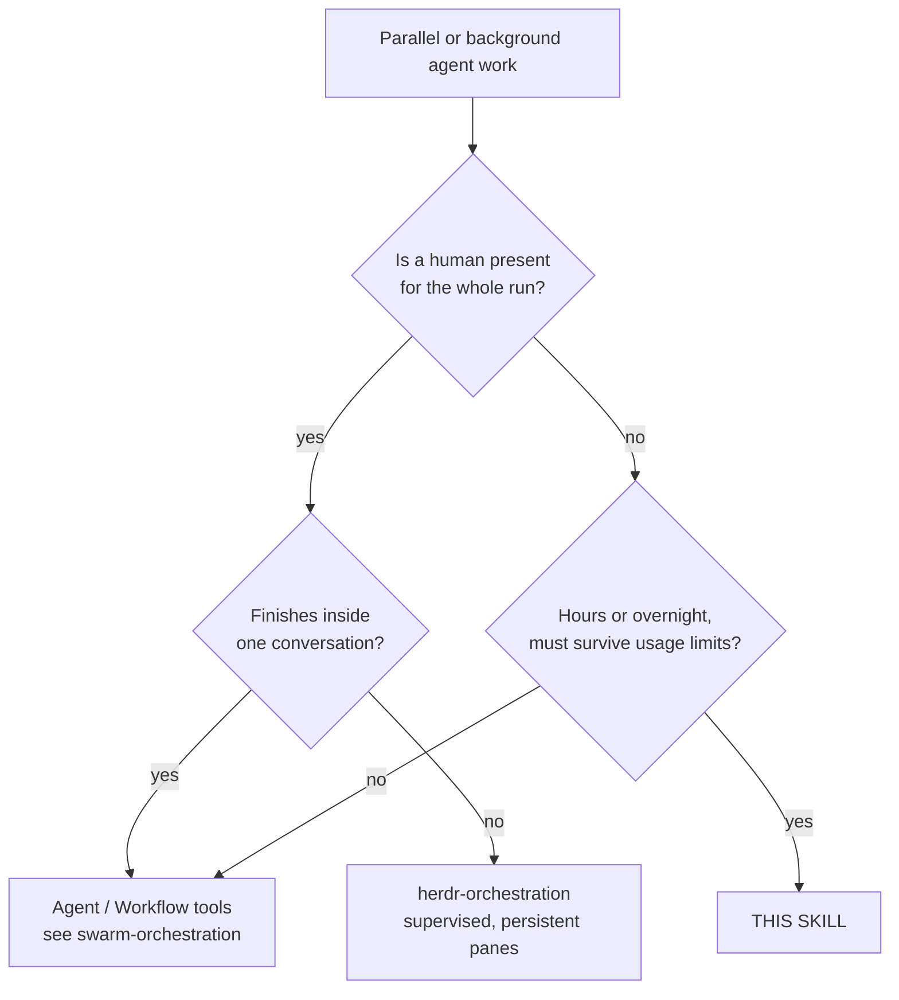
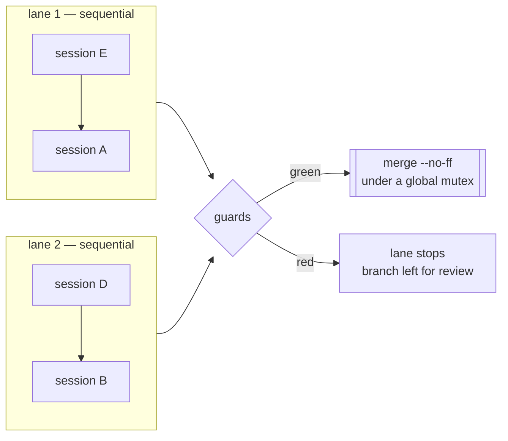
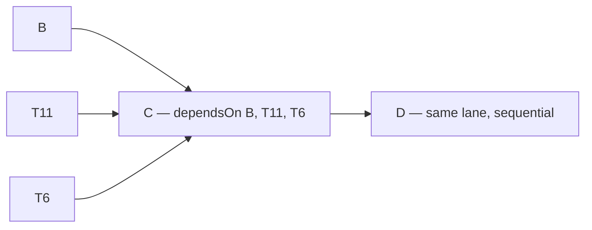
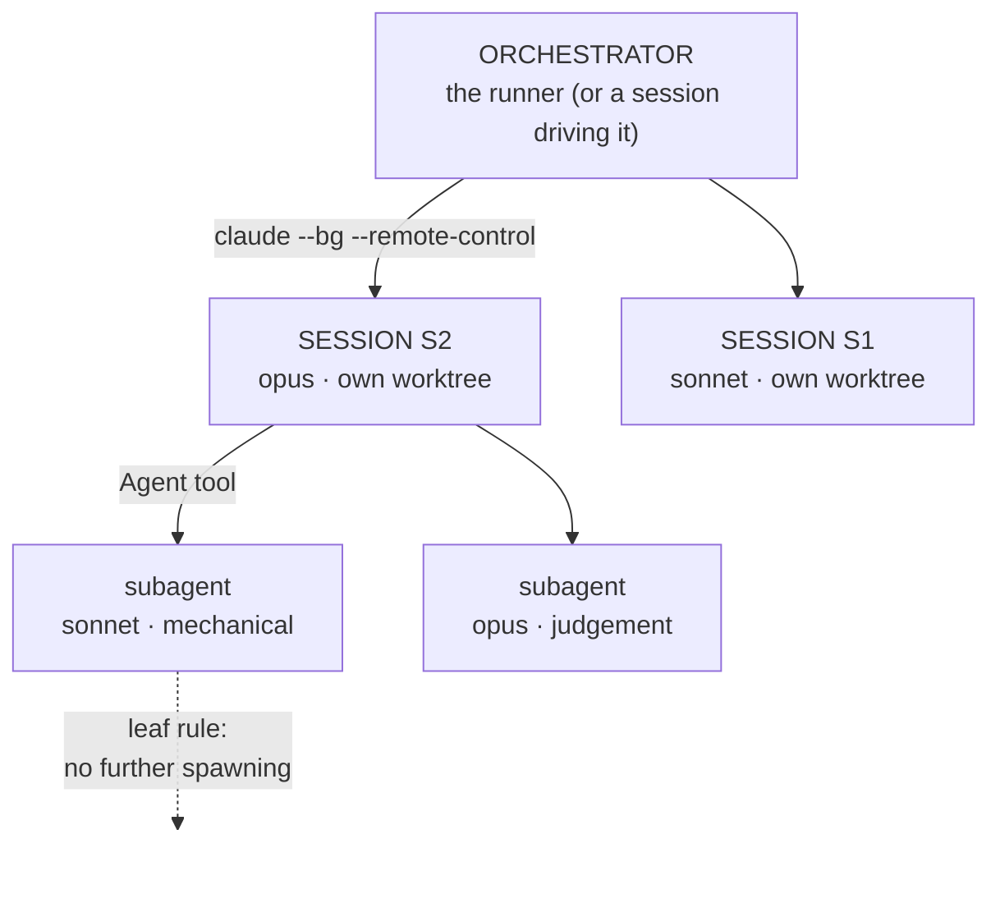
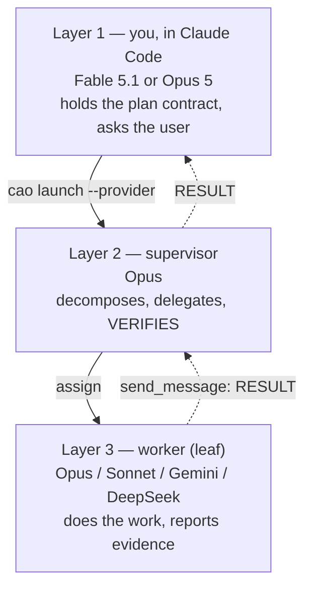

# Unattended Orchestration

Long-horizon agent work with **no human present**: an overnight batch, a weekend migration, a
queue of handoffs too large for one sitting. The runner starts each session, watches it, and
recovers it — through the usage limit, a 529, and a session that stops early.

Adopted from downstream project A's wave-3 runner (2026-09-04) and generalised; see
ADR 0006 in that repository for why it is config-driven.

## You are the main (L1) orchestrator? Read this first

If you hold a plan and spawn Opus sub-orchestrators (L2) that in turn spawn mechanical executors
(L3: Haiku, Sonnet, Gemini Flash, DeepSeek, Muse Spark), read
[`references/main-orchestrator.md`](references/main-orchestrator.md) before anything else. It covers:
- navigating with Serena, Graphify and Omnigraph;
- spawning and briefing L2, and the L3 routes with their measured status;
- cross-family review: a different model family reviews and tests than the one that wrote;
- off-peak timing: prefer pools in their cheap/quiet window (`provider_windows.py`, `provider-windows.json`);
- filtering logs with code before reading them, and saving tokens;
- checking CPU, RAM, disk and GPU on a shared host;
- evidence rules: check outcomes and reasoning, recompute numbers, label what is measured.

The operator does not repeat these in briefs; they are standing orders.

**Work rules at every level** (operator, 2026-09-18; detail in `main-orchestrator.md` §4 and §4b):
1. **DeepSeek first** for L3 implementation and bulk work. **Claude Sonnet/Haiku closes**: they
   do the last checks and the final implementation pass. **The reviewer is never the writer's
   model** (DeepSeek ↔ Sonnet).
2. **Build piecewise.** Plan with the superpowers skills; build test-first and fast. Every data
   run climbs a ladder: **small artificial data with a known output → a small slice of real data
   → the full data**, so an error surfaces before a long run.
3. L3 model choice follows [`references/l3-routing.md`](references/l3-routing.md): cost, time,
   urgency, availability, importance, context size, complexity, privacy and track record, over
   OpenRouter, local Ollama, DeepSeek and Claude. Status: *proposed*.
4. **Free first, private never** (operator, 2026-09-18). The operator allowed training on user
   data, so OpenRouter's free models and the Muse *contributor* models are available, which
   stretches the Claude budget much further.
   - Use them **whenever possible**.
   - **No private data may ever reach them**: hosts, IPs, usernames, e-mail, home paths,
     tokens, private project names, or any content of a private repo.
   - Private work goes to private-safe models only: DeepSeek's paid API, or local Ollama.
   - Every leaf starts through the leaf gate, which enforces this
     ([`references/l3-routing.md`](references/l3-routing.md) §4).

## Adopting this skill in another repository

**Copy this folder in and run it. Nothing here is specific to the repo it came from.**

```bash
cp -r skills/unattended-orchestration <your-repo>/skills/     # or anywhere you like
cd <your-repo>
pwsh -File skills/unattended-orchestration/run_handoff_sessions.ps1 -Init
```

`-Init` writes `.claude/handoff.config.json`, detecting your git root and your **actual** base
branch. Then edit the sessions, and:

```bash
… -Validate      # repo, branch, lanes, guards, launcher — check before trusting it to a night
… -EmitBriefs    # read the briefs as markdown; launches nothing
… -DryRun        # rehearse preflight and lane dispatch; starts no session
…                # run it
```

Four properties make that work, and each is covered by
[`tests/Portability.Tests.ps1`](tests/Portability.Tests.ps1), which copies the skill into a
throwaway repository and drives the whole path there unedited:

| Property | Why it matters for adoption |
|---|---|
| **The repository is detected**, not configured (`git rev-parse --show-toplevel`) | A committed config carries no machine-specific path, so it works for everyone who clones it. `repo` remains available as an override. |
| **The session tool is an adapter** (`launcher`) | The default describes Claude Code, so an unedited config just runs. Adapter shorthands (`"launcher": "claude"`, `"agy"`, `"grok"`, `"codewhale"`) resolve pre-tested argument vectors from `AgentAdapters.psm1`, while custom adapters or overrides merge key-by-key. |
| **Cross-platform primitives** | Junction on Windows, symlink elsewhere; named mutex on Windows, exclusive lock file elsewhere. A named `System.Threading.Mutex` throws `PlatformNotSupportedException` off Windows, which would kill the first state write. |
| **Guards, subagents and briefs are opt-in** | An unconfigured repo gets a runner that works, not one that assumes pytest, a venv, or a delegation policy. |

The one hard requirement is **PowerShell 7** (`pwsh`), which runs on Windows, Linux and macOS.

**A worktree holds tracked files only.** Everything a session needs that git does not carry has
to be created *per worktree*, in `postWorktree`, or it is silently absent — and "silently" is
the word: a venv whose editable install points at the main checkout imports the **main
checkout's** package from inside the worktree, a cwd-relative code-graph server answers from a
graph that was never built there, a memory tool registers every worktree under one name. The
checklist, all measured while adopting this skill into a second repository (2026-09-05):

| the worktree lacks | what happens if you ignore it | fix, per worktree |
|---|---|---|
| a venv | `python` from the main checkout's venv resolves `import <package>` to the main checkout's `src` (editable `.pth`), so the session tests code it did not write | `postWorktree`: `uv sync --frozen` (24 s with a warm cache); guards and briefs use `{{worktree}}/.venv` |
| the code graph (`graphify-out/`, gitignored) | the cwd-relative MCP server finds nothing, or a junction shares ONE graph that any session's rebuild overwrites for all | build it in `postWorktree` (27 s, no API key) — or `copyDirs` for a snapshot each session may rebuild |
| the gitignored working ledger / SDD workspace | the brief points at files that do not exist | `copyDirs` |
| trust in `~/.claude.json` and MCP approval in `.claude/settings.local.json` | the first tool call blocks on a dialog nobody answers — and the `~/.claude.json` entry alone does **not** suppress the "New MCP server found" dialog (measured: three lanes blocked in three seconds) | `postWorktree`: the bundled `{{skillDir}}/trust_worktree.py --mcpjson <name>`, which writes the worktree's `settings.local.json` with `enableAllProjectMcpServers`; keep that file gitignored |
| MCP servers that take longer than the default 30 s to start (Serena via `uvx`, a Docker bridge) when several sessions launch at once | the session logs `CONNECT_TIMEOUT` and works without them (measured: Serena failed in 2 of 4 launches on a loaded host) | put `"env": {"MCP_TIMEOUT": "120000"}` in the main checkout's `.claude/settings.local.json`; `trust_worktree.py` copies it into every worktree |
| a unique memory-tool project name | Serena's tracked `project.yml` names every worktree the same; by-name activation raises for all of them | drop `project_name` from `project.yml` (each worktree self-names by folder) and activate by absolute path |
| the gitignored `.env` (secrets, switches) | the worktree app generates fresh secrets, so archives encrypted by the main checkout cannot be read there - or a fresh key silently becomes the live one | `copyFiles: [".env"]` |
| the live data directory, wanted by ONE lane | every worktree that links it lets a suite run reach real data; every worktree that lacks it makes the data session move nothing and report success | per-session `linkDirs` on exactly the sessions that own the move, nothing global (measured 2026-09-05, downstream project B: a tracked placeholder would also have pre-empted the link, so keep `data/` untracked) |
| an untracked prior-art drop one lane reads | the port session finds an empty folder and ports from memory | per-session `linkDirs` for that lane only |

## 0. Where each fact lives — read this before editing anything

This file is **normative policy**. It holds no paths, models, timeouts or test commands.

| Fact | Single owner |
|---|---|
| Sessions, models, briefs, lanes | your repo's `handoff.config.json` → `sessions`, `lanes` |
| Subagent tiers, concurrency cap, leaf rule | same file → `subagents` |
| Timeouts, retry and continue caps, poll interval | same file (defaults: `HandoffCore.psm1` → `$HandoffDefaults`) |
| Guard command and its paths | same file → `guards` |
| Tool allowlist, permission mode | same file → `allowedTools`, `permissionMode` |
| Which agent to drive, and how | same file → `launcher` (defaults to Claude Code); a session may override it with `sessions.<key>.launcher` |
| Branch, worktree and state locations | same file → `baseBranch`, `branchPrefix`, `worktree*`, `stateDir` |
| Shared vs per-session artifacts | same file → `linkDirs` (one shared copy) / `copyDirs` (one per worktree) / `copyFiles` (single gitignored files, e.g. `.env`); a session adds its own under `sessions.<key>.linkDirs|copyDirs|copyFiles`, merged after the global lists |
| Cross-lane ordering | same file → each session's `dependsOn`; `maxDependencyHours` |
| When a quiet session counts as finished; whether it is stopped after merging; whether its worktree goes | same file → `quietMinutes`, `stopAfterMerge`, `removeWorktreeAfterMerge` |
| When a quiet session counts as **hung**, and how often it may hang before the lane stops | same file → `stallMinutes`, `stallWindow` |
| Mutual exclusion between running sessions | same file → each session's `resources` |
| The final, pinned test run | same file → a session with `guardsOnly: true` and `dependsOn` the rest |
| The machine budget briefs defer under | same file → `machineBudget`, rendered as `{{machineBudget}}`; `<stateDir>/load.json` |
| When each provider is cheap or quiet (off-peak) | `provider-windows.json` (UTC, with sources); read via `provider_windows.py` |
| The controller's own brief | same file → `controllerBrief` / `controllerBriefFile` |
| The controller → session channel | `{{inbox}}` (`<stateDir>/inbox/<key>.md`), read by the session; written by the controller |
| Traps every brief must carry | same file → `traps`, rendered as `{{traps}}` |
| The skill's own folder, for bundled helpers | `{{skillDir}}` (set by the runner) → `trust_worktree.py` |
| Shared brief preamble | same file → `briefTemplate` / `briefTemplateFile` |
| Every annotated field | [`handoff.config.example.json`](handoff.config.example.json) |
| Failure→recovery rules, config validation | [`HandoffCore.psm1`](HandoffCore.psm1) (tested) |
| Orchestration itself | [`run_handoff_sessions.ps1`](run_handoff_sessions.ps1) |

If you find a model name, a timeout or a test path in *this* file, that is a bug — replace it
with a pointer.

## 1. When this, and when something else



The distinction that matters is **who recovers a stopped session**. In-session tooling assumes
you are there; Herdr assumes you can look at a pane. This runner assumes nobody will look until
morning, so every stop must be classified and recovered automatically — or recorded in a state
file precisely enough to be understood cold.

**Do not use it** for work that fits in one sitting. The worktree, guard and merge machinery is
only worth its cost when the alternative is losing a night.

## 2. The model

**Lanes run in parallel; sessions inside a lane run in sequence.** That is the only scheduling
primitive, and it is enough: put sessions that contend for a resource — a database, a store, a
generated artifact — in the *same* lane, and independent ones in different lanes.

Each session gets its **own git worktree on its own branch**, cut from the current base branch.
Isolation is per *session*, not per subagent — see the worktree rules in
the `mcp-servers-setup` skill; a session per worktree is what gives each
one its own Serena process and its own graph.



Per session: create worktree → start background session with its brief → poll until the turn
ends → classify → recover or continue → run guards → merge. A red guard or a merge conflict
stops **that lane only**; other lanes keep running.

**Exclusion across lanes is `resources`.** Ordering is not exclusion: a read-only session can
starve a writer on a single-holder store while the lanes say nothing is wrong. Each session lists
what it *holds* while running (`"store:write"`, `"store:read"`, a bare name meaning write); the
runner refuses to start a session whose resources conflict with a running one — write excludes
everything on that name, read excludes only write — and says so in the state file.

**Ordering across lanes is `dependsOn`.** A session listing dependencies waits — before its
worktree is cut — until each has *merged*, so it forks from a base branch that already carries
their work. A dependency that ends in a state no operator action turns into a merge (`failed`,
`blocked`, `crashed`, `auth-failed`) fails the dependent instead of leaving it polling until
morning; a red guard or a merge conflict is *waited on* (bounded by `maxDependencyHours`),
because the operator resolves those by hand within minutes and the runner then records the
branch as merged-elsewhere (measured 2026-09-05: three of nine merges, and the final-suite
lane had to be re-queued after every one before this). That is what lets one invocation run
"B, T11 and T6 in parallel, then C after all three, then D" without an operator returning to
start the second half.



## 3. Recovery — the part that earns the skill

Every turn that ends is classified from the session log, and the kind decides the response:

| Kind | Response | Why |
|---|---|---|
| `auth` | **stop the lane immediately** | An expired login fails every launch instantly. Retrying burns the whole night for nothing. |
| `limit` | sleep until the reset epoch Claude reports, else a flat wait, then **resume the same session** | The message carries the exact reset time; waiting blind wastes hours. |
| `transient` | short wait, then resume | 500/529/network are self-clearing. |
| `other` + no DONE note | resume with a nudge, up to the continue cap | A session that stopped early has committed work; resuming continues from it. |
| operator's `stop-<key>` marker in `<stateDir>/queue` | **stop the lane at its next decision point** — with a DONE note present, go to the guards; without one, stop | A finished lane used to be killable only with `Stop-Process` on its poller. |
| branch already an ancestor of the base branch (merged by hand or by another runner) | mark `merged`, `finished_by: merged-elsewhere`, skip | Two runners over one state file, or an orchestrator merging by hand, must not re-run a session whose work is already in. |
| DONE note present, branch clean and quiet for `quietMinutes` | **finished** — stop the session, run the guards, merge — even while the agents view still says "working" | Measured twice in one day: a finished session reported `working` for three hours, hit the session-hours cap, and was stopped and *resumed* — a fresh session that read the brief, found the work done, and idled. The evidence of completion is the DONE note, not the turn. |
| permission prompt | **`blocked`**, lane stops | A background session cannot answer. It would sit there until morning. |
| no DONE note, and log, worktree and process tree all quiet for `stallMinutes` | **`stalled`** — end the child and resume it, exactly as an early stop | A hung child is invisible to `quietMinutes`, which only ever closes a session that already finished. |
| `stallWindow.maxStalls` stalls inside `stallWindow.hours` | **`stalled-repeatedly`**, lane stops | Stalls that frequent are a general problem; a sixth resume only spends another hour proving it. |

The exact patterns and waits live in `Classify-HandoffFailure`; they are covered by
[`tests/HandoffCore.Tests.ps1`](tests/HandoffCore.Tests.ps1), because the alternative way to
test them is to actually hit a usage limit at 03:00.

**Every provider words exhaustion differently, and a wording the classifier does not know is not
a small miss — it is a wall resumed as an early stop.** Claude Code says `usage limit
reached|<epoch>`, and the epoch is preferred over every other reading because it is exact.
Antigravity (`agy`) says `Individual quota reached ... Resets in 98h52m33s` in its JSON `error`
field and `RESOURCE_EXHAUSTED (code 429): Individual quota reached` on a retried API call — so
`quota reached|quota exceeded|resource_exhausted` also means `limit`, with `Resets in
(\d+)h(\d+)m(\d+)s` parsed into the wait and clamped to the same six-hour ceiling as the epoch
branch, falling back to the flat 30 minutes when the phrase carries no reset time. Added
2026-09-12, after the agy JSON form (which contains neither "limit reached" nor "429") put a
99-hour quota wall through the `other` path and spent eight six-minute resume attempts on it.

**A hung child is not a finished one, and the runner used to notice neither** (added 2026-09-12).
`quietMinutes` closes a session that has **already written its DONE note**; nothing watched a child
that hangs *before* writing one, so the lane simply waited for the launcher's own print-timeout —
360 minutes for `agy`. Measured that day: an agy child sat 48 minutes with an empty stdout, no new
commit and no DONE note. A session is now **stalled** when its session log, its worktree
(tracked *and* untracked files, not just commits) and **its process tree's CPU** have *all* been
quiet for `stallMinutes` with no DONE note (`0` disables it; the default, like every timeout here,
lives in `$HandoffDefaults` and is printed by `-Validate`); the runner then ends the
child and resumes it down the same path as any early stop, so a stall that is really a usage limit
or an expired login is still classified from the log. The third signal is not belt-and-braces: the
same day, an agy child that looked identical from outside — empty stdout, no commit, no dirty file,
35 minutes of it — was working the whole time and went on to make 7 commits and write its DONE
note, so a two-signal detector would have killed a session 35 minutes into finishing its plan. The
rate rule is `stallWindow` — `maxStalls` stalls inside `hours` hours: stalls that frequent are a
**general** problem rather than a one-off, so the lane stops as `stalled-repeatedly` for the
operator instead of being resumed again; stalls older than the window drop out of the count.

**A print-mode launcher's stdout is not a life sign.** Under `agy -p --output-format json` the
stdout file is created at 0 bytes and written **once, at turn end** — measured 2026-09-12: created
08:43:48, still 0 bytes 57 minutes later, then 92,837 bytes at 09:40:13. Its mtime is therefore the
*launch* time for the whole turn, so for a `runner-managed` launcher only the **stderr** file, the
worktree and the process tree may count towards a stall; everything else has a stdout log that is
appended as it goes and that is the only log it has. Two corollaries. First, `agy`'s stderr line
`root agent idle; waiting for N background task(s) (bounded by --print-timeout)` means the **root
agent is blocked on its own asynchronous terminal command** (a `pytest` run, that day) — it is
*not* evidence of a subagent: `agy agents` was empty and no child conversation existed. Second,
`--output-format stream-json` (NDJSON, written incrementally) is the recorded future path to live
progress and is **not implemented here**; until it is, the process tree is the only signal that
distinguishes a hung child from a busy one.

**Success is the DONE note and the guards — never the agent's own final status.** Measured
2026-09-12: an agy turn that completed every task, made 7 commits and wrote its DONE note still
reported `"status":"ERROR"` (`Your previous response contained an improperly formatted function
call`). The runner reads that JSON in exactly two places — the preflight probe, and recovering a
session id — and in neither does it decide whether a session succeeded.

**Resume, never restart.** The runner keeps one live session per handoff: it stops the finished
one before resuming, so retries never accumulate background sessions holding the same
conversation. Nothing a session committed is ever lost.

**A resumed session is told why, when, and that its subagents are gone.** The nudge names the
reason (limit reset, transient failure, session-hours cap, host or runner restart, early stop),
the current time, and the one fact the session cannot see for itself: every subagent it had in
flight died with the previous process, so their staged or unstaged work must be checked and
re-dispatched. Measured 2026-09-08: a host shutdown killed a session with two fix-round
implementers mid-edit; the generic "continue where you stopped" would have left it waiting.

## 4. Three layers of orchestration

An unattended run is three levels deep, and each level has a different job. Collapsing them —
one giant session doing everything itself — is the failure this section exists to prevent.



| Layer | Owns | Never does |
|---|---|---|
| **Orchestrator** | worktrees, launch, recovery, guards, merge | the work itself |
| **Session** | one handoff, start to DONE note; delegates to subagents | merge to the base branch |
| **Subagent** | one scoped task with an explicit return contract | spawn further subagents (*leaf rule*) |

**Sessions stay joinable.** Each launches with a stable `--remote-control` name, so an
"unattended" run is interactive on demand — `claude attach handoff-S2` joins it and lets you
type; `claude logs handoff-S2` reads its output without joining. That name is derived in
`Get-HandoffSessionVars` and printed in the runner log, the state file, and every emitted brief.

**The runner is controllable while it runs.** `<stateDir>/queue/lane-<name>.json`
(`{"sessions": ["F9"]}`) starts another lane child, which re-reads the config — so a session added
to the config after the start is launchable without a second runner over the same state file;
an empty `stop-<key>` file stops that session's lane at its next decision point.
`<stateDir>/load.json` (cpu %, running sessions, refreshed every poll) is what a brief under a
`machineBudget` reads before a heavy run — the budget is *advisory* on purpose: a runner that
blocked lanes on CPU would deadlock behind another project's compute pass. `-Cleanup` stops every
merged session's process, removes its worktree and branch, and prunes its Serena project row.

**The final suite is a lane, never the main checkout.** A `guardsOnly` session with `dependsOn`
every other session cuts a worktree at the merged HEAD and runs the guards there; nothing else
runs the full suite. Measured 2026-09-04: a suite started from the main checkout while five
merges fast-forwarded under it reported 18 red, of which 9 were artefacts of the moving tree.

**The controller's only channel INTO a running session is a file.** There is no
non-interactive `claude send`; the desktop session-messaging tools do not reach `--bg` sessions;
`attach` needs a terminal. So every brief carries `{{inbox}}` — `<stateDir>/inbox/<key>.md` —
and tells the session to read it at every decision point and before every long wait, act on it,
and append what it did. Measured need (2026-09-05): a session polled a silent three-hour compute
run every 25 minutes; the controller had diagnosed the cause in five, and could only reach the
session by appending to the log file it happened to be polling and killing the process.

**The orchestrator may itself be an agent session.** A controller session that launched the
runner in the background watches `<stateDir>/state.json` and `runner.log`, reads each DONE note
as it lands, and adjudicates — it never edits the worktrees. What it cannot do is *answer* a
prompt inside a background session (there is no non-interactive `attach`), which is why
`postWorktree` pre-approval and the refusal rule below matter more, not less, when the operator
is an agent.

**A successor brief is written from the predecessor's DONE note.** Eight re-cuts in one day
converged on the same six blocks, and the sessions that received them lost no time orienting:

```
# Session <N> — <one line: what this pass is>
*Read <previous DONE note> in full first — above all <the one finding it must not re-learn>.*
## Start            worktree + venv/graph check + commit flags + refusal rule
## What is true now measured facts with the session that measured them; what other lanes own RIGHT NOW
## The work, in order   numbered; each item names the guard it ships with (pass AND fire)
## Not yours — write it down, do not do it   the operator's items, other lanes' files, the changelog
## Done means       DONE note contents: commits, remains, refusals verbatim, fallbacks
```

The "what other lanes own right now" line is the one that prevents conflicts. Render the
controller's own brief the same way (`controllerBriefFile`, shown first by `-EmitBriefs`), so a
controller session can be restarted from the same source of truth as its lanes.

**Cross-session memory goes through the memory graph, not through files.** Parallel sessions
each own a worktree copy of every tracked file, so a shared ledger, a shared RESUME note or a
shared changelog section edited by two sessions is a merge conflict waiting for the runner.
Give parallel sessions their own ledger/memory/changelog-fragment files and let the sequential
tail fold them in; put the durable decisions in the structured memory graph, which every session
reads at start.

**Subagent policy is stated once.** The `subagents` block renders into every brief as
`{{subagentPolicy}}`, so all sessions delegate the same way. It is opt-in: a session told to
delegate with no cap and no tier assignment delegates badly. Delegation depth is capped at
`maxDepth` (default: 3 levels: Main orchestrator -> phase-specific orchestrator subagent -> task-specific
subagent orchestrator). Subagents at level `maxDepth` are leaves and cannot spawn further subagents.
This prevents runaway exponential tree fan-out and unmetered quota exhaustion. Controller briefs
are scaffolded from `prompts/unattended-orchestration.md` at `-Init` time, embedding research-grade
reporting and resource-throttling criteria.

## 5. Choosing a model per session

Route by the **shape** of the work, not its importance. The question that decides the tier is
whether a wrong answer is *visible*: mechanical work fails loudly and cheaply, judgement work
fails quietly and is discovered much later.

| Work shape | Tier | Why |
|---|---|---|
| Pattern-matching an established convention; closed-file edits; scaffolding; renames; doc sweeps | cheaper tier | Structurally verifiable. A guard or a diff catches it immediately. |
| Config with repo-wide blast radius; anything where the recovery is "revert and re-verify" | top tier | Needs the discipline to verify through the real path and back out rather than push through. |
| Deciding what survives a refactor; reconciling two designs; ambiguous requirements | top tier | Fails silently. Nothing goes red when judgement is wrong. |
| Work whose output another session depends on | top tier | Its errors are inherited, not contained. |

Put the chosen model in each session's `model`, and the subagent tiers in `subagents.tiers`.
Neither belongs in this file.

## 6. Flags beyond the adoption path

The four-step path is in *Adopting this skill* above. Beyond it:

| Flag | Effect |
|---|---|
| `-Sessions X,Y` | run just these, as one sequential lane, ignoring configured lanes |
| `-Lanes "X,Y;Z"` | override the configured lanes for this run — one string, `;` between lanes, so it survives `pwsh -File` and `Start-Process`, which flatten an array argument into positional tokens (measured 2026-09-05: `-Lanes 'A' 'L' 'D' 'FINAL'` through Start-Process bound `L` to `-Sessions` and `FINAL` to `-WaitUntil`) |
| `-Fresh` | ignore recorded state; re-run sessions already marked merged |
| `-NoMerge` | stop after the guards; leave branches for review |
| `-WaitUntil "yyyy-MM-dd HH:mm"` | sleep, then start |
| `-FollowUp "…" -FollowUpSessions X` | also schedule a detached second run, so one invocation covers a night *and* a morning |
| `-OutFile <path>` | with `-EmitBriefs`, write instead of printing |
| `-Init -Force` | overwrite an existing config |
| `-Cleanup` | stop, remove and prune every merged session's process, worktree, branch and Serena row |
| `-Status` | print every session's state from `state.json` as one table (status, finished_by, refusals, last error) |

**`-EmitBriefs` is the manual path.** It renders each session as a `### Session` block — model,
branch, worktree, attach command, then the brief in a fenced block — and launches nothing, so one
config serves both an unattended run and a human pasting into interactive sessions. Both call the
same `Build-HandoffBrief`, so pasted text cannot drift from what would have launched; that is the
whole point, and it makes the emitted markdown **generated** — edit the config and re-emit, never
the file. Use it for a session whose blast radius wants a human watching.

Follow a running session with the launcher's own commands (`claude attach <id>`,
`claude logs <id>` by default). Both ids are recorded in `state.json` and the runner log.

## 7. Rules

1. **Validate before every unattended run.** `-Validate` then `-DryRun`. A lane naming a session
   that does not exist used to fail four hours in, inside a detached child whose stdout nobody
   was reading.
2. **Never put secrets in the config** — it is meant to be committed. Tokens are read from
   `envFrom` at preflight and exported to the children; they are never copied into a worktree.
3. **Guards are opt-in, and they gate the merge.** With no `guards` block the runner merges on a
   clean stop alone. Declare them for anything that touches shared state.
4. **A refusal is a signal, not an obstacle.** Sessions run under the auto-mode classifier. The
   brief must tell them to record a refusal in the DONE note and carry on — never to work around
   it. This is the single most important line in `briefTemplate`.
5. **Pre-approve the worktree** via `postWorktree`. A fresh worktree is an unapproved folder; the
   first session in it asks to trust the directory, and a background session cannot answer.
   The skill ships the helper: `'{{skillDir}}/trust_worktree.py' '{{worktree}}' --repo '{{repo}}'`
   (`--mcpjson <name>` also enables a `.mcp.json` server for the worktree).
6. **Keep the machine awake.** The runner cannot change power settings.
7. **Never run a long suite in the main checkout while lanes merge into it.** Modules import
   before a merge and tests collect after it; the reds are artefacts. Use a `guardsOnly` lane.
8. **The tool allowlist must match how your MCP servers are wired.** A user-scope server is
   `mcp__<name>__*`; the same server as a plugin is `mcp__plugin_<plugin>_<server>__*`. Wrong
   prefix = the session silently lacks the tool. See
   `mcp-servers-setup`.

## 8. Changing the runner

Tests are the contract, and all test suites must stay green:

```bash
pwsh -File skills/unattended-orchestration/tests/AdapterContract.Tests.ps1 # adapter schemas & vectors
pwsh -File skills/unattended-orchestration/tests/HandoffCore.Tests.ps1     # pure logic
pwsh -File skills/unattended-orchestration/tests/Ledger.Tests.ps1          # NDJSON event ledger & crash recovery
pwsh -File skills/unattended-orchestration/tests/McpTopology.Tests.ps1     # Serena/Omnigraph/Graphify topology & leaf rules
pwsh -File skills/unattended-orchestration/tests/Archive.Tests.ps1         # artifact archival & idempotent cleanup
pwsh -File skills/unattended-orchestration/tests/Portability.Tests.ps1     # cross-repo adoption
pwsh -File skills/unattended-orchestration/tests/Runner.Smoke.Tests.ps1    # the driver, via -Validate/-DryRun
```

For evaluation of external persistence multiplexers (Herdr) vs autonomous unattended runners, see [ADR 0007](../../docs/decisions/0007-herdr-as-unattended-backend.md).

Proposals that came out of real runs but are not built yet — lane control while running,
resource exclusion beyond ordering, a machine-wide compute budget — are collected in
[`PROPOSALS-2026-09-05-from-a-downstream-orchestrator.md`](PROPOSALS-2026-09-05-from-a-downstream-orchestrator.md),
each with the incident that motivates it. Read it before inventing a feature; the incident may
already be there.

Put anything that is a function of its arguments in `HandoffCore.psm1` so it can be tested
without an overnight run; the driver keeps only what genuinely touches git, `claude` or the
clock. Both bugs found on this runner's first real invocation lived in the driver and were
invisible to the unit tests — which is why the smoke suite invokes the script itself.

> **PowerShell array trap, twice over.** The output stream unrolls one array level. Both a
> `ForEach-Object` over nested arrays and an `if`/`else` **expression** assigned to a variable
> collapsed `[["E","A"]]` into `["E","A"]`, turning one sequential lane into two parallel ones —
> silently, and exactly against the contention lanes exist to prevent. Build nested arrays with
> an explicit loop and `+= ,`, and return them with a leading comma.

## 9. CAO — the interactive, hierarchical lane

CAO (CLI Agent Orchestrator) runs a live, inspectable hierarchy of agent terminals
with a web dashboard on `:9889`. The batch runner still owns headless overnight
waves; CAO owns work you want to watch, steer, and spread across providers.

Everything in this section was measured against CAO 2.5.0, on 2026-09-10 and in
a full live run on 2026-09-11. Where a rule looks pedantic, it is because the
alternative failed silently — see
`docs/superpowers/plans/2026-09-10-cao-orchestration-lane/EVIDENCE.md`.

### The runbook — what to actually run, in order

```bash
export PYTHONPATH=<repo>/skills/unattended-orchestration
export CAO_HOME_DIR="$HOME/.cao"      # or the CLI and the server use different homes

# 0. once per host, where the AGENTS will run (not necessarily where you are)
cao-server &                          # nothing below works without it

# 1. preflight. exit 1 = not ready, and it says why
python -m cao check                   # config, credentials, server, warnings
python -m cao probe                   # do the pools ANSWER? closes proven-dead ones
python -m cao profiles --out ./profiles   # then run the `cao install` lines it prints

# 2. agree the plan WITH THE USER, then commit it
python -m cao plan                    # scaffold; ships deliberately INVALID
#    ... ask the questions, fill in answers, remove every <placeholder> ...

# 3. run one phase
python -m cao launch --phase p1                    # refuses without a valid plan
python -m cao sweep --answer                       # unblock waiting agents; every few min
python -m cao verify --phase p1 --terminal <id>    # YOU run the guard, not the agent
python -m cao verify --phase p1 --rework           # on failure: fresh agent, same phase
python -m cao resume --apply                       # after a crash or a usage limit
```

Exit codes are distinguishable on purpose: **0** done, **1** action needed,
**2** crash or unreachable, **3** refused, **4** needs a human.

Two habits that matter more than the commands. Run `sweep` on a loop — a blocked
agent is a slot doing nothing, and nothing else notices. And never treat CAO's
own `completed` as done: measured live, both terminals of a killed session
reported `completed` while the file they were asked to create did not exist.

### Known limits, stated rather than discovered

* **A leaf spawned through `assign` onto `antigravity` failed with *"There's an
  issue with the selected model"*, unexplained.** The same model answers from a
  plain tmux pane, in an ext4 cwd, with CAO's own flags. If it bites, route the
  leaf elsewhere (`cao.levels[].pool`) — the ladder already descends on its own.
* **Depth is policed between sweeps, not prevented** (§9.3), and on
  `antigravity_cli` tool restrictions are advisory (§9.4).
* **Quota detection is pattern-based** and fails *open*: an unrecognised wall
  looks like a working pool until a guard fails.
* **`probe` closes a pool only on proof** (not installed / not authenticated).
  A pool that is merely slow stays in the ladder, so a phase may burn one rework
  cycle discovering it.

### 9.0 The rules that are not negotiable

**Plan first, interactively.** Before any session launches, a `PLAN.lock.json`
contract must exist and validate. It cannot express "I did not ask": it needs
either a question with `answeredBy: "user"`, or an `assumedDefaults` entry saying
what you decided on the user's behalf **and why**. `cao/plan.py` refuses to
dispatch otherwise. Planning happens once, at Layer 1. Sub-orchestrators receive a
finished plan.

**Sub-orchestrators never re-plan.** A supervisor or worker that finds the plan
wrong emits `RESULT <id> status=needs_revision` with the contradicting evidence
and stops. Evidence flows up; authority stays at the top.

**Never leave a waiting agent unanswered.** A terminal in `waiting_user_answer` is
a held slot doing nothing, and it stalls everything above it. Sweep for them
(`cao/watchdog.py`), answer what the configuration already implies, and escalate
anything touching credentials, money, deletion or publication. Measured: a worker
sat on a permission dialog for seven minutes while its supervisor waited for a
callback that could never arrive.

**Never decline a quota pool.** `agy`'s Claude 4.6 models bill to Antigravity, not
to Claude Code. Refusing them does not get a better model — it gets a smaller
budget. Freshness is about ordering *within* a pool, never a ban.

**`check` and `probe` answer different questions, and only one should gate
dispatch.** `check` asks whether credentials exist; `probe` asks whether the pool
*works*. Measured live: `probe` reported `antigravity failed`, routing chose
antigravity anyway, and two spawned workers died. `probe` now records both
directions — a failure closes the pool for routing, a pass reinstates it — so one
bad minute cannot decline a pool for the rest of a run. **Run `probe` before a
long run, not just `check`.**

Only **proof** closes a pool: `not_installed` or `not_authenticated`. A timeout,
an unrecognised banner, or a harness limitation is reported and acted on not at
all — measured, `agy -p` answers inside tmux and prints `error: interrupted`
when its stdout is a pipe, so probing it through a pipe reported a healthy
provider as dead. The antigravity probe therefore runs in a throwaway tmux
session, and classifies only the slice after a sentinel the probe shell prints
*after* the command is echoed — otherwise it matches the question it asked and
can only ever report `ok`.

**A quota wall has three meanings, and they need three responses.** Measured in
the shipped Claude Code 2.1.236 binary (`strings`, 2026-09-11):

| Provider says | Means | Response |
|---|---|---|
| `rate_limit_error`, `Usage limit reached`, `RESOURCE_EXHAUSTED`, `429` | capacity returns | cool the pool ~1 h, descend the ladder |
| `billing_error`, `credit balance too low`, `spend limit reached` | it will **not** return by waiting | close the pool; a human has to act |
| `overloaded_error`, `529`, `request timed out` | seconds of congestion | **change nothing** — closing a pool here declines capacity that was never gone |

`budget.classify_limit()` decides, and transient wins over the others: those
bodies carry prose, and one stray "rate limit" in a 529 would close a healthy
pool. Before this, all three read as one thing: a billing wall was cooled for an
hour that could not help, and a 529 removed a pool that was fine.

**Review across model families, not across pools.** `claude-opus-4-6` reached via
`agy` is different quota and the *same* blind spots. `cao/dispatch.py` pairs on
`family`; a forced same-family review is tagged `review_degraded`, never hidden.

**Orchestrators are never cheap.** Layer 1 runs Fable 5.1 or Opus 5; a level that
spawns runs Opus. Only leaves may run Sonnet, Gemini or DeepSeek, because there
the task is already specified and a guard already exists. Fable is Level-1 only —
never spawn it as a subagent. See §9.2; `python -m cao check` enforces it.

**Run the guard yourself.** A phase is done when its acceptance guard passes for
someone who was not asked to produce a good answer — never when an agent says so.
`python -m cao verify --phase X` is the only thing that releases a lease; on
failure `--rework` respawns with the guard's own output (§9.9).

**Report what happened.** A launch timeout is not a failure (§9.6). A boot is not
a delegation. An agent's evidence is a claim, not a measurement. If a guard did
not run, say so.

### 9.1 CAO or the batch runner?

| Need | Use |
|---|---|
| Overnight, headless, nobody watching | batch runner |
| Live dashboard, inspect an agent mid-run | CAO |
| Mixed providers in one hierarchy | CAO |
| Guard-gated auto-merge to a base branch | batch runner |
| Cross-session memory | both → Omnigraph |

### 9.2 Layers, and how to delegate



#### Never put a cheap model where decisions are made

| Layer | Model | Why |
|---|---|---|
| **1 — orchestrator** | **Fable 5.1 or Opus 5** | Talks to the user, owns the plan contract, arbitrates every escalation. |
| **2 — supervisor** | **Opus** | Decides what tasks exist, who gets them, and whether returned evidence holds. |
| **3 — worker (leaf)** | **Opus, Sonnet, Gemini, or DeepSeek** | The task is already specified and a guard already exists. Cheapness is safe here and nowhere else. |

A level that spawns is doing judgement work: decomposition, sequencing, and
accepting or rejecting evidence. A weak model there does not fail loudly — it
decomposes badly, accepts a plausible-sounding report, and every layer beneath
inherits the mistake. You pay for it three layers down as rework, which is far
more expensive than the model you saved on.

**Fable is Level-1 only.** It may drive the top session; never spawn it as a
subagent. `orchestrator_model_warnings()` enforces both rules, and
`python -m cao check` prints them.

#### How to delegate, concretely

1. **Decompose to a task with a guard.** If you cannot name the command that
   proves it done, it is not a task yet — it is a wish. Split it further.
2. **One task per worker.** A worker holding two tasks reports on the easier one.
3. **`assign`, never `handoff`.** `handoff` blocks your MCP call for the worker's
   whole run; measured, a ten-minute worker timed out the connection and took the
   session's MCP tools down with it. `assign` returns immediately and the worker
   replies via `send_message`.
4. **Send a TASK envelope, not prose.** Reference `plan_ref`; never re-quote the
   plan. `cao/wire.py` has no field that could carry it.
5. **Wait, and stay reachable.** Your turn must not end while a callback is
   outstanding — poll `get_terminal_status` rather than signing off.
6. **Answer anything that blocks.** A worker in `waiting_user_answer` is a held
   slot doing nothing. Sweep with `python -m cao sweep`; auto-answer what the
   config already implies, escalate credentials, money, deletion, publication.
7. **RE-VERIFY, do not relay.** You hold `fs_read` and `fs_list`. If a worker
   claims a file exists or has certain contents, read it. Measured: a worker
   created a file correctly and then reported an `od -c` dump that did not match
   it — the work was right, the evidence was invented — and its supervisor passed
   that on verbatim. Relaying is not verifying.
8. **Escalate rather than improvise.** If the plan is wrong, emit
   `RESULT <id> status=needs_revision` with the contradicting evidence and stop.
   Layer 1 decides.

#### What a supervisor may not do

Generated spawner profiles get `@cao-mcp-server, fs_read, fs_list`, so CAO denies
them `Bash`, `Write`, `Edit`, `Agent` and `Monitor`. "Delegate, never implement"
is a property of the tool surface on a hard-enforcement provider, not a request
you have to trust. A supervisor that finds itself wanting to write code has
mis-decomposed: split the task and assign it.

Depth comes from `handoff.config.json` → `cao.maxDepth` and `cao.levels`. Each
level carries its own `pool` / `model` / `effort`, so an Opus supervisor over a
DeepSeek worker is cross-family for free. `cao/profiles.py` generates one profile
per level; never hand-edit a generated profile.

### 9.3 Depth is policed, not enforced — know the difference

CAO has no spawn-depth limit, and **tool restrictions cannot supply one**:

- `assign` / `handoff` are not `allowedTools` entries. MCP is granted per *server*
  (`@cao-mcp-server`), so a leaf cannot be given `send_message` while being denied
  `assign`.
- On `antigravity_cli` restrictions are advisory anyway — CAO's own
  `SOFT_ENFORCEMENT_PROVIDERS` documents them as "prompt-level text only".

**Use CAO's vocabulary, not the provider's.** CAO translates a universal set —
`execute_bash`, `fs_read`, `fs_write`, `fs_list`, `fs_*`, `web_fetch`,
`@cao-mcp-server` — into each provider's native names. A native name
(`write_file`, `Read`) is not a vocabulary entry, maps to nothing, and CAO then
blocks *every* native tool: the agent is left with MCP, `skill` and `todowrite`.
That looks exactly like "restrictions do not work", and cost two wrong diagnoses
here. `"*"` disables restrictions entirely — an escape hatch, not a default.

That vocabulary is what makes "delegate, never implement" real: a spawner gets
`fs_read, fs_list` and CAO denies it `Bash`, `Write`, `Edit`, `Agent`, `Monitor`.
*Depth*, though, still cannot come from the tool surface, so it is policed
out of band by `cao/monitor.py`, which walks the **server-stamped `caller_id`
chain** — not the agent-written `group` field, which the policed party controls.

What that costs, stated plainly: policing is **reactive**. The child is already
running before the sweep sees it; the poll interval is the blast radius; a
termination can interrupt a write (survivable only because workers live in
disposable worktrees); and an orphaned parent makes depth *unknown*, which is
reported for a human rather than auto-terminated. It turns a hard limit into a
budget. That is worth doing only because the alternative — trusting a rule CAO
itself documents as advisory — provides no bound at all.

### 9.4 Setup: the things that silently do not work

```bash
python infra/mcp-servers/cao-setup/setup_cao.py --check --config handoff.config.json
```

| Trap | Symptom | Rule |
|---|---|---|
| `CAO_HOME_DIR` unset | profiles "installed" but invisible; CAO passes `--agent <name>` to Claude Code, which answers `agent not found` | **export `CAO_HOME_DIR="$HOME/.cao"` in every `cao` call.** The default home is on `/mnt/c` |
| profile `provider:` ignored at launch | `400 … Kiro engine 'v2' cannot start` | always pass `cao launch --provider <provider>` |
| profiles copied into `~/.cao/profiles/` | `cao profile list` never shows them | the store is `<name>.md`, registered with `cao install` |
| `bash -c` | `command not found` | **always `bash -lc`** — every agent binary lives in `~/.local/bin` |
| `cao` on Windows | ImportError every time | never invoke `cao` from Windows; go through `wsl -d <distro> bash -lc` |
| fresh worktree | Claude never reaches idle, terminal is deleted | `trust_worktree.py <wt> --mcpjson omnigraph` **before** launch |
| Claude Code startup | `initialization timed out after 60s` | `cao config set provider_init_timeout 300` in the server's home |

### 9.5 Filesystem placement — the largest single win

Measured on the same repo, same distro:

| Layout | `git status` |
|---|---|
| repo on `/mnt/c` (9p) | **3.021 s** |
| ext4 worktree, `.git` on `/mnt/c` | **0.146 s** |
| fully ext4 | 0.017 s |

An agent runs `git status`, file reads and test discovery constantly. Set
`cao.worktreeRoot` to `$HOME/cao-worktrees` and provision with `cao/worktree.py`;
the main checkout stays on Windows for the IDE. A full ext4 clone is another 8×
and is **not** recommended — it needs a push-back step that can fail halfway and
lose work.

**A worktree is not a working environment until it is hydrated.** It holds
*tracked* files only — no `.env`, so no `OMNIGRAPH_TOKEN`, and an agent whose
memory tools fail for that reason reports it as a code problem. The launch path
copies `.env` (`cp -n`, so a re-provision never clobbers one) and pins
`OMNIGRAPH_GRAPH_ID` **in the file**, not only in `cao launch --env`: children a
supervisor spawns inherit the worktree, not Layer 1's environment, and an
unpinned child writes to whatever graph is globally configured — the wrong-graph
failure this repo's CLAUDE.md opens with.

### 9.6 Reading failures correctly

- **A `cao launch` client timeout is not a failure.** `MCP_REQUEST_TIMEOUT` is a
  hard-coded 30 s; the server usually creates the session anyway. Check
  `cao session list` before retrying, or you will create duplicates.
- **Booting is not delegating.** A supervisor reaching `idle` proves nothing about
  whether a worker ever ran. Look for a second terminal and a returned RESULT.
- **`/health` "ok" means the binary exists**, not that it is logged in or in
  quota. Use `cao/probe.py`, which distinguishes `ok` / `not_authenticated` /
  `quota` / `not_installed` / `failed`.
- **An agent's evidence is a claim, not a measurement.** Measured: a worker
  created a file correctly and then reported an `od -c` dump that did not match
  it, and its supervisor relayed that verbatim. Re-verify anything you hold the
  tools to check — relaying is not verifying.

### 9.7 Providers

| Pool | Reached via | Notes |
|---|---|---|
| `anthropic` | `claude` | hard enforcement; effort via `claudeConfig.effort` → `--effort` |
| `antigravity` | `agy` | **soft enforcement**; effort rides in the model id. **Install the NATIVE Linux build**, not a shim to `agy.exe`: a Windows process cannot run with its cwd on ext4, and since this lane puts worktrees there, a shimmed agy shows "not signed in" — an auth-looking symptom with a path cause. `setup_cao.py --check` detects the flavour |
| `deepseek` | `opencode` | there is no official DeepSeek CLI; OpenCode is third-party. Pin the model with a custom `deepseek-direct` provider hitting `api.deepseek.com/v1`, or the registry decides for you |

Quota is tracked per **pool** in `cao/budget.py`, which fails *open* on an unknown
pool — the detection patterns are unverified until a real limit is measured, and
falsely cooling a healthy pool costs more than a missed wall.

**`deepseek_review.sh`** runs a cross-family review through that pool from Git
Bash, reading the key from the untracked secrets file so it never appears in a
command line or a log. Two limits, both measured 2026-09-17 (OpenCode 1.18.30):

- **`--file` attaches only ~1,000 lines, and the truncation is silent.** A
  bigger file is not rejected — the model reviews the first ~1,000 lines and
  says nothing about the rest, so a review that looks complete may have seen a
  fifth of the diff.
- **The prompt file must live under `/tmp/cross-review`** inside WSL.
  Anywhere else, opencode auto-rejects the read as "external directory" — the
  exact symptom of getting this wrong.

For any diff over ~900 lines, use `deepseek_chunked_review.sh <label>
<base-sha> <merge-sha> <done-means-file> <out-md> [repo] [paths...]` instead:
it splits the diff into <=900-line parts, copies each part's prompt into
`/tmp/cross-review` itself before calling opencode, and concatenates the
per-part reviews.

### 9.8 Memory and isolation

Omnigraph is the only memory layer: `memory_store` / `memory_recall` are never
granted. Pin the graph per run with `--env OMNIGRAPH_GRAPH_ID=<repo folder>`,
which CAO forwards to the supervisor **and every worker it spawns**. Without it,
agents inherit the global pin and write to the wrong graph — the failure recorded
in `CLAUDE.md` from 2026-07-17.

### 9.9 Safety: what stops an agent destroying, lying, or leaving a mess

Three failure modes, three mechanisms. None of them is a prompt asking nicely.

#### Destruction — bounded by where the agent runs

Leaves hold `execute_bash` and `fs_*`, which is an unrestricted shell. The
protection is not permission checking, it is **blast radius**: an agent only ever
gets a disposable git worktree on a fast filesystem, never the main checkout.
`plan_launch` **refuses** if the resolved working directory is the repository
root, and the generated leaf prompt names the operations that are never its call
(`git push`, force-push, branch deletion, `rm -rf` outside its worktree, history
rewriting) — for those it must emit `needs_revision` and stop.

If a worker is terminated mid-write, it corrupts a directory that exists to be
thrown away. That is the whole reason the placement rule (§9.5) is a safety
control and not only a performance one.

#### Lying — beaten by an exit code, not by trust

An agent's report is a **claim**. Measured on 2026-09-10: a worker created a file
correctly, then reported an `od -c` dump that did not match it, and its supervisor
relayed that verbatim while holding `fs_read`. Neither was malicious. Neither was
detectable from the report.

So Layer 1 runs the phase's own guard itself:

```bash
python -m cao check                        # config, credentials, warnings
python -m cao probe                        # do the pools actually WORK? gates routing
python -m cao plan                         # scaffold a contract (ships INVALID)
python -m cao launch --phase p1            # refuses without an approved plan
python -m cao verify --phase p1            # runs acceptance.guard in the worktree
python -m cao verify --phase p1 --terminal T  # ...and checks what that agent CLAIMED
python -m cao verify --phase p1 --rework   # ...and respawns an agent if it fails
python -m cao sweep   --answer             # depth violations + unblock waiting agents
python -m cao resume  --apply              # restart work nobody else continued
```

- The guard is the one **the plan declared**, not one the agent chose — otherwise
  it is marking its own homework.
- A phase with no guard is `ERROR`, never `PASS`. "Nothing to check" must not read
  as verified.
- **The lease is released only on a pass.** A phase is done when the guard says
  so, never when an agent says so.
- `pass` / `fail` / `error` are three states, not two. A guard that could not run
  (missing worktree, broken shell) is `ERROR` and says *"the guard never ran, so
  this says nothing about the code"* — it does not consume a rework attempt.
  Measured: conflating them once burned three attempts and escalated to a human
  blaming code that had never executed.

#### The guard answers "is it done". `--terminal` answers "did it lie"

A failing guard is only half the signal. A phase that fails after the agent
honestly reported `status=blocked` is ordinary work. A phase that fails after
`status=ok` is a different finding entirely: **this agent's reports cannot be
trusted on any phase — including the ones whose guards happened to pass.**

`--terminal <id>` reads that terminal's RESULT envelope and compares it with the
verdict this run just measured (`cao/verify.py::compare_claim`):

| guard | agent said | finding |
|---|---|---|
| `fail` | `status=ok` | **CONTRADICTED** — printed to stderr, appended to `verify.ndjson` as `kind=contradiction` |
| `fail` | `status=blocked` / `needs_revision` | agreed — an honest report of a real failure |
| `pass` | `status=ok` | agreed |
| `fail` | no parsable RESULT | **NO REPORT** — the agent died or was killed; stated, never scored as a lie |
| `pass` | no parsable RESULT | silent — if the work is done, how it was reported is not a problem |
| `error` | anything | **never a contradiction** — a guard that could not run is the *absence* of evidence, so it cannot convict anyone |

The `error` row is the one worth guarding: treating `CANNOT_RUN` as a caught lie
would manufacture accusations out of a broken worktree. It is recorded as well as
printed, because the operator who needs it was asleep when it happened.

**A terminal is a rendered tmux pane, not a message.** `wire.find_result()`
strips ANSI and takes the LAST envelope in the capture. Two traps, both measured
live: a strict line-0 parse finds a banner and reports "no claim" for every
terminal that will ever exist; and a naive ANSI strip deletes the cursor-move
escapes that STAND IN for runs of spaces, welding `RESULT p1 status=ok` into
`RESULTp1status=ok`.

**`--rework` counts spawns, not verdicts.** `cao verify` is read-mostly, and
inspecting a phase three times used to report *"3 failed attempts (cap 3)"* and
escalate a phase nobody had reworked once.

#### Rework — a fresh agent, briefed with the failure verbatim

On `fail`, `--rework` releases the lease and respawns for the same phase, carrying
`rework_brief()`: the guard command, its exit code, and **its own output**, not a
summary. A paraphrase of a failure is one more chance to soften it, and the
previous agent already believed it had succeeded.

The brief tells the new agent three things: fix the cause not the guard, never
edit or weaken the guard, and expect the guard to be run again by Layer 1 — a
claim that disagrees with an exit code loses. If the *guard* is genuinely wrong,
that is `needs_revision` to Layer 1, never a silent adjustment.

**`resume` will not guess.** It restarts a phase only when the lease expired,
nobody is recorded as continuing it, attempts remain, *and* CAO's live task list
confirms nothing is running it. If CAO is unreachable it **refuses**, because an
empty live list reads as "nobody is working" and would license restarting work
that is still in progress.

`resume.maxAttempts` (default 3) caps it. Beyond that the phase becomes
`needs_human` with the lease **held**: rework that never converges burns budget
without approaching done, and leaving the lease held stops another sweep picking
it up.

#### Proven end to end, once, on purpose

The loop below is not a design sketch. On 2026-09-11 one phase went through it
live: the first agent's session was killed mid-delegation and CAO reported
`completed` for both terminals; the guard caught it; the rework was refused
because the session name was taken; the pool the ladder wanted was down and
`probe` closed it; the ladder descended to `anthropic/sonnet`; the next agent did
the work; the guard passed and the lease was released. Six defects, five of which
only exist where this code meets something it does not own. See EVIDENCE §13.

#### The order that makes it work

```
plan  ->  launch  ->  (agent works)  ->  verify  ->  pass: lease released
                                            |
                                            +-- fail  -> rework (up to maxAttempts)
                                            +-- error -> fix the environment; no attempt spent
```

Every step refuses rather than defaulting. `launch` exits 3 on refusal, `verify`
exits 1 on rework-needed and 4 on `needs_human`, so a wrapper can tell a refusal
from a crash from a completed run.

### 9.10 CAO or Herdr?

Herdr is a terminal *backend*, not a cross-OS bridge: it decides who owns panes,
while the agent still runs on that pane's machine. It also forwards `--cwd`
untranslated and is marked experimental upstream. Use Herdr where the
`herdr-orchestration` skill already puts it — supervised, human-present panes —
and CAO for this lane.
