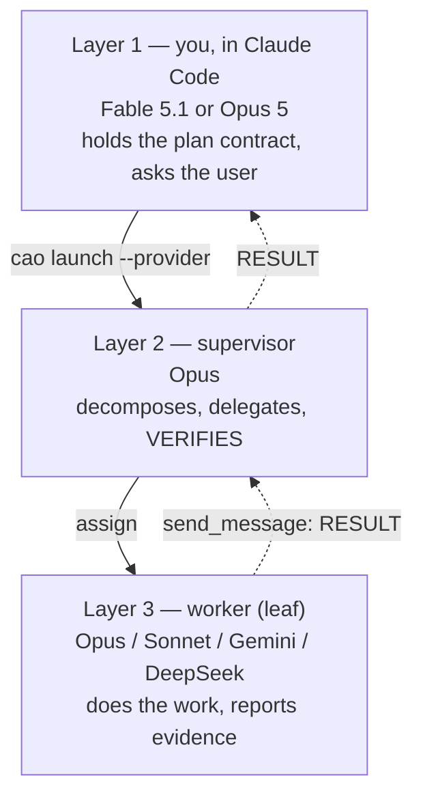

# CAO — the interactive, hierarchical lane

Moved out of `SKILL.md` (routing v2 spec §8.1, C2), except the runbook command block itself:
`tests/cao/test_cli.py` (`test_we_advertise_some_flagged_commands`,
`test_every_advertised_command_parses`) scans `SKILL.md` for every `python -m cao ...` string it
advertises and checks each one against the real argparse parser, so those commands have to stay
physically in `SKILL.md`'s CAO section. See `SKILL.md`'s "CAO" rules for the runbook in order;
this file covers everything else — layers, safety mechanisms, providers, setup traps and the
proven incidents.

CAO (CLI Agent Orchestrator) runs a live, inspectable hierarchy of agent terminals
with a web dashboard on `:9889`. The batch runner still owns headless overnight
waves; CAO owns work you want to watch, steer, and spread across providers.

Everything in this section was measured against CAO 2.5.0, on 2026-09-10 and in
a full live run on 2026-09-11. Where a rule looks pedantic, it is because the
alternative failed silently — see
`docs/superpowers/plans/2026-09-10-cao-orchestration-lane/EVIDENCE.md`.

Two habits that matter more than the commands. Run `sweep` on a loop — a blocked
agent is a slot doing nothing, and nothing else notices. And never treat CAO's
own `completed` as done: measured live, both terminals of a killed session
reported `completed` while the file they were asked to create did not exist.

### Known limits, stated rather than discovered

* **A leaf spawned through `assign` onto `antigravity` failed with *"There's an
  issue with the selected model"*, unexplained.** The same model answers from a
  plain tmux pane, in an ext4 cwd, with CAO's own flags. If it bites, route the
  leaf elsewhere (`cao.levels[].pool`) — the ladder already descends on its own.
* **Depth is policed between sweeps, not prevented** (§9.3), and on
  `antigravity_cli` tool restrictions are advisory (§9.4).
* **Quota detection is pattern-based** and fails *open*: an unrecognised wall
  looks like a working pool until a guard fails.
* **`probe` closes a pool only on proof** (not installed / not authenticated).
  A pool that is merely slow stays in the ladder, so a phase may burn one rework
  cycle discovering it.

### 9.0 The rules that are not negotiable

**Plan first, interactively.** Before any session launches, a `PLAN.lock.json`
contract must exist and validate. It cannot express "I did not ask": it needs
either a question with `answeredBy: "user"`, or an `assumedDefaults` entry saying
what you decided on the user's behalf **and why**. `cao/plan.py` refuses to
dispatch otherwise. Planning happens once, at Layer 1. Sub-orchestrators receive a
finished plan.

**Sub-orchestrators never re-plan.** A supervisor or worker that finds the plan
wrong emits `RESULT <id> status=needs_revision` with the contradicting evidence
and stops. Evidence flows up; authority stays at the top.

**Never leave a waiting agent unanswered.** A terminal in `waiting_user_answer` is
a held slot doing nothing, and it stalls everything above it. Sweep for them
(`cao/watchdog.py`), answer what the configuration already implies, and escalate
anything touching credentials, money, deletion or publication. Measured: a worker
sat on a permission dialog for seven minutes while its supervisor waited for a
callback that could never arrive.

**Never decline a quota pool.** `agy`'s Claude 4.6 models bill to Antigravity, not
to Claude Code. Refusing them does not get a better model — it gets a smaller
budget. Freshness is about ordering *within* a pool, never a ban.

**`check` and `probe` answer different questions, and only one should gate
dispatch.** `check` asks whether credentials exist; `probe` asks whether the pool
*works*. Measured live: `probe` reported `antigravity failed`, routing chose
antigravity anyway, and two spawned workers died. `probe` now records both
directions — a failure closes the pool for routing, a pass reinstates it — so one
bad minute cannot decline a pool for the rest of a run. **Run `probe` before a
long run, not just `check`.**

Only **proof** closes a pool: `not_installed` or `not_authenticated`. A timeout,
an unrecognised banner, or a harness limitation is reported and acted on not at
all — measured, `agy -p` answers inside tmux and prints `error: interrupted`
when its stdout is a pipe, so probing it through a pipe reported a healthy
provider as dead. The antigravity probe therefore runs in a throwaway tmux
session, and classifies only the slice after a sentinel the probe shell prints
*after* the command is echoed — otherwise it matches the question it asked and
can only ever report `ok`.

**A quota wall has three meanings, and they need three responses.** Measured in
the shipped Claude Code 2.1.236 binary (`strings`, 2026-09-11):

| Provider says | Means | Response |
|---|---|---|
| `rate_limit_error`, `Usage limit reached`, `RESOURCE_EXHAUSTED`, `429` | capacity returns | cool the pool ~1 h, descend the ladder |
| `billing_error`, `credit balance too low`, `spend limit reached` | it will **not** return by waiting | close the pool; a human has to act |
| `overloaded_error`, `529`, `request timed out` | seconds of congestion | **change nothing** — closing a pool here declines capacity that was never gone |

`budget.classify_limit()` decides, and transient wins over the others: those
bodies carry prose, and one stray "rate limit" in a 529 would close a healthy
pool. Before this, all three read as one thing: a billing wall was cooled for an
hour that could not help, and a 529 removed a pool that was fine.

**Review across model families, not across pools.** `claude-opus-4-6` reached via
`agy` is different quota and the *same* blind spots. `cao/dispatch.py` pairs on
`family`; a forced same-family review is tagged `review_degraded`, never hidden.

**Orchestrators are never cheap.** Layer 1 runs Fable 5.1 or Opus 5; a level that
spawns runs Opus. Only leaves may run Sonnet, Gemini or DeepSeek, because there
the task is already specified and a guard already exists. Fable is Level-1 only —
never spawn it as a subagent. See §9.2; `python -m cao check` enforces it.

**Run the guard yourself.** A phase is done when its acceptance guard passes for
someone who was not asked to produce a good answer — never when an agent says so.
`python -m cao verify --phase X` is the only thing that releases a lease; on
failure `--rework` respawns with the guard's own output (§9.9).

**Report what happened.** A launch timeout is not a failure (§9.6). A boot is not
a delegation. An agent's evidence is a claim, not a measurement. If a guard did
not run, say so.

### 9.1 CAO or the batch runner?

| Need | Use |
|---|---|
| Overnight, headless, nobody watching | batch runner |
| Live dashboard, inspect an agent mid-run | CAO |
| Mixed providers in one hierarchy | CAO |
| Guard-gated auto-merge to a base branch | batch runner |
| Cross-session memory | both → Omnigraph |

### 9.2 Layers, and how to delegate



#### Never put a cheap model where decisions are made

| Layer | Model | Why |
|---|---|---|
| **1 — orchestrator** | **Fable 5.1 or Opus 5** | Talks to the user, owns the plan contract, arbitrates every escalation. |
| **2 — supervisor** | **Opus** | Decides what tasks exist, who gets them, and whether returned evidence holds. |
| **3 — worker (leaf)** | **Opus, Sonnet, Gemini, or DeepSeek** | The task is already specified and a guard already exists. Cheapness is safe here and nowhere else. |

A level that spawns is doing judgement work: decomposition, sequencing, and
accepting or rejecting evidence. A weak model there does not fail loudly — it
decomposes badly, accepts a plausible-sounding report, and every layer beneath
inherits the mistake. You pay for it three layers down as rework, which is far
more expensive than the model you saved on.

**Fable is Level-1 only.** It may drive the top session; never spawn it as a
subagent. `orchestrator_model_warnings()` enforces both rules, and
`python -m cao check` prints them.

#### How to delegate, concretely

1. **Decompose to a task with a guard.** If you cannot name the command that
   proves it done, it is not a task yet — it is a wish. Split it further.
2. **One task per worker.** A worker holding two tasks reports on the easier one.
3. **`assign`, never `handoff`.** `handoff` blocks your MCP call for the worker's
   whole run; measured, a ten-minute worker timed out the connection and took the
   session's MCP tools down with it. `assign` returns immediately and the worker
   replies via `send_message`.
4. **Send a TASK envelope, not prose.** Reference `plan_ref`; never re-quote the
   plan. `cao/wire.py` has no field that could carry it.
5. **Wait, and stay reachable.** Your turn must not end while a callback is
   outstanding — poll `get_terminal_status` rather than signing off.
6. **Answer anything that blocks.** A worker in `waiting_user_answer` is a held
   slot doing nothing. Sweep with `python -m cao sweep`; auto-answer what the
   config already implies, escalate credentials, money, deletion, publication.
7. **RE-VERIFY, do not relay.** You hold `fs_read` and `fs_list`. If a worker
   claims a file exists or has certain contents, read it. Measured: a worker
   created a file correctly and then reported an `od -c` dump that did not match
   it — the work was right, the evidence was invented — and its supervisor passed
   that on verbatim. Relaying is not verifying.
8. **Escalate rather than improvise.** If the plan is wrong, emit
   `RESULT <id> status=needs_revision` with the contradicting evidence and stop.
   Layer 1 decides.

#### What a supervisor may not do

Generated spawner profiles get `@cao-mcp-server, fs_read, fs_list`, so CAO denies
them `Bash`, `Write`, `Edit`, `Agent` and `Monitor`. "Delegate, never implement"
is a property of the tool surface on a hard-enforcement provider, not a request
you have to trust. A supervisor that finds itself wanting to write code has
mis-decomposed: split the task and assign it.

Depth comes from `handoff.config.json` → `cao.maxDepth` and `cao.levels`. Each
level carries its own `pool` / `model` / `effort`, so an Opus supervisor over a
DeepSeek worker is cross-family for free. `cao/profiles.py` generates one profile
per level; never hand-edit a generated profile.

### 9.3 Depth is policed, not enforced — know the difference

CAO has no spawn-depth limit, and **tool restrictions cannot supply one**:

- `assign` / `handoff` are not `allowedTools` entries. MCP is granted per *server*
  (`@cao-mcp-server`), so a leaf cannot be given `send_message` while being denied
  `assign`.
- On `antigravity_cli` restrictions are advisory anyway — CAO's own
  `SOFT_ENFORCEMENT_PROVIDERS` documents them as "prompt-level text only".

**Use CAO's vocabulary, not the provider's.** CAO translates a universal set —
`execute_bash`, `fs_read`, `fs_write`, `fs_list`, `fs_*`, `web_fetch`,
`@cao-mcp-server` — into each provider's native names. A native name
(`write_file`, `Read`) is not a vocabulary entry, maps to nothing, and CAO then
blocks *every* native tool: the agent is left with MCP, `skill` and `todowrite`.
That looks exactly like "restrictions do not work", and cost two wrong diagnoses
here. `"*"` disables restrictions entirely — an escape hatch, not a default.

That vocabulary is what makes "delegate, never implement" real: a spawner gets
`fs_read, fs_list` and CAO denies it `Bash`, `Write`, `Edit`, `Agent`, `Monitor`.
*Depth*, though, still cannot come from the tool surface, so it is policed
out of band by `cao/monitor.py`, which walks the **server-stamped `caller_id`
chain** — not the agent-written `group` field, which the policed party controls.

What that costs, stated plainly: policing is **reactive**. The child is already
running before the sweep sees it; the poll interval is the blast radius; a
termination can interrupt a write (survivable only because workers live in
disposable worktrees); and an orphaned parent makes depth *unknown*, which is
reported for a human rather than auto-terminated. It turns a hard limit into a
budget. That is worth doing only because the alternative — trusting a rule CAO
itself documents as advisory — provides no bound at all.

### 9.4 Setup: the things that silently do not work

```bash
python infra/mcp-servers/cao-setup/setup_cao.py --check --config handoff.config.json
```

| Trap | Symptom | Rule |
|---|---|---|
| `CAO_HOME_DIR` unset | profiles "installed" but invisible; CAO passes `--agent <name>` to Claude Code, which answers `agent not found` | **export `CAO_HOME_DIR="$HOME/.cao"` in every `cao` call.** The default home is on `/mnt/c` |
| profile `provider:` ignored at launch | `400 … Kiro engine 'v2' cannot start` | always pass `cao launch --provider <provider>` |
| profiles copied into `~/.cao/profiles/` | `cao profile list` never shows them | the store is `<name>.md`, registered with `cao install` |
| `bash -c` | `command not found` | **always `bash -lc`** — every agent binary lives in `~/.local/bin` |
| `cao` on Windows | ImportError every time | never invoke `cao` from Windows; go through `wsl -d <distro> bash -lc` |
| fresh worktree | Claude never reaches idle, terminal is deleted | `trust_worktree.py <wt> --mcpjson omnigraph` **before** launch |
| Claude Code startup | `initialization timed out after 60s` | `cao config set provider_init_timeout 300` in the server's home |

### 9.5 Filesystem placement — the largest single win

Measured on the same repo, same distro:

| Layout | `git status` |
|---|---|
| repo on `/mnt/c` (9p) | **3.021 s** |
| ext4 worktree, `.git` on `/mnt/c` | **0.146 s** |
| fully ext4 | 0.017 s |

An agent runs `git status`, file reads and test discovery constantly. Set
`cao.worktreeRoot` to `$HOME/cao-worktrees` and provision with `cao/worktree.py`;
the main checkout stays on Windows for the IDE. A full ext4 clone is another 8×
and is **not** recommended — it needs a push-back step that can fail halfway and
lose work.

**A worktree is not a working environment until it is hydrated.** It holds
*tracked* files only — no `.env`, so no `OMNIGRAPH_TOKEN`, and an agent whose
memory tools fail for that reason reports it as a code problem. The launch path
copies `.env` (`cp -n`, so a re-provision never clobbers one) and pins
`OMNIGRAPH_GRAPH_ID` **in the file**, not only in `cao launch --env`: children a
supervisor spawns inherit the worktree, not Layer 1's environment, and an
unpinned child writes to whatever graph is globally configured — the wrong-graph
failure this repo's CLAUDE.md opens with.

### 9.6 Reading failures correctly

- **A `cao launch` client timeout is not a failure.** `MCP_REQUEST_TIMEOUT` is a
  hard-coded 30 s; the server usually creates the session anyway. Check
  `cao session list` before retrying, or you will create duplicates.
- **Booting is not delegating.** A supervisor reaching `idle` proves nothing about
  whether a worker ever ran. Look for a second terminal and a returned RESULT.
- **`/health` "ok" means the binary exists**, not that it is logged in or in
  quota. Use `cao/probe.py`, which distinguishes `ok` / `not_authenticated` /
  `quota` / `not_installed` / `failed`.
- **An agent's evidence is a claim, not a measurement.** Measured: a worker
  created a file correctly and then reported an `od -c` dump that did not match
  it, and its supervisor relayed that verbatim. Re-verify anything you hold the
  tools to check — relaying is not verifying.

### 9.7 Providers

| Pool | Reached via | Notes |
|---|---|---|
| `anthropic` | `claude` | hard enforcement; effort via `claudeConfig.effort` → `--effort` |
| `antigravity` | `agy` | **soft enforcement**; effort rides in the model id. **Install the NATIVE Linux build**, not a shim to `agy.exe`: a Windows process cannot run with its cwd on ext4, and since this lane puts worktrees there, a shimmed agy shows "not signed in" — an auth-looking symptom with a path cause. `setup_cao.py --check` detects the flavour |
| `deepseek` | `opencode` | there is no official DeepSeek CLI; OpenCode is third-party. Pin the model with a custom `deepseek-direct` provider hitting `api.deepseek.com/v1`, or the registry decides for you |

Quota is tracked per **pool** in `cao/budget.py`, which fails *open* on an unknown
pool — the detection patterns are unverified until a real limit is measured, and
falsely cooling a healthy pool costs more than a missed wall.

**`deepseek_review.sh`** runs a cross-family review through that pool from Git
Bash, reading the key from the untracked secrets file so it never appears in a
command line or a log. Two limits, both measured 2026-09-17 (OpenCode 1.18.30):

- **`--file` attaches only ~1,000 lines, and the truncation is silent.** A
  bigger file is not rejected — the model reviews the first ~1,000 lines and
  says nothing about the rest, so a review that looks complete may have seen a
  fifth of the diff.
- **The prompt file must live under `/tmp/cross-review`** inside WSL.
  Anywhere else, opencode auto-rejects the read as "external directory" — the
  exact symptom of getting this wrong.

For any diff over ~900 lines, use `deepseek_chunked_review.sh <label>
<base-sha> <merge-sha> <done-means-file> <out-md> [repo] [paths...]` instead:
it splits the diff into <=900-line parts, copies each part's prompt into
`/tmp/cross-review` itself before calling opencode, and concatenates the
per-part reviews.

### 9.8 Memory and isolation

Omnigraph is the only memory layer: `memory_store` / `memory_recall` are never
granted. Pin the graph per run with `--env OMNIGRAPH_GRAPH_ID=<repo folder>`,
which CAO forwards to the supervisor **and every worker it spawns**. Without it,
agents inherit the global pin and write to the wrong graph — the failure recorded
in `CLAUDE.md` from 2026-07-17.

### 9.9 Safety: what stops an agent destroying, lying, or leaving a mess

Three failure modes, three mechanisms. None of them is a prompt asking nicely.

#### Destruction — bounded by where the agent runs

Leaves hold `execute_bash` and `fs_*`, which is an unrestricted shell. The
protection is not permission checking, it is **blast radius**: an agent only ever
gets a disposable git worktree on a fast filesystem, never the main checkout.
`plan_launch` **refuses** if the resolved working directory is the repository
root, and the generated leaf prompt names the operations that are never its call
(`git push`, force-push, branch deletion, `rm -rf` outside its worktree, history
rewriting) — for those it must emit `needs_revision` and stop.

If a worker is terminated mid-write, it corrupts a directory that exists to be
thrown away. That is the whole reason the placement rule (§9.5) is a safety
control and not only a performance one.

#### Lying — beaten by an exit code, not by trust

An agent's report is a **claim**. Measured on 2026-09-10: a worker created a file
correctly, then reported an `od -c` dump that did not match it, and its supervisor
relayed that verbatim while holding `fs_read`. Neither was malicious. Neither was
detectable from the report.

So Layer 1 runs the phase's own guard itself:

```bash
python -m cao check                        # config, credentials, warnings
python -m cao probe                        # do the pools actually WORK? gates routing
python -m cao plan                         # scaffold a contract (ships INVALID)
python -m cao launch --phase p1            # refuses without an approved plan
python -m cao verify --phase p1            # runs acceptance.guard in the worktree
python -m cao verify --phase p1 --terminal T  # ...and checks what that agent CLAIMED
python -m cao verify --phase p1 --rework   # ...and respawns an agent if it fails
python -m cao sweep   --answer             # depth violations + unblock waiting agents
python -m cao resume  --apply              # restart work nobody else continued
```

- The guard is the one **the plan declared**, not one the agent chose — otherwise
  it is marking its own homework.
- A phase with no guard is `ERROR`, never `PASS`. "Nothing to check" must not read
  as verified.
- **The lease is released only on a pass.** A phase is done when the guard says
  so, never when an agent says so.
- `pass` / `fail` / `error` are three states, not two. A guard that could not run
  (missing worktree, broken shell) is `ERROR` and says *"the guard never ran, so
  this says nothing about the code"* — it does not consume a rework attempt.
  Measured: conflating them once burned three attempts and escalated to a human
  blaming code that had never executed.

#### The guard answers "is it done". `--terminal` answers "did it lie"

A failing guard is only half the signal. A phase that fails after the agent
honestly reported `status=blocked` is ordinary work. A phase that fails after
`status=ok` is a different finding entirely: **this agent's reports cannot be
trusted on any phase — including the ones whose guards happened to pass.**

`--terminal <id>` reads that terminal's RESULT envelope and compares it with the
verdict this run just measured (`cao/verify.py::compare_claim`):

| guard | agent said | finding |
|---|---|---|
| `fail` | `status=ok` | **CONTRADICTED** — printed to stderr, appended to `verify.ndjson` as `kind=contradiction` |
| `fail` | `status=blocked` / `needs_revision` | agreed — an honest report of a real failure |
| `pass` | `status=ok` | agreed |
| `fail` | no parsable RESULT | **NO REPORT** — the agent died or was killed; stated, never scored as a lie |
| `pass` | no parsable RESULT | silent — if the work is done, how it was reported is not a problem |
| `error` | anything | **never a contradiction** — a guard that could not run is the *absence* of evidence, so it cannot convict anyone |

The `error` row is the one worth guarding: treating `CANNOT_RUN` as a caught lie
would manufacture accusations out of a broken worktree. It is recorded as well as
printed, because the operator who needs it was asleep when it happened.

**A terminal is a rendered tmux pane, not a message.** `wire.find_result()`
strips ANSI and takes the LAST envelope in the capture. Two traps, both measured
live: a strict line-0 parse finds a banner and reports "no claim" for every
terminal that will ever exist; and a naive ANSI strip deletes the cursor-move
escapes that STAND IN for runs of spaces, welding `RESULT p1 status=ok` into
`RESULTp1status=ok`.

**`--rework` counts spawns, not verdicts.** `cao verify` is read-mostly, and
inspecting a phase three times used to report *"3 failed attempts (cap 3)"* and
escalate a phase nobody had reworked once.

#### Rework — a fresh agent, briefed with the failure verbatim

On `fail`, `--rework` releases the lease and respawns for the same phase, carrying
`rework_brief()`: the guard command, its exit code, and **its own output**, not a
summary. A paraphrase of a failure is one more chance to soften it, and the
previous agent already believed it had succeeded.

The brief tells the new agent three things: fix the cause not the guard, never
edit or weaken the guard, and expect the guard to be run again by Layer 1 — a
claim that disagrees with an exit code loses. If the *guard* is genuinely wrong,
that is `needs_revision` to Layer 1, never a silent adjustment.

**`resume` will not guess.** It restarts a phase only when the lease expired,
nobody is recorded as continuing it, attempts remain, *and* CAO's live task list
confirms nothing is running it. If CAO is unreachable it **refuses**, because an
empty live list reads as "nobody is working" and would license restarting work
that is still in progress.

`resume.maxAttempts` (default 3) caps it. Beyond that the phase becomes
`needs_human` with the lease **held**: rework that never converges burns budget
without approaching done, and leaving the lease held stops another sweep picking
it up.

#### Proven end to end, once, on purpose

The loop below is not a design sketch. On 2026-09-11 one phase went through it
live: the first agent's session was killed mid-delegation and CAO reported
`completed` for both terminals; the guard caught it; the rework was refused
because the session name was taken; the pool the ladder wanted was down and
`probe` closed it; the ladder descended to `anthropic/sonnet`; the next agent did
the work; the guard passed and the lease was released. Six defects, five of which
only exist where this code meets something it does not own. See EVIDENCE §13.

#### The order that makes it work

```
plan  ->  launch  ->  (agent works)  ->  verify  ->  pass: lease released
                                            |
                                            +-- fail  -> rework (up to maxAttempts)
                                            +-- error -> fix the environment; no attempt spent
```

Every step refuses rather than defaulting. `launch` exits 3 on refusal, `verify`
exits 1 on rework-needed and 4 on `needs_human`, so a wrapper can tell a refusal
from a crash from a completed run.

### 9.10 CAO or Herdr?

Herdr is a terminal *backend*, not a cross-OS bridge: it decides who owns panes,
while the agent still runs on that pane's machine. It also forwards `--cwd`
untranslated and is marked experimental upstream. Use Herdr where the
`herdr-orchestration` skill already puts it — supervised, human-present panes —
and CAO for this lane.
