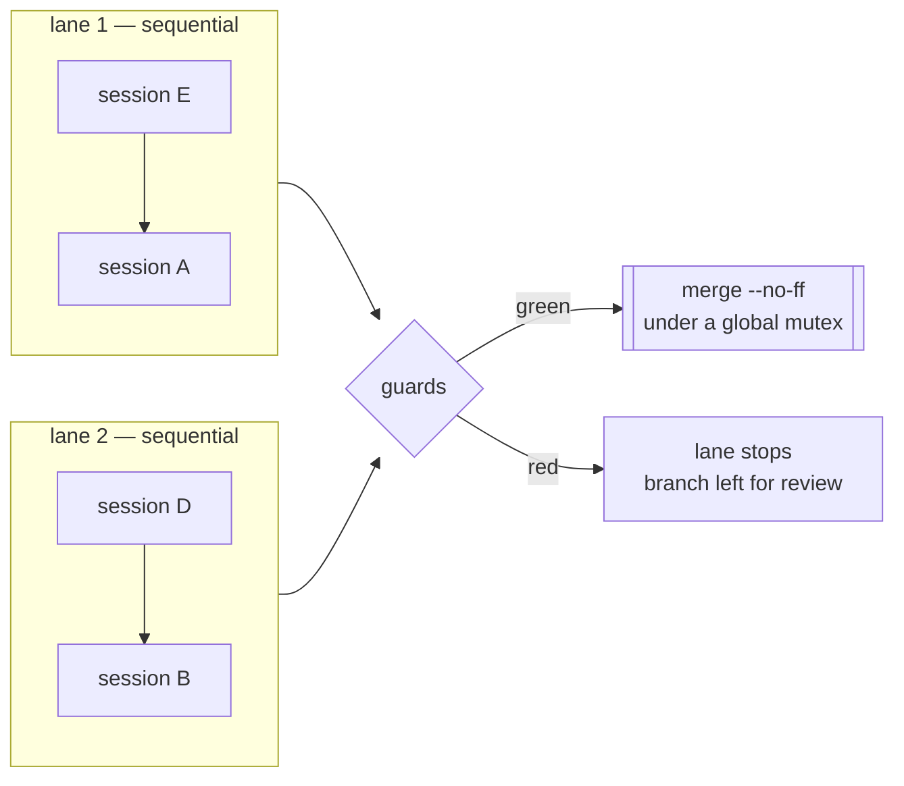
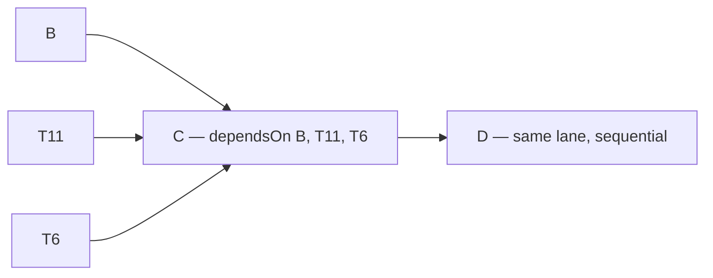

# Lanes, sessions, and choosing a model per session

Moved out of `SKILL.md` (routing v2 spec §8.1, C2) so the skill body stays a rule list; nothing
here is duplicated there. `SKILL.md` links to this file; treat this as the single home for these
facts.

## The model

**Lanes run in parallel; sessions inside a lane run in sequence.** That is the only scheduling
primitive, and it is enough: put sessions that contend for a resource — a database, a store, a
generated artifact — in the *same* lane, and independent ones in different lanes.

Each session gets its **own git worktree on its own branch**, cut from the current base branch.
Isolation is per *session*, not per subagent — see the worktree rules in
the `mcp-servers-setup` skill; a session per worktree is what gives each
one its own Serena process and its own graph.

Per session: create worktree → start background session with its brief → poll until the turn
ends → classify → recover or continue → run guards → merge. A red guard or a merge conflict
stops **that lane only**; other lanes keep running.

**Exclusion across lanes is `resources`.** Ordering is not exclusion: a read-only session can
starve a writer on a single-holder store while the lanes say nothing is wrong. Each session lists
what it *holds* while running (`"store:write"`, `"store:read"`, a bare name meaning write); the
runner refuses to start a session whose resources conflict with a running one — write excludes
everything on that name, read excludes only write — and says so in the state file.

**Ordering across lanes is `dependsOn`.** A session listing dependencies waits — before its
worktree is cut — until each has *merged*, so it forks from a base branch that already carries
their work. A dependency that ends in a state no operator action turns into a merge (`failed`,
`blocked`, `crashed`, `auth-failed`) fails the dependent instead of leaving it polling until
morning; a red guard or a merge conflict is *waited on* (bounded by `maxDependencyHours`),
because the operator resolves those by hand within minutes and the runner then records the
branch as merged-elsewhere (measured 2026-09-05: three of nine merges, and the final-suite
lane had to be re-queued after every one before this). That is what lets one invocation run
"B, T11 and T6 in parallel, then C after all three, then D" without an operator returning to
start the second half.

## Choosing a model per session

Route by the **shape** of the work, not its importance. The question that decides the tier is
whether a wrong answer is *visible*: mechanical work fails loudly and cheaply, judgement work
fails quietly and is discovered much later.

| Work shape | Tier | Why |
|---|---|---|
| Pattern-matching an established convention; closed-file edits; scaffolding; renames; doc sweeps | cheaper tier | Structurally verifiable. A guard or a diff catches it immediately. |
| Config with repo-wide blast radius; anything where the recovery is "revert and re-verify" | top tier | Needs the discipline to verify through the real path and back out rather than push through. |
| Deciding what survives a refactor; reconciling two designs; ambiguous requirements | top tier | Fails silently. Nothing goes red when judgement is wrong. |
| Work whose output another session depends on | top tier | Its errors are inherited, not contained. |

Put the chosen model in each session's `model`, and the subagent tiers in `subagents.tiers`.
Neither belongs in `SKILL.md`.
