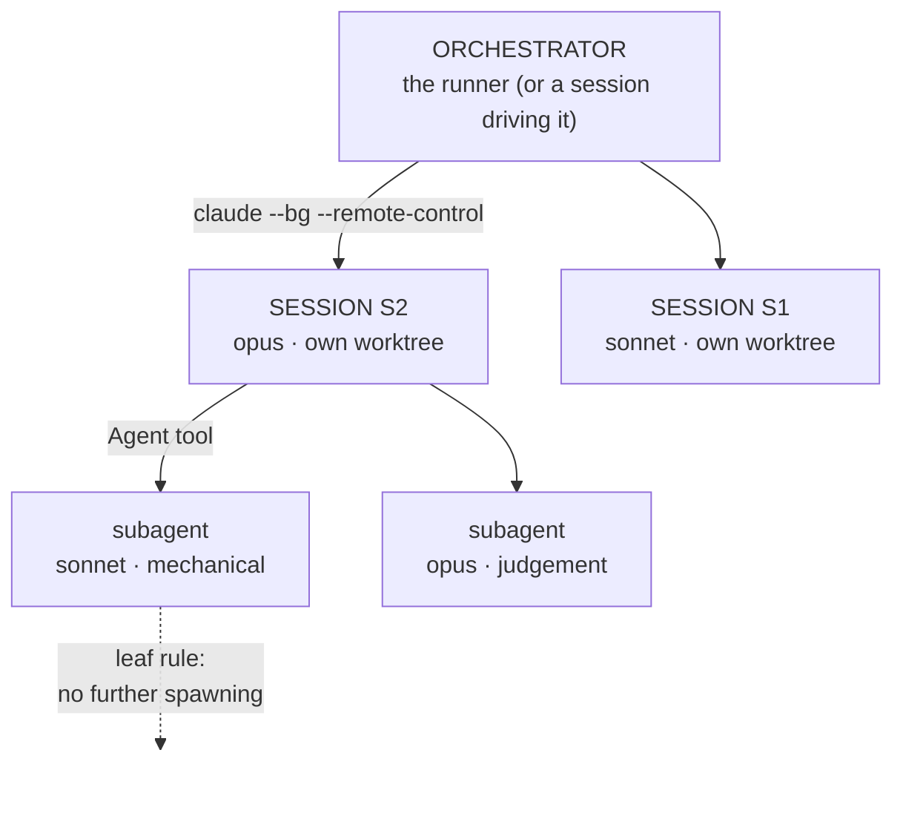

# Three layers of orchestration

Moved out of `SKILL.md` (routing v2 spec §8.1, C2). `SKILL.md` links here; nothing in this file
is restated there.

An unattended run is three levels deep, and each level has a different job. Collapsing them —
one giant session doing everything itself — is the failure this section exists to prevent.



| Layer | Owns | Never does |
|---|---|---|
| **Orchestrator** | worktrees, launch, recovery, guards, merge | the work itself |
| **Session** | one handoff, start to DONE note; delegates to subagents | merge to the base branch |
| **Subagent** | one scoped task with an explicit return contract | spawn further subagents (*leaf rule*) |

**Sessions stay joinable.** Each launches with a stable `--remote-control` name, so an
"unattended" run is interactive on demand — `claude attach handoff-S2` joins it and lets you
type; `claude logs handoff-S2` reads its output without joining. That name is derived in
`Get-HandoffSessionVars` and printed in the runner log, the state file, and every emitted brief.

**The runner is controllable while it runs.** `<stateDir>/queue/lane-<name>.json`
(`{"sessions": ["F9"]}`) starts another lane child, which re-reads the config — so a session added
to the config after the start is launchable without a second runner over the same state file;
an empty `stop-<key>` file stops that session's lane at its next decision point.
`<stateDir>/load.json` (cpu %, running sessions, refreshed every poll) is what a brief under a
`machineBudget` reads before a heavy run — the budget is *advisory* on purpose: a runner that
blocked lanes on CPU would deadlock behind another project's compute pass. `-Cleanup` stops every
merged session's process, removes its worktree and branch, and prunes its Serena project row.

**The final suite is a lane, never the main checkout.** A `guardsOnly` session with `dependsOn`
every other session cuts a worktree at the merged HEAD and runs the guards there; nothing else
runs the full suite. Measured 2026-09-04: a suite started from the main checkout while five
merges fast-forwarded under it reported 18 red, of which 9 were artefacts of the moving tree.

**The controller's only channel INTO a running session is a file.** There is no
non-interactive `claude send`; the desktop session-messaging tools do not reach `--bg` sessions;
`attach` needs a terminal. So every brief carries `{{inbox}}` — `<stateDir>/inbox/<key>.md` —
and tells the session to read it at every decision point and before every long wait, act on it,
and append what it did. Measured need (2026-09-05): a session polled a silent three-hour compute
run every 25 minutes; the controller had diagnosed the cause in five, and could only reach the
session by appending to the log file it happened to be polling and killing the process.

**The orchestrator may itself be an agent session.** A controller session that launched the
runner in the background watches `<stateDir>/state.json` and `runner.log`, reads each DONE note
as it lands, and adjudicates — it never edits the worktrees. What it cannot do is *answer* a
prompt inside a background session (there is no non-interactive `attach`), which is why
`postWorktree` pre-approval and the refusal rule matter more, not less, when the operator
is an agent.

**A successor brief is written from the predecessor's DONE note.** Eight re-cuts in one day
converged on the same six blocks, and the sessions that received them lost no time orienting:

```
# Session <N> — <one line: what this pass is>
*Read <previous DONE note> in full first — above all <the one finding it must not re-learn>.*
## Start            worktree + venv/graph check + commit flags + refusal rule
## What is true now measured facts with the session that measured them; what other lanes own RIGHT NOW
## The work, in order   numbered; each item names the guard it ships with (pass AND fire)
## Not yours — write it down, do not do it   the operator's items, other lanes' files, the changelog
## Done means       DONE note contents: commits, remains, refusals verbatim, fallbacks
```

The "what other lanes own right now" line is the one that prevents conflicts. Render the
controller's own brief the same way (`controllerBriefFile`, shown first by `-EmitBriefs`), so a
controller session can be restarted from the same source of truth as its lanes.

**Cross-session memory goes through the memory graph, not through files.** Parallel sessions
each own a worktree copy of every tracked file, so a shared ledger, a shared RESUME note or a
shared changelog section edited by two sessions is a merge conflict waiting for the runner.
Give parallel sessions their own ledger/memory/changelog-fragment files and let the sequential
tail fold them in; put the durable decisions in the structured memory graph, which every session
reads at start.

**Subagent policy is stated once.** The `subagents` block renders into every brief as
`{{subagentPolicy}}`, so all sessions delegate the same way. It is opt-in: a session told to
delegate with no cap and no tier assignment delegates badly. Delegation depth is capped at
`maxDepth` (default: 3 levels: Main orchestrator -> phase-specific orchestrator subagent -> task-specific
subagent orchestrator). Subagents at level `maxDepth` are leaves and cannot spawn further subagents.
This prevents runaway exponential tree fan-out and unmetered quota exhaustion. Controller briefs
are scaffolded from `prompts/unattended-orchestration.md` at `-Init` time, embedding research-grade
reporting and resource-throttling criteria.
