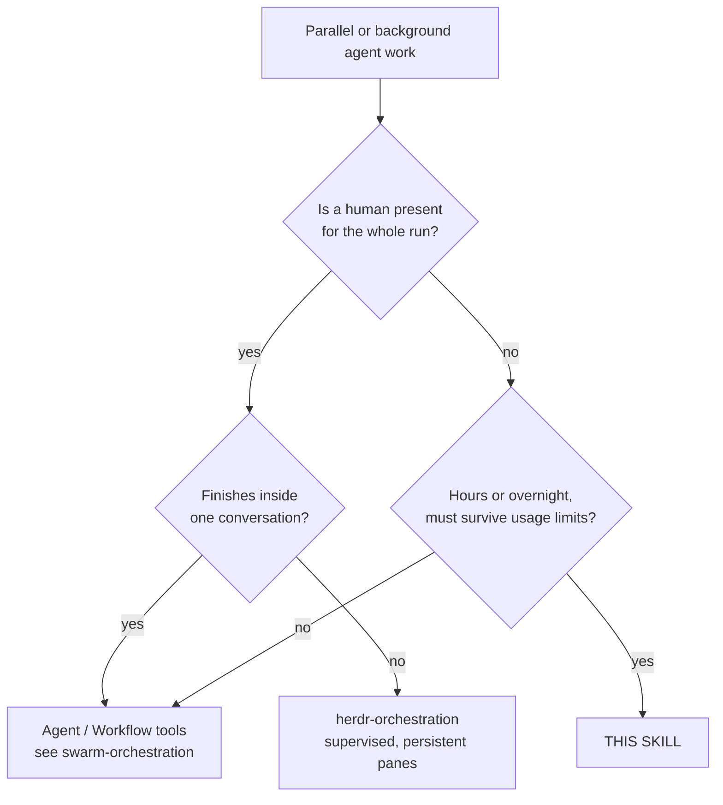

# Setting up and driving the batch runner

Moved out of `SKILL.md` (routing v2 spec §8.1, C2). `SKILL.md` links here; nothing in this file
is restated there.

## When this, and when something else



The distinction that matters is **who recovers a stopped session**. In-session tooling assumes
you are there; Herdr assumes you can look at a pane. This runner assumes nobody will look until
morning, so every stop must be classified and recovered automatically — or recorded in a state
file precisely enough to be understood cold.

**Do not use it** for work that fits in one sitting. The worktree, guard and merge machinery is
only worth its cost when the alternative is losing a night.

## Adopting this skill in another repository

**Copy this folder in and run it. Nothing here is specific to the repo it came from.**

```bash
cp -r skills/unattended-orchestration <your-repo>/skills/     # or anywhere you like
cd <your-repo>
pwsh -File skills/unattended-orchestration/run_handoff_sessions.ps1 -Init
```

`-Init` writes `.claude/handoff.config.json`, detecting your git root and your **actual** base
branch. Then edit the sessions, and:

```bash
… -Validate      # repo, branch, lanes, guards, launcher — check before trusting it to a night
… -EmitBriefs    # read the briefs as markdown; launches nothing
… -DryRun        # rehearse preflight and lane dispatch; starts no session
…                # run it
```

Four properties make that work, and each is covered by
[`../tests/Portability.Tests.ps1`](../tests/Portability.Tests.ps1), which copies the skill into a
throwaway repository and drives the whole path there unedited:

| Property | Why it matters for adoption |
|---|---|
| **The repository is detected**, not configured (`git rev-parse --show-toplevel`) | A committed config carries no machine-specific path, so it works for everyone who clones it. `repo` remains available as an override. |
| **The session tool is an adapter** (`launcher`) | The default describes Claude Code, so an unedited config just runs. Adapter shorthands (`"launcher": "claude"`, `"agy"`, `"grok"`, `"codewhale"`) resolve pre-tested argument vectors from `AgentAdapters.psm1`, while custom adapters or overrides merge key-by-key. |
| **Cross-platform primitives** | Junction on Windows, symlink elsewhere; named mutex on Windows, exclusive lock file elsewhere. A named `System.Threading.Mutex` throws `PlatformNotSupportedException` off Windows, which would kill the first state write. |
| **Guards, subagents and briefs are opt-in** | An unconfigured repo gets a runner that works, not one that assumes pytest, a venv, or a delegation policy. |

The one hard requirement is **PowerShell 7** (`pwsh`), which runs on Windows, Linux and macOS.

**A worktree holds tracked files only.** Everything a session needs that git does not carry has
to be created *per worktree*, in `postWorktree`, or it is silently absent — and "silently" is
the word: a venv whose editable install points at the main checkout imports the **main
checkout's** package from inside the worktree, a cwd-relative code-graph server answers from a
graph that was never built there, a memory tool registers every worktree under one name. The
checklist, all measured while adopting this skill into a second repository (2026-09-05):

| the worktree lacks | what happens if you ignore it | fix, per worktree |
|---|---|---|
| a venv | `python` from the main checkout's venv resolves `import <package>` to the main checkout's `src` (editable `.pth`), so the session tests code it did not write | `postWorktree`: `uv sync --frozen` (24 s with a warm cache); guards and briefs use `{{worktree}}/.venv` |
| the code graph (`graphify-out/`, gitignored) | the cwd-relative MCP server finds nothing, or a junction shares ONE graph that any session's rebuild overwrites for all | build it in `postWorktree` (27 s, no API key) — or `copyDirs` for a snapshot each session may rebuild |
| the gitignored working ledger / SDD workspace | the brief points at files that do not exist | `copyDirs` |
| trust in `~/.claude.json` and MCP approval in `.claude/settings.local.json` | the first tool call blocks on a dialog nobody answers — and the `~/.claude.json` entry alone does **not** suppress the "New MCP server found" dialog (measured: three lanes blocked in three seconds) | `postWorktree`: the bundled `{{skillDir}}/trust_worktree.py --mcpjson <name>`, which writes the worktree's `settings.local.json` with `enableAllProjectMcpServers`; keep that file gitignored |
| MCP servers that take longer than the default 30 s to start (Serena via `uvx`, a Docker bridge) when several sessions launch at once | the session logs `CONNECT_TIMEOUT` and works without them (measured: Serena failed in 2 of 4 launches on a loaded host) | put `"env": {"MCP_TIMEOUT": "120000"}` in the main checkout's `.claude/settings.local.json`; `trust_worktree.py` copies it into every worktree |
| a unique memory-tool project name | Serena's tracked `project.yml` names every worktree the same; by-name activation raises for all of them | drop `project_name` from `project.yml` (each worktree self-names by folder) and activate by absolute path |
| the gitignored `.env` (secrets, switches) | the worktree app generates fresh secrets, so archives encrypted by the main checkout cannot be read there - or a fresh key silently becomes the live one | `copyFiles: [".env"]` |
| the live data directory, wanted by ONE lane | every worktree that links it lets a suite run reach real data; every worktree that lacks it makes the data session move nothing and report success | per-session `linkDirs` on exactly the sessions that own the move, nothing global (measured 2026-09-05, downstream project B: a tracked placeholder would also have pre-empted the link, so keep `data/` untracked) |
| an untracked prior-art drop one lane reads | the port session finds an empty folder and ports from memory | per-session `linkDirs` for that lane only |

## Where each fact lives — read this before editing a config

The runner's own config file is **normative policy**. It holds no paths, models, timeouts or
test commands beyond what is listed here.

| Fact | Single owner |
|---|---|
| Sessions, models, briefs, lanes | your repo's `handoff.config.json` → `sessions`, `lanes` |
| Subagent tiers, concurrency cap, leaf rule | same file → `subagents` |
| Timeouts, retry and continue caps, poll interval | same file (defaults: `HandoffCore.psm1` → `$HandoffDefaults`) |
| Guard command and its paths | same file → `guards` |
| Tool allowlist, permission mode | same file → `allowedTools`, `permissionMode` |
| Which agent to drive, and how | same file → `launcher` (defaults to Claude Code); a session may override it with `sessions.<key>.launcher` |
| Branch, worktree and state locations | same file → `baseBranch`, `branchPrefix`, `worktree*`, `stateDir` |
| Shared vs per-session artifacts | same file → `linkDirs` (one shared copy) / `copyDirs` (one per worktree) / `copyFiles` (single gitignored files, e.g. `.env`); a session adds its own under `sessions.<key>.linkDirs|copyDirs|copyFiles`, merged after the global lists |
| Cross-lane ordering | same file → each session's `dependsOn`; `maxDependencyHours` |
| When a quiet session counts as finished; whether it is stopped after merging; whether its worktree goes | same file → `quietMinutes`, `stopAfterMerge`, `removeWorktreeAfterMerge` |
| When a quiet session counts as **hung**, and how often it may hang before the lane stops | same file → `stallMinutes`, `stallWindow` |
| Mutual exclusion between running sessions | same file → each session's `resources` |
| The final, pinned test run | same file → a session with `guardsOnly: true` and `dependsOn` the rest |
| The machine budget briefs defer under | same file → `machineBudget`, rendered as `{{machineBudget}}`; `<stateDir>/load.json` |
| When each provider is cheap or quiet (off-peak) | `../provider-windows.json` (UTC, with sources); read via `../provider_windows.py` |
| The controller's own brief | same file → `controllerBrief` / `controllerBriefFile` |
| The controller → session channel | `{{inbox}}` (`<stateDir>/inbox/<key>.md`), read by the session; written by the controller |
| Traps every brief must carry | same file → `traps`, rendered as `{{traps}}` |
| The skill's own folder, for bundled helpers | `{{skillDir}}` (set by the runner) → `trust_worktree.py` |
| Shared brief preamble | same file → `briefTemplate` / `briefTemplateFile` |
| Every annotated field | [`../handoff.config.example.json`](../handoff.config.example.json) |
| Failure→recovery rules, config validation | [`../HandoffCore.psm1`](../HandoffCore.psm1) (tested) |
| Orchestration itself | [`../run_handoff_sessions.ps1`](../run_handoff_sessions.ps1) |

If you find a model name, a timeout or a test path in the config's *documentation*, that is a
bug — replace it with a pointer.

## Flags beyond the adoption path

The four-step path is in *Adopting this skill* above. Beyond it:

| Flag | Effect |
|---|---|
| `-Sessions X,Y` | run just these, as one sequential lane, ignoring configured lanes |
| `-Lanes "X,Y;Z"` | override the configured lanes for this run — one string, `;` between lanes, so it survives `pwsh -File` and `Start-Process`, which flatten an array argument into positional tokens (measured 2026-09-05: `-Lanes 'A' 'L' 'D' 'FINAL'` through Start-Process bound `L` to `-Sessions` and `FINAL` to `-WaitUntil`) |
| `-Fresh` | ignore recorded state; re-run sessions already marked merged |
| `-NoMerge` | stop after the guards; leave branches for review |
| `-WaitUntil "yyyy-MM-dd HH:mm"` | sleep, then start |
| `-FollowUp "…" -FollowUpSessions X` | also schedule a detached second run, so one invocation covers a night *and* a morning |
| `-OutFile <path>` | with `-EmitBriefs`, write instead of printing |
| `-Init -Force` | overwrite an existing config |
| `-Cleanup` | stop, remove and prune every merged session's process, worktree, branch and Serena row |
| `-Status` | print every session's state from `state.json` as one table (status, finished_by, refusals, last error) |

**`-EmitBriefs` is the manual path.** It renders each session as a `### Session` block — model,
branch, worktree, attach command, then the brief in a fenced block — and launches nothing, so one
config serves both an unattended run and a human pasting into interactive sessions. Both call the
same `Build-HandoffBrief`, so pasted text cannot drift from what would have launched; that is the
whole point, and it makes the emitted markdown **generated** — edit the config and re-emit, never
the file. Use it for a session whose blast radius wants a human watching.

Follow a running session with the launcher's own commands (`claude attach <id>`,
`claude logs <id>` by default). Both ids are recorded in `state.json` and the runner log.
