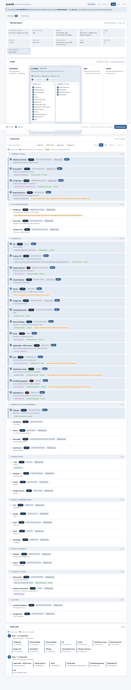
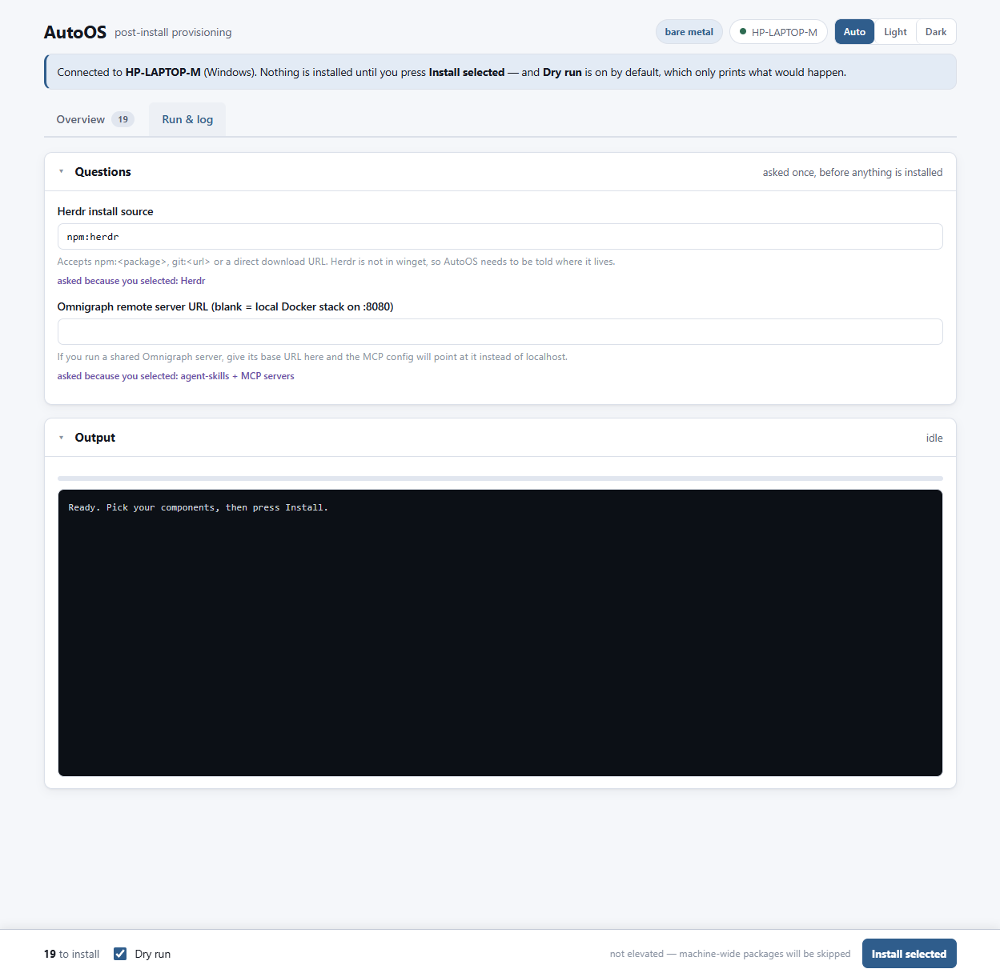

# AutoOS

Set up a freshly installed machine without clicking through twenty installers.

```powershell
.\setup.ps1          # Windows 10/11
```

```bash
./setup.sh           # Debian · Ubuntu · Raspberry Pi OS · macOS
```

One command per platform. It works out what kind of machine it is running on,
suggests a sensible profile, lets you tick exactly what you want, shows you the
plan, and only then installs anything.

**Docs quick nav:** [Getting started](docs/getting-started.md) ·
[Model routing](docs/models.md) · [API keys](docs/api-keys.md) ·
[Browser UI](docs/web-ui.md) · [Catalog](docs/catalog.md) ·
[all docs ↓](#documentation)

---

## Why it works this way

Post-install automation usually fails in the same three ways. Each design
decision here is aimed at one of them.

| The usual failure | What AutoOS does instead |
|---|---|
| **The tool needs tools.** A setup script that needs WSL, Ansible, Python packages and a TUI library cannot run on the machine it is meant to set up. | **No dependencies.** PowerShell 5.1 and bash are already there. On Linux, `python3` is used only to read JSON. No test framework, no menu library. |
| **All or nothing.** Rigid blocks — "install the dev bundle" — mean taking software you do not want, or editing the script. | **A checkbox per component.** Profiles are just a starting set of ticks. Dependencies resolve themselves. |
| **It runs once, then rots.** Re-running reinstalls, half-fails, or overwrites your config. | **Safe to run twice.** A second run reports `skipped`. Every file it edits is backed up first, and `--undo` puts them back. |

Two more rules the code is built around, both learned the hard way:

- **Nothing is installed before you confirm.** Detection and selection have no
  side effects at all, which is what makes `--dry-run` worth trusting.
- **Never overwrite a PATH, profile or config wholesale** — read, append, write
  back. Replacing `Path` outright once wiped a user's entire environment; there
  is now exactly one code path for PATH edits, and a test that guards it.

## What it looks like

```
── Detected system ─────────────────────────────────────────────
  Operating system       Microsoft Windows 11 Home (build 26200)
  Architecture           x64
  CPU                    AMD Ryzen 5 4500U - 6 threads
  Memory                 7.4 GB
  Package managers       winget, choco
  Already present        git, node, docker, wsl

  Choose what to install   14 of 36 selected  [████░░░░░░] 38%

   TERMINAL & SHELL  (2/3 selected)
  ❯ [✓] Windows Terminal          Tabbed terminal with true-colour support
    [✓] PowerShell 7              Modern cross-platform PowerShell
    [ ] Oh My Posh                Prompt theme engine for PowerShell

   CODING & AI  (2/2 selected)
    [✓] Claude Code CLI           Anthropic's terminal coding agent
    [✓] Docker Desktop            Containers - backs the local MCP stack

  ↑↓/jk move   SPACE toggle   g group   a all   n none   i invert   ENTER confirm   ESC cancel
```

## What's inside

| Directory | Contains |
|---|---|
| `setup.ps1` / `setup.sh` | The two entry points. Everything else is called by these. |
| [`catalog/`](docs/catalog.md) | **What** can be installed — `windows.json`, `linux.json`, `macos.json`. Data only. |
| `lib/windows/` · `lib/linux/` | **How** it happens: detect, catalog, install, ui, state, serve. |
| [`web/`](docs/web-ui.md) | The browser UI served by `--serve`. |
| [`tests/`](docs/testing.md) | Both suites — 69 Linux, 62 Windows, no framework needed. |
| [`Windows/ansible/`](docs/remote-provisioning.md) | Provisioning *other* machines over the network. Not used by `setup.ps1`. |
| [`Linux/ubuntu_autoinstall/`](docs/remote-provisioning.md#unattended-ubuntu-install) | Unattended Ubuntu install profile. |
| `third_party/` | Vendored code under its own licence. Never edited. |
| [`docs/`](docs/README.md) | Everything below, in detail. |

### Software on offer

Run `--list` for the current set. The headline items:

| Area | Includes |
|---|---|
| Terminal | Windows Terminal, PowerShell 7, Oh My Posh, zsh + Powerlevel10k, Nerd Fonts |
| Coding & AI | Claude Code CLI, OpenCode CLI, Claude autostart (reopens your sessions after a reboot), Claude Desktop, Antigravity, Zed, VS Code, Docker, Herdr, Node.js, OmniRoute gateway, LiteLLM fallback router |
| Input | Handy — offline speech-to-text, so you can dictate prompts instead of typing them |
| MCP stack | Clones [agent-skills](https://github.com/Ch3fUlrich/agent-skills), registers Graphify with Claude Code and approves Omnigraph per-repo — asking for your Omnigraph URL rather than hardcoding one, and naming what is still missing rather than pretending it is wired |
| Desktop (Windows) | Windhawk with the Explorer file-size and taskbar-clock mods, PowerToys |
| Remote | Tailscale, WireGuard, Parsec, OpenSSH |
| Science | Miniconda plus an isolated `suite2p` environment |

Adding software means adding a catalog entry. No code changes — see
[the catalog](docs/catalog.md).

## How to run it

### Profiles

A profile is a starting set of ticks; the suggestion comes from your hardware.

| Profile | For |
|---|---|
| `workstation` | A machine you sit in front of |
| `ai-coding` | Development box: editors, agents, containers, shell |
| `light` | Raspberry Pi 5 and similar — Claude Code, Tailscale, Herdr |
| `server` *(Linux)* | Headless: shell, networking, containers, no GUI |
| `custom` | Nothing pre-ticked |
| `everyday` | Browsers, media, gaming, remote control and resin-printing tools |

Details: [Profiles & detection](docs/profiles.md).

### Common runs

```bash
./setup.sh --profile light --dry-run        # what a Pi would get; changes nothing
./setup.sh --only claude-code,tailscale -y  # just those two, plus dependencies
./setup.sh --from-state .autoos-state.json  # repeat a previous machine's setup
./setup.sh --undo                           # restore the files it backed up
./setup.sh --list                           # every component id
./setup.sh --create-usb --image ubuntu-desktop-lts --engine ventoy \
           --usb-device /dev/sdb --dry-run  # preview a rescue-stick write
```

```powershell
.\setup.ps1 -Profile ai-coding -DryRun
.\setup.ps1 -Only claude-code,tailscale -Yes
.\setup.ps1 -FromState .autoos-state.json
.\setup.ps1 -Undo
.\setup.ps1 -CreateUsb -Image ubuntu-desktop-lts -Engine ventoy -UsbDevice \\.\PHYSICALDRIVE5 -DryRun
```

A USB write only happens with `--wipe-target-disk` / `-WipeTargetDisk` in
addition; without it the plan is shown and nothing is downloaded or written.

`--dry-run` prints every command that *would* run and touches nothing. It is
the right way to see what a profile means before committing to it.

Installed applications have a green check in both interfaces. Package installation is skipped; selected configuration steps can still repair the setup. Overall progress counts finished components, while a second bar shows native download/installer progress (or an explicit indeterminate state).

The `everyday` profile includes Unified Remote Server. FiiO K3 and CHITUBOX use explicit vendor setup steps where no verified package-manager installer is available; these report **Action required**, not installed. See [desktop setup](docs/desktop-setup.md) for the full list, shell configuration and suggested additional profiles.

Full flag table: [Getting started](docs/getting-started.md#flags).

> **Windows:** `setup.ps1` is not code-signed, so run it as
> `powershell -NoProfile -ExecutionPolicy Bypass -File .\setup.ps1` rather than
> loosening the machine-wide policy. [Why](docs/security.md#code-signing).

## Using it from a browser

For a machine with no keyboard attached — a Pi in a cupboard, a server you reach
over Tailscale — `--serve` gives you the same thing as a web page.

```bash
./setup.sh --serve                    # only this machine can reach it
./setup.sh --serve --bind 0.0.0.0     # reachable from your LAN / tailnet
```

```powershell
.\setup.ps1 -Serve
```

It prints a URL containing a one-time token. Open it and you get two tabs:
**Overview** — detected system, profile, components and install order, each in a
collapsible card — and **Run & log**. There is a light/dark/auto theme switch, a
list-or-grid layout for the components with a column selector, and a persistent
action bar showing the running total. Selecting a profile expands its card to
show exactly what it installs before you scroll into the detail.

**You can do the whole setup in the browser and install from there** — nothing
has to happen in the terminal except starting the server. Leave *Dry run*
ticked for the first pass, read the log, then untick it and confirm.

Dependencies are made visible rather than silently resolved. Every component
shows what it `needs` and what `needs` it; ticking Claude Code auto-adds Node.js
with a dashed purple `auto` badge, and a dependency something else requires is
marked `locked` with a tooltip naming what requires it. The **Install order**
tab turns the same information into numbered steps — step 1 needs nothing, and
each later step states what it is waiting on.

The page does not install anything itself: it calls a small local server that
runs the very same `setup.sh` / `setup.ps1` you would have typed, so the two
paths cannot drift apart.

Security, because this endpoint installs software:

- binds `127.0.0.1` unless you pass `--bind`, which prints a warning
- every API call needs the token, regenerated on each start
- `--serve --dry-run` locks the session to preview-only, server-side
- one run at a time

Full walkthrough and limits: [Browser UI](docs/web-ui.md).

## AI agents: the OpenHands Agent Canvas

`agent-canvas` (npm `@openhands/agent-canvas`, catalog id `openhands`) is the
OpenHands web UI plus its agent-server, started locally through `uvx`. AutoOS
installs it and writes its configuration; you use it in the browser.

```bash
./setup.sh --only openhands -y        # installs Node.js too, then configures ~/.openhands
```

```powershell
.\setup.ps1 -Only openhands -Yes
```

**1. Give it keys (optional).** The configure step reads, in this order, the
environment (`MUSE_API_KEY`, `DEEPSEEK_API_KEY`, `OPENROUTER_API_KEY`,
`CONTEXT7_API_KEY`) and then `~/Documents/Code/agent-skills/secrets/api_keys.conf`
(`muse=…`, `deepseek=…`, `openrouter=…`, `context7=…`). Keys are written only to
your `~/.openhands`, never to this repository. With no keys at all you still get
a working setup on the local Ollama model.

**2. What the configure step writes** (re-running it is safe; `settings.json` is
backed up first and merged, not replaced):

| Path under `~/.openhands` | Contents |
|---|---|
| `settings.json` | The default LLM — the first of Muse Spark → DeepSeek → OpenRouter free → local Ollama you have a key for — plus the Serena, Graphify and Omnigraph MCP servers |
| `profiles/*.json` | One LLM profile per model in [`catalog/llm-models.json`](catalog/llm-models.json) (DeepSeek, Muse Spark, 16 OpenRouter models, Ollama), with context windows and prices |
| `agent-profiles/*.json` | The agent hierarchy, copied from [`openhands/agent-profiles/`](openhands/agent-profiles) |
| `skills` | A link to `agent-skills/skills`, when that checkout exists |

**3. Start it and open the page.**

```bash
agent-canvas                  # http://localhost:8000
agent-canvas --port 3000      # another port
agent-canvas --info           # stack versions and ports
```

LLM settings are changed in the page's **Settings**, not through flags or
environment variables. The page's API key is generated and injected for you. With
`--public`, you must set `LOCAL_BACKEND_API_KEY` and paste it in the browser. Don't
use `--public` on a machine others can reach without a reason.

**4. Pick an agent profile.** The vendored agent profiles form a three-level
hierarchy: the two upper levels plan and delegate, and the lowest level carries
out closed, mechanical tasks.

| Level | Profile | Model | Spawns sub-agents |
|---|---|---|---|
| L1 orchestrator | `orchestrator` / `orchestrator-free` | Muse Spark / Nemotron Ultra (OpenRouter free) | yes |
| L2 sub-orchestrator | `suborchestrator` / `suborchestrator-free` | Muse Spark / Nemotron Ultra | yes |
| L3 worker | `worker` / `worker-free` / `worker-free-high` | DeepSeek chat / Laguna / Nemotron Lightning | no |
| L3 via ACP | `claude-sonnet`, `claude-haiku`, `claude-opus`, `agy-gemini-3.8-flash` | Claude Code or Gemini CLI, which must be installed and signed in | — |

Pick the `-free` variants to run the whole tree on OpenRouter's free tier. Every
profile can switch model at run time (`enable_switch_llm_tool`).

Things to know:

- **Ollama's address is chosen at configure time.** `agent-canvas` runs the
  agent-server on the host, but a containerised OpenHands sees `127.0.0.1` as
  itself. So `OLLAMA_BASE_URL` wins when set. Otherwise
  `http://host.docker.internal:11434/v1` is used if Ollama answers there (Docker
  Desktop hosts, where both the host and containers can reach it). Otherwise it
  stays `http://127.0.0.1:11434/v1`, which is right for a native Linux host. For
  OpenHands in a container on native Linux, set
  `OLLAMA_BASE_URL=http://ollama:11434` (or your Ollama's address) and re-run
  the configure step.
- **`agent-canvas` has no headless mode.** It has no `--prompt`, `--model` or
  session flags, so it can't be driven as a CLI worker from a script. For
  unattended runs, use the orchestration skills in `agent-skills`, and use the
  canvas when a person is watching.
- Muse Spark and DeepSeek are paid per token. The `-free` profiles and Ollama
  cost nothing.

Vendored profile details and the thinking-flag opt-outs:
[`openhands/README.md`](openhands/README.md).

## Repeat, verify, undo

```bash
./setup.sh --from-state .autoos-state.json
```

Every real run records what you chose and what happened. Replaying onto
different hardware drops what does not apply and says so. Components can declare
a `verify` command that must succeed after install, so "the package manager
said OK" is not mistaken for "it works". And `--undo` restores every file
AutoOS backed up — deliberately **without** uninstalling packages, which is left
to the tool that owns that record.

Details: [Replay, verification & undo](docs/state-and-undo.md).

## AI model routing

Every agent installed here — OpenCode CLI, Zed's agent panel, Neovim +
sidekick, OpenHands — talks to **OmniRoute** on `http://127.0.0.1:20128`.
Routing is defined in one place, `configuration/`:

```
configuration/api-keys.yml        every provider key (git-ignored)
configuration/omniroute/combos.json   the tier chains
configuration/omniroute/apply.*   register keys + build the combos
configuration/start-stack.*       start the gateway + an app, wired
```

`tier1` is 1M-context-only (orchestration), `tier2` holds everything under
1M, `tier3` is the cheap driver; every tier has a `-clean` twin that excludes
models/plans that train on prompts — pick `tierN-clean` for sensitive data.
Free legs go first, the sanctioned paid legs (cerebras, sambanova, deepseek,
meta, openrouter, zen) after them. LiteLLM on `:4000` stays as a manual
fallback. Full tier tables, known provider quirks and the resolved fallback
trees: [Model routing](docs/models.md).





From a fresh OS to a working agent setup:

```powershell
.\setup.ps1 -Profile ai-coding -Yes                  # install the stack
Copy-Item configuration\api-keys.example.yml configuration\api-keys.yml   # fill in
.\configuration\omniroute\apply.ps1                  # register keys, build combos
.\configuration\start-stack.ps1 -App opencode        # gateway + app, wired
```

| App | Start (after keys are in) |
|---|---|
| OpenCode CLI / TUI | `.\configuration\start-stack.ps1 -App opencode` (or `opencode`) |
| Zed | `.\configuration\start-stack.ps1 -App zed` (agent panel pre-routed) |
| Neovim + sidekick | `.\configuration\start-stack.ps1 -App nvim`, then `<leader>aa` |
| OpenHands | `.\configuration\start-stack.ps1 -App openhands` (needs Docker Desktop running) |
| Any CLI, zero config | `omniroute run <tool> --model tier2` (injects env, writes nothing) |

`omniroute run opencode --model tier3` launches opencode with the gateway env
injected and the model preset — no config file is written, so it is the
fastest way to test routing. The repo's `opencode.jsonc` does the same thing
persistently.

Details: [Model routing](docs/models.md) (tiers, combos, routing map) ·
[API keys](docs/api-keys.md) (where each key comes from) ·
[configuration/](configuration/README.md) (what lives where) ·
OpenHands config template: `configuration/openhands/config.toml`.

## Tests

```bash
bash tests/run-tests.sh          # Linux / macOS
bash tests/run-tests.sh --wsl    # same suite through WSL2, from Windows
```

```powershell
powershell -File tests\run-tests.ps1
```

No framework to install, and **no test installs anything** — providers are
asserted on the planned command, never on system state. CI additionally runs
`shellcheck`, `PSScriptAnalyzer`, `ansible-lint`, and a secret scan that
rejects credential-shaped values and committed binaries.

Details: [Testing](docs/testing.md).

## Documentation

| Page | Answers |
|---|---|
| [Getting started](docs/getting-started.md) | How do I run it, and what do the flags do? |
| [Profiles & detection](docs/profiles.md) | What does it work out about my machine? |
| [The catalog](docs/catalog.md) | How do I add software? |
| [Browser UI](docs/web-ui.md) | How do I drive a headless machine from a browser? |
| [Replay, verification & undo](docs/state-and-undo.md) | How do I repeat a setup and get back? |
| [Architecture](docs/architecture.md) | How is it built, and why that way? |
| [Testing](docs/testing.md) | How do I check a change before shipping it? |
| [Remote provisioning](docs/remote-provisioning.md) | How do I set up a machine that isn't this one? |
| [Security](docs/security.md) | What must never be committed? |
| [Troubleshooting](docs/troubleshooting.md) | It broke. Now what? |
| [Model routing](docs/models.md) | Which AI model answers, and how do free-first fallbacks work? |
| [API keys](docs/api-keys.md) | Where does each key come from, and what does it cost? |
| [Verification](docs/verification.md) | What was tested and proven, and what is known broken? |

Working on this repo with an AI agent? [AGENTS.md](AGENTS.md) is the contract.

## Status

Windows and Linux are used and tested — including the Linux suite under WSL2.
**macOS is implemented but has not been run on real Apple hardware**; its
catalog and schema are covered by both suites, but treat a first run there as
untested and use `--dry-run`.

## Licence

[MIT](LICENSE). Vendored third-party code under `third_party/` keeps its own
licence.
