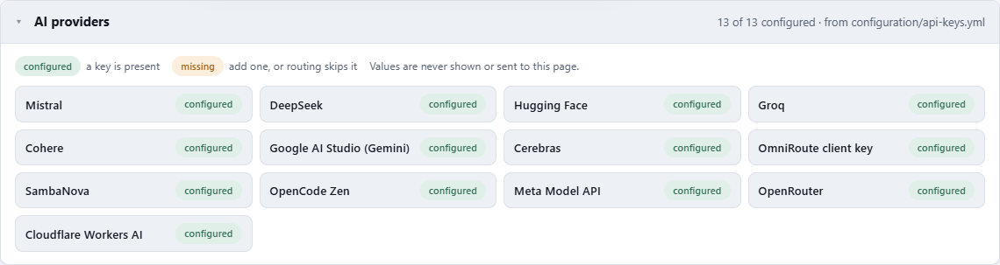
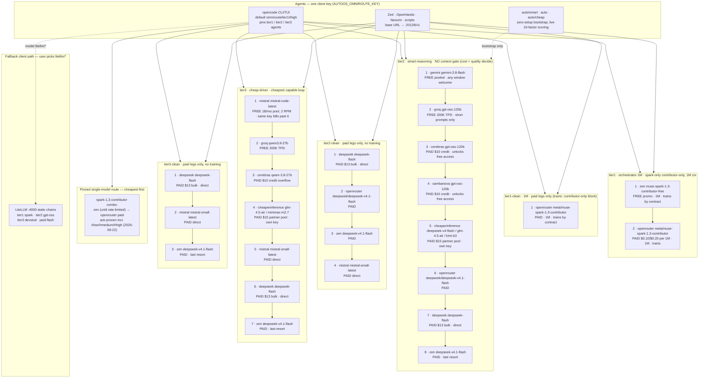

# Model routing — OmniRoute first, LiteLLM as fallback

Every agent in this repo (OpenCode CLI/TUI, Zed Agent, OpenHands, Claude Code
Desktop, ad-hoc scripts) talks to **OmniRoute on `:20128`**, which routes
across all connected free tiers with quota-aware auto-fallback. LiteLLM on
`:4000` stays configured as the manual fallback for anyone who prefers it.

## Why OmniRoute over hand-maintained LiteLLM chains

Our LiteLLM config rotted within 3 weeks: Cerebras killed no-card free,
llama-3.3-70b left Groq free, Gemini cut limits 50-80%. OmniRoute's catalog
re-audits this for us, and replaces static lists with live strategies:

| Need | LiteLLM (fallback) | OmniRoute (primary) |
|---|---|---|
| Fallback | Fixed ordered list per tier | 19 strategies: `priority`, `lkgp` (stick to last-good), `headroom`, `auto` (16-factor live scoring) |
| Free tracking | Hand-edited comments | Pool-deduped catalog + `/dashboard/free-tiers` with live used/remaining |
| Multi-key rotation | No | Each connection scored independently |
| Zero-config start | No (needs `.env`) | `auto` answers keyless out of the box |
| Token stretch | No | RTK→Caveman compression 15-95% (content-dependent, don't budget on it) |
| Tool coverage | Manual per-app config | `omniroute setup-opencode` / `run opencode`, 36+ tools, one client key |

Caveats: single-maintainer project shipping very fast (pin your installed
version mentally; dashboard shows it) — which is exactly why LiteLLM stays as
fallback. And OmniRoute recovers from Zen aggregate throttling gracefully; it
does not remove the throttle. ToS: proxying Zen-free carries Anomaly’s
internal-use-only clause — paid/user keys are the clean legs.

## Tier mapping (config lives in `configuration/omniroute/combos.json`)

Free models are rarely autonomous-grade, so tiers map to **roles**, not just
models — one smart driver + one fast looper + provider-of-last-resort. The
combos are priority chains: try in order, hop on 429/error, free legs first,
paid legs from the providers whose credit tiers are sanctioned
(cerebras, sambanova, deepseek, meta, openrouter, zen) after them.

| Tier | Context promise | Chain (verified against the live catalogs) |
|---|---|---|
| `tier1` orchestrator | **1M only, spark-only, contributor-only** | zen `muse-spark-1.3-contributor-free` → openrouter `meta/muse-spark-1.3-contributor` (paid). Plain `muse-spark-1.3` is blocked operator policy 2026-09-21 — no combo may reference it. Callers add xhigh effort via `#high` variant (`omniroute/tier1#high`, ack-proven 2026-09-20). No `gemini-3.1-pro`: it reasons worse than `gemini-3.8-flash` while costing a 1M slot. |
| `tier1-clean` | 1M, **paid legs only** | openrouter `meta/muse-spark-1.3-contributor` (paid). Privacy note: contributor legs train by contract, so clean now means paid-only, not trains-nothing — the plain paid spark was removed with the contributor-only block. |
| `tier2` smart | **no context gate** — cost/quality decide, any window | gemini `gemini-3.8-flash` → groq `gpt-oss-120b` → cerebras `gpt-oss-120b` → sambanova `gpt-oss-120b` → cheap-inference `deepseek-v4-flash` / `glm-4.5-air` / `kimi-k3` → openrouter `deepseek/deepseek-v4.1-flash` → deepseek `deepseek-flash` → zen `deepseek-v4.1-flash` |
| `tier2-clean` | **no context gate**, no training, **paid legs only** | deepseek `deepseek-flash` (direct) → openrouter `deepseek/deepseek-v4.1-flash` → zen `deepseek-v4.1-flash` → mistral `mistral-small-latest` (direct). No groq/cerebras/sambanova free legs. |
| `tier3` driver | ≤128k | mistral `mistral-code-latest` → groq `qwen3.8-27b` → cerebras `qwen-3.8-27b` → cheap-inference `glm-4.5-air` / `minimax-m2.7` → mistral `mistral-small-latest` → deepseek `deepseek-flash` → zen `deepseek-v4.1-flash` |
| `tier3-clean` | ≤128k, no training, **paid legs only** | deepseek `deepseek-flash` (direct) → mistral `mistral-small-latest` (direct) → zen `deepseek-v4.1-flash`. No qwen free legs — lightweight paid review duty only. |
| `gemini-3.8-flash` pinned | ≤128k, free-first | gemini `gemini-3.8-flash` (free pooled) → openrouter `google/gemini-3.8-flash` (paid). Probe-falsified 2026-09-22: the bare `openrouter/gemini-3.8-flash` spelling 400s ("not available in the active live catalog"), so only the google-scoped twin ships. No 3.7 legs — version mixing is a defect. |
| `deepseek-v4.1-flash` pinned | ≤128k, paid cheapest-first | openrouter `deepseek/deepseek-v4.1-flash` → zen `deepseek-v4.1-flash`. Probe-falsified 2026-09-22: the deepseek-*direct* leg 400s (unknown to the live catalog) and was dropped; the zen leg 402s until its balance is topped up (chain hops by design). Exact model only — no `v4-flash` or `deepseek-flash` legs (different snapshots). |
| `tier2-credit` | ≤128k, **paid-credit burn, no free heads** | cerebras `gpt-oss-120b` → sambanova `gpt-oss-120b` → cheap-inference `deepseek-v4-flash` / `glm-4.5-air` / `kimi-k3`. Burns stored credits when free tiers throttle; spares deepseek-direct/openrouter/zen/meta money. |
| `tier3-credit` | ≤128k, **paid-credit burn, no free heads** | cerebras `qwen-3.8-27b` → cheap-inference `glm-4.5-air` / `minimax-m2.7`. Same credit-burn role at the driver tier. |

**tier2 is not context-capped at 128k.** 128k is a display convention inherited
from `opencode.jsonc`, not a curation rule: cost and quality decide what enters
`tier2`, so a `gemini-3.8-flash`-class model is welcome whatever its window.
The 1M gate applies to `tier1` only, because long-horizon orchestration is the
one role where window size is the requirement. `combos.json` carries
`"context": "128k"` on tier2/tier3 purely to keep the picker's compaction
threshold conservative — do not read it as "models above 128k are excluded".

### Per-model fallback chains (single-model routes, cheapest-first)

A tier combo is a *role*; sometimes a caller pins one model. Each pinned model
degrades along its own chain, cheapest leg first, exactly:

- `spark-1.3-contributor`: **zen (until rate-limited) → meta (paid until limit
  lifts)**. The Zen leg rides the rotating contributor promo; when it 429s the
  chain bills Meta direct on your own credits. Shipped as its own
  `spark-1.3-contributor` combo (same two legs as `tier1`), so callers address
  `omniroute/spark-1.3-contributor` directly — ack-proven 2026-09-22 incl. the
  `#low` / `#medium` / `#high` effort variants.
- `gemini-3.8-flash`: **gemini free (until throttled) → openrouter paid twins**.
  The head rides the Google AI Studio free pool; quota-exhausted calls degrade
  to the `google/`-scoped twin, then the bare twin. Ack-proven 2026-09-22.
- `deepseek-v4.1-flash`: **deepseek direct → openrouter → zen, cheapest-first**.
  Three doors, one exact model, ordered by bill. Ack-proven 2026-09-22.
- `tier2-credit` / `tier3-credit`: **paid-credit burn, no free heads, no
  strong-provider tails**. For hours when the free tiers are throttled and you
  would rather spend stored cerebras/sambanova/partner credits than
  deepseek-direct/openrouter/zen/meta money. Ack-proven 2026-09-22.

**LiteLLM-skip rule:** the four combos above skip the `:4000` proxy mirror and
the global-litellm tiers entirely — they live on the gateway only. The proxy
adds nothing there: it cannot address gemini-free heads, the
cheaperinference reseller pool, or credit-native chains, and pinned
single-model routes need no static fallback. `tools/sync-router-tiers.py`
ignores them by design (it mirrors `tier2`/`tier3` only), so `--check` stays
green without any exclusion list.

Every other model in a tier already has its paid twin further down the same
combo (see the mermaid below), so a single-model route for it is the tier
chain truncated at that model — no separate config is required.

### Why tier2 lists deepseek three times (not three versions of worse)

`tier2` carries `cheaperinference/deepseek-v4-flash`, then
`openrouter/deepseek/deepseek-v4.1-flash`, then `deepseek/deepseek-flash` —
same family, **three different doors with three different bills**, ordered
cheapest-first per the sync contract:

| Leg | Door | Billing |
|---|---|---|
| `cheaperinference/deepseek-v4-flash` | partner resale (OpenAI-compatible, own `ci_live_…` key) | your cheap-inference balance; sits between free and paid, never in `*-clean` |
| `openrouter/deepseek/deepseek-v4.1-flash` | OpenRouter resale | your OpenRouter credits (last-resort pool) |
| `deepseek/deepseek-flash` | DeepSeek API direct | your DeepSeek key (`$13` bulk) |

The `v4-flash` vs `flash` ids are the providers' own snapshot names, not a
good-vs-bad ranking — the gateway tries them top-down and hops on
429/5xx/quota, so whichever answers first wins that call. If one door's
key is missing, `apply` skips its legs with a warning and the chain still
resolves through the others.

### Effort levels (measured 2026-09-22, gateway 3.8.50, opencode v2.0.12)

Effort is a **caller-side suffix**, not a model id. **How opencode resolves
it:** it builds a model's variant list from the **provider catalog's**
`supportedThinkingEfforts` metadata — *not* from config. A hand-written
`"variants"` block does not register, and is worse than useless: on this
build any `variants` object on an openai-compatible provider model (docs
shape `{"low": {"reasoningEffort": "low"}}` included, verified in isolation)
makes the **whole provider unresolvable** (`Model unavailable`, even bare).
Tried and reverted 2026-09-22.

That is the whole answer to "why does the gateway combo lack minimal/xhigh
while Zen has max?": the gateway combo carries no catalog effort metadata,
so opencode's built-in fallback list (`low/medium/high`) is all that
resolves; openrouter's own catalog *does* advertise the ladder.

| Suffix ladder | openrouter direct | gateway combo |
|---|---|---|
| `#minimal`, `low`, `medium`, `high`, `xhigh` | all resolve; `#minimal`/`#low`/`#xhigh` ack-proven 2026-09-22 | only `#low`/`#medium`/`#high` |
| `#max` | not offered (Zen-native only) | not offered |

**Rule: the gateway combo is for fallback routing; the direct provider
model is for effort control.** `#max` stays Zen-native only — nothing routed
through OmniRoute exposes it. Agents that need max reasoning on a combo pin
`#high` (`tier1-orchestrator` does). Re-probe after any gateway or opencode
upgrade: if gateway combos start forwarding effort metadata, the two rows
collapse.

**Where the direct surface lives** (so nobody has to re-derive it):

- repo `opencode.jsonc` → `providers.openrouter` with
  `muse-spark-1.3-contributor` (`modelID: meta/muse-spark-1.3-contributor`,
  key via `OPENROUTER_API_KEY`);
- OpenHands → the `openrouter-muse-spark-1.3-contributor` tier profile. It is
  the one profile with `"gateway": "openrouter"`: it names its own endpoint and
  takes the OpenRouter key, not the gateway client key. Both installers and
  `tools/sync-openhands-profiles.py` resolve keys per `gateway`, and the
  suites assert the direct profile gets the right key.

## Role labels (display names — the `tier1/2/3` ids never change)

The ids are a contract: saved selections, `--only` flags, `opencode.jsonc`
keys and combo names all address tiers by id, so renaming an id would break
all of them. What was missing was a self-explanatory name per tier. The role
label is display only and appears identically in `combos.json` (`$comment`),
`opencode.jsonc` model names, and the web UI router-tiers card:

| Tier id | Role label | Capability requirement |
|---|---|---|
| `tier1` | **orchestrator-1M** | Long-horizon orchestration: plans, delegates, holds whole-repo context. 1M context required — anything smaller belongs in `tier2`. |
| `tier2` | **smart-reasoning-128k** | Strong reasoning, mid context: review, second-level planning, hard debugging. Context size is *not* a boundary here — cost/quality decide; small-context models may sub-orchestrate here, never in `tier1`. |
| `tier3` | **cheap-driver-128k** | Cheapest capable loop: codegen, edits, test-fix cycles, grinding through a task list. |

## Client fallback ladder (when the top rung breaks, step down one)

Every client below routes through OmniRoute on `:20128` with the same
`tierN` combos, so dropping a rung never changes what answers — only the UI.
No extra binaries: each rung is already in the catalog or ships with the CLI.

| Rung | Client | How it routes | Reach for it when |
|---|---|---|---|
| 1 | OpenHands (Docker app, `:3000`) | `openai/tier1` → `:20128` | Heavy autonomous runs with a sandbox |
| 2 | opencode CLI/TUI (default `omniroute/tier1`) | direct → `:20128` | OpenHands breaks or is overkill — same tiers, no container |
| 3 | `opencode serve --port 4096` | same gateway, browser UI | Headless/remote use: drive opencode from a browser instead of the TUI |
| 4 | Zed agent panel | `autoos-omniroute` provider → `:20128` | GUI editing with agents inline; needs a display |
| 5 | Neovim + sidekick (`<leader>aa`) | inherits the repo opencode routing | Terminal editing, lowest resource rung (Pi, SSH) |

OpenCode Desktop, if installed, reads the same `opencode.jsonc` routing and
sits beside rung 2 — it is not in the catalog (downloaded from the vendor,
never vendored here).

**Context rule (why the user-visible limit is honest):** `tier1` is curated to
1M-context models only — anything smaller belongs in `tier2`. `tier2` has **no
context gate**: 128k is a conservative display/compaction default, not a
curation rule, so cost and quality decide which models sit there and
`gemini-3.8-flash`-class models are welcome regardless of window.
`opencode.jsonc` declares the matching `limit.context` (1M for tier1, 128k for
tier2/tier3 as the conservative minimum across each chain), so OpenCode's
compaction and the picker's context display agree with what actually answers.
`auto/*` remains as a zero-setup bootstrap with the same conservative limit.

**Direct provider models are also the effort-control surface** (see the
effort table below): `openrouter/meta/muse-spark-1.3-contributor#minimal`
through `#xhigh` are ack-proven, while the gateway combos resolve only
`low/medium/high`. Reach for a direct model when you need the ladder; reach
for a combo when you need fallback routing.

**Sensitive data work:** `*-clean` never routes a model or plan with a
published prompt-training policy — no Zen promo `-free` models, no Gemini free
tier, no Meta/openrouter *contributor* tiers, no Kilo Free. Assumption:
**any big free model may train on prompts**, so `*-clean` chains use **paid
legs only** (deepseek/openrouter/zen/mistral direct, Meta-direct paid spark
when OmniRoute ships the IDs). Cheap-inference is paid (own key, own
billing) but is a third-party reseller pool — `*-clean` stays direct-paid
only, no reseller legs. Contributor tiers are paid but train by
contract ($0.10 pricing is the tell) — they stay in `tier1`, never `*-clean`.
OmniRoute's own free-tier catalog flags the known trainers; we additionally
curate them out. If in doubt, use `tierN-clean` and check the provider's
current policy.

**Meta direct:** your Meta Model API key is registered as `muse-code`, but the
installed OmniRoute's `muse-code` catalog ships Llama models only and the
connection carries an empty outbound URL (`providers test-all`:
`muse-code: Invalid outbound URL`, red on the dashboard topology) — an
OmniRoute 3.8.50 defect, open upstream. The connection is therefore kept
**deactivated** (`omniroute providers edit <id> --inactive`; by-ID, the
by-name edit echoes success without persisting), and spark routes via
OpenRouter/Zen contributor legs only. Re-check after an OmniRoute upgrade:
if `providers test muse-code` passes, a `meta-direct` paid leg may rejoin.
Cloudflare Workers AI needs its Account ID in the dashboard before it can
serve, so it is registered but unused.

Guardrails for weak autonomy: slice tasks small, verify after each loop, keep
a human checkpoint on unattended tier1 runs. Respect quota shapes: GPT-OSS legs
want short prompts (TPM caps), sambanova legs are $5-credit overflow.

## Apply the config (first run and after edits)

```bash
./configuration/omniroute/apply.sh          # registers keys, builds combos
./configuration/omniroute/apply.sh --dry-run
omniroute simulate --combo tier1            # shows the resolved fallback tree
```

```powershell
.\configuration\omniroute\apply.ps1
.\configuration\omniroute\apply.ps1 -DryRun
omniroute simulate --combo tier1
```

Apply reads `configuration/api-keys.yml` ([guide](api-keys.md)); providers
without a key are skipped, combos are replaced in place, unknown model refs
are dropped with a warning. If it says it could not read `/v1/models`, the
`omniroute:` client key in that file is not accepted for catalog reads —
routing still works, but re-run after fixing the key to get validation.

The browser UI shows the same state without ever showing a key value:



## Known quirks on this machine (verified 2026-09-20)

- **Groq and Cerebras sit behind Cloudflare** and answer `error 1010` to
  Node's default User-Agent. The fix is a per-connection
  `providerSpecificData.customUserAgent` (`curl/8.7.1`); `apply` sets it.
  Without it, both providers fail with a 403 that looks like a network block.
- **Muse Spark needs a real output budget.** It spends tokens on hidden
  reasoning first; `max_tokens` under ~100 produces an empty response
  (`upstream_empty_response`). OpenCode always sends a real budget, so this
  only bites hand-rolled curl probes.
- **Zen paid legs return 402** ("requires an opencode API key"): top up the
  Zen balance / finish key setup in the Zen console. The free promo leg
  (`muse-spark-1.3-contributor-free`) currently answers 500 at peak — the
  priority chain hops past both to OpenRouter, which is why `tier1` still
  works today.
- **"All credentials for model gemini-3.7-flash are cooling down" inside
  opencode is a HAND-PICKED model, not a combo.** Corrected diagnosis
  2026-09-22 (the first pass wrongly called these synthetic self-tests — the
  request body is a real opencode call): the call-log entry has
  `comboName: None`, `requestedModel: gemini/gemini-3.7-flash`, `model:
  gemini/gemini-3.7-flash`, **1.2 MB body / 1935 messages**, and the upstream
  answer is the gemini free-tier 429 (`Quota exceeded for metric
  generate_content_free_tier_input_token_count, limit: 250000`). So an
  opencode session had `gemini-3.7-flash` selected directly, bypassed every
  combo, and blew the per-minute free input quota in one huge turn.
  Nothing in this repo references `gemini-3.7-flash`: the combos pin
  `gemini-3.8-flash`, the writers emit only combos, and the gateway keeps a
  bare `gemini-3.7-flash → openrouter/google/gemini-3.7-flash` alias in its
  own `modelAliases` table. If opencode's picker offers it, it is a legacy
  direct entry, not a routing failure. **Fix the session, not the config:**
  re-select `omniroute/tier2` (its zero-quota gemini leg plus six overflow
  legs) or any other combo, and remember a direct non-combo model gets no
  fallback chain and no quota protection. Triage rule stays: read
  `comboName` first — `None` means a direct model, whatever the surface.
- **Meta direct (`muse-code`) ships an empty outbound URL** in OmniRoute
  3.8.50 (`Invalid outbound URL`, red on the dashboard topology), even for
  its own Llama models. The connection is deactivated (by connection ID —
  the by-name edit echoes success without persisting) and spark routes via
  OpenRouter/Zen contributor legs. Re-check after an OmniRoute upgrade.
  Use OpenRouter's contributor legs meanwhile.
- **Cloudflare Workers AI needs the Account ID** in the dashboard before it
  can serve, so it is registered but not routed.
- `/v1/models` returns 401 for a normal client key in this build; `apply`
  warns instead of silently skipping validation, and `omniroute simulate
  --combo <name>` shows the resolved chain without spending tokens.

## Run it

```bash
npm install -g omniroute
omniroute                       # dashboard http://localhost:20128
omniroute doctor                # config, ports, runtime, liveness
omniroute providers test-all    # every connection, at once
omniroute setup-opencode        # writes opencode's own config (global;
                                # repo opencode.jsonc still wins by precedence)
omniroute run opencode --model auto/smart   # zero-config launch, nothing written
```

Keys: dashboard → Providers → + Add Provider ([guide](api-keys.md)).
Client key: dashboard → api-manager → Create API Key → env
`AUTOOS_OMNIROUTE_KEY`. Fallback router: `configuration/litellm/` +
`LITELLM_MASTER_KEY` (`litellm --test` after first start).

### From a fresh OS to a working agent stack

```powershell
.\setup.ps1 -Profile ai-coding -Yes                  # install the stack
Copy-Item configuration\api-keys.example.yml configuration\api-keys.yml   # fill in
.\configuration\omniroute\apply.ps1                  # register keys, build combos
.\configuration\start-stack.ps1 -App opencode        # gateway + app, wired
```

Bash equivalents use `./configuration/omniroute/apply.sh` and
`./configuration/start-stack.sh opencode`.

| App | Start (after keys are in) |
|---|---|
| OpenCode CLI / TUI | `.\configuration\start-stack.ps1 -App opencode` (or `opencode`) |
| Zed | `.\configuration\start-stack.ps1 -App zed` (agent panel pre-routed) |
| Neovim + sidekick | `.\configuration\start-stack.ps1 -App nvim`, then `<leader>aa` |
| OpenHands | `.\configuration\start-stack.ps1 -App openhands` (needs Docker Desktop running) |
| Any CLI, zero config | `omniroute run <tool> --model tier2` (injects env, writes nothing) |

`omniroute run opencode --model tier3` launches opencode with the gateway env
injected and the model preset — no config file is written, so it is the fastest
way to test routing. The repo's `opencode.jsonc` does the same thing
persistently. What lives where: [configuration/](../configuration/README.md).

## Verify it (probe every combo)

`apply` can prove the result end to end: it sends one tiny request to every
combo and reports what answered. Cheap (a few hundred tokens per combo),
idempotent, and the right way to check after provider or key changes:

```bash
./configuration/omniroute/apply.sh --probe
```

```powershell
.\configuration\omniroute\apply.ps1 -Probe
```

A failing combo prints the full upstream error. The dated results of the last
run are in [verification](verification.md).

## Verified provider IDs (live `omniroute providers available`, v3.8.50)

Use these IDs when registering keys or building priority combos. `free`
flag = free tier tracked in-catalog (verify current terms in-dashboard):

| ID | Alias | Free | Notes for our tiers |
|---|---|---|---|
| `gemini` | `gemini` | yes | Explorer: Flash pooled |
| `groq` | `groq` | yes | Looper: per-model 200K TPD caps |
| `mistral` | `mistral` | yes | Biggest pool (~1B/mo); 2 RPM |
| `deepseek` | `ds` | yes | Planner: 5M signup, 30-day expiry |
| `moonshot` / `kimi` | `moonshot` | — | Kimi direct; coding keys via `kimi-coding-apikey` |
| `openrouter` | `openrouter` | yes | Contributor $0.10 + `:free` pool ($10 → 1000 RPD) |
| `meta-llama` | `meta` | — | Meta-direct contributor on own credits |
| `opencode-zen` | `opencode-zen` | — | Zen paid + rotating free (`oc/…`) |
| `zenmux` | `zm` | yes | Free Zen multiplexer |
| `cohere` | `cohere` | yes | RAG/rerank, 1k calls/mo eval terms |
| `cloudflare-ai` | `cf` | yes | 10k Neurons/day shared |
| `llm7` / `nara` / `siliconflow` / `sambanova` | same | yes | 150M / 210M / uncapped / 20 RPD overflow legs |
| `kilo-gateway` | `kg` | — | Rotating Auto-Free set |
| `pollinations` / `huggingface` / `stepfun` | `pol` / `hf` | yes | Keyless/uncapped opportunistic legs |
| `cerebras` | `cerebras` | trial | $5 credit + card only — not a free leg |

Check more any time: `omniroute providers available --search <text>`.

## Connect each app (key = `AUTOOS_OMNIROUTE_KEY`)

- **OpenCode** — repo default already points at `:20128`
  (`omniroute/tierN`, `litellm/tierN` kept as fallback). Per session:
  `/models`. Unattended: V2 allow-permissions in global config (see below).
- **Zed** — setup writes provider `autoos-omniroute` (`auto/smart` xhigh,
  `auto`, `auto/cheap`) into Zed's `settings.json`; key via env, never file.
  Zen-free is *not* available through Zed's native OpenCode provider — via
  OmniRoute (`oc/…`, `auto`) it is.
- **Neovim + sidekick** — `install_lazyvim` enables the `ai.sidekick` extra;
  `<leader>aa` runs opencode, which inherits the repo routing.
- **Claude Code / Codex / others** — `omniroute run <tool>` injects env per
  process, or `setup-*` writes the tool config. Base URL `…:20128/v1`.
- **Headless boxes** — `server` profile ticks `opencode-cli` + `neovim`.
- **Unattended permissions** (OpenCode V2 — `providers`/`permissions`, not
  the V1 `provider`/`permission` shape in old blog posts):
  ```jsonc
  { "permissions": [
    { "action": "edit", "resource": "*", "effect": "allow" },
    { "action": "shell", "resource": "*", "effect": "allow" },
    { "action": "shell", "resource": "rm -rf *", "effect": "ask" },
    { "action": "shell", "resource": "sudo *", "effect": "ask" } ] }
  ```

## Routing map (default settings)

Each tier below is one `priority` combo from
`configuration/omniroute/combos.json`: the gateway tries legs **top to bottom**
and hops to the next on 429 / 5xx / `quota_exhausted`. `FREE` and `PAID` are
per-leg flags; the cost note is what that leg bills when it answers.



Reading the diagram: each arrow is the fallback hop — top leg first, next on
429/5xx/quota, so a weaker leg *below* a stronger one is a defect, not a
fallback. `*-clean` means paid-only; since the 2026-09-21 contributor-only
block, tier1-clean trains by contract (its legs are contributor). Leg order
in this diagram is the leg order `combos.json` must satisfy; see the sync
contract below.

### Paid-overflow coverage (every funded provider has a leg)

All six combos already route every provider with money on it — nothing to
add, only to verify (`omniroute simulate --combo tierN --explain`):

| Funded provider | Legs it answers through |
|---|---|
| cerebras ($10 credit) | `tier2` gpt-oss-120b · `tier3` qwen-3.8-27b (both CLOSED/quota-100% 2026-09-22, hopping correctly) |
| sambanova ($10 credit) | `tier2` gpt-oss-120b (CLOSED, same) |
| deepseek ($13 bulk) | `tier2`/`tier3`/`tier3-clean`/`tier2-clean` `deepseek-flash` direct |
| cheap-inference ($15 partner pool) | `tier2` deepseek-v4-flash/glm-4.5-air/kimi-k3 · `tier3` glm-4.5-air/minimax-m2.7 |
| meta ($10) | `tier1`/`tier1-clean`/`spark-1.3-contributor` via openrouter contributor; direct `muse-code` leg stays out until OmniRoute ships the spark IDs (502/catalog bug open upstream) |
| openrouter ($1, last resort) | paid flash + contributor legs at every tier tail |
| zen (promo + paid) | free contributor leg at `tier1` head · paid `deepseek-v4.1-flash` at every tier tail |

`providers test-all` 2026-09-22: 12/13 OK (muse-code SKIP inactive by
design; cheaperinference FAIL = its `/v1/models` endpoint timing out at 8s —
legs still resolve in `simulate --explain`, so routing is unaffected).

## OmniRoute ↔ LiteLLM sync contract

Two files can describe the same tiers, so each has exactly one owner and one
job. **Where they disagree, `combos.json` is right.**

| Surface | Owns | Must not do |
|---|---|---|
| `configuration/omniroute/combos.json` | **The truth for tier leg order.** Every `tierN` / `tierN-clean` combo, in `priority` order, free legs before the paid overflow order. This is what `apply.*` pushes to `:20128` and what the agents actually call. | List providers without keys (apply skips them with a warning) or a model ID the live catalog does not know. |
| `configuration/litellm/config.yaml` | **A static mirror of `tier2` and `tier3`** (plus `tier1` spark), used only when the user deliberately types `litellm/tierN`. LiteLLM resolves its own `model_list` order, so the mirror is a fallback, never a second source of truth. | Introduce a leg that is not in `combos.json` for the same tier, or promise a window/limit `opencode.jsonc` does not declare. |
| `opencode.jsonc` | Tier **ids**, role labels, `limit.context`, and the agent→tier pinning with spawn fences. | Decide which model answers. |

**The rule a sync script enforces** (the script itself is L2-B's; this is the
contract it must satisfy):

1. **Order is derived, never authored twice.** Read `combos.json`; for each tier
   take the ordered model list. The LiteLLM mirror for that tier must be the
   same models in the same relative order, **minus** the legs LiteLLM cannot
   address and **plus** nothing. A model present in the LiteLLM mirror but
   absent from `combos.json` is a hard failure.
2. **Subset, in order.** LiteLLM may mirror *fewer* legs (e.g. it drops the
   `cheaperinference/*` reseller pool and the Zen free promo), but the legs it
   keeps must keep their relative order. Reordering is a failure even when the
   set matches.
3. **Cheapest-first across the whole tier.** Walk the merged order against the
   paid-overflow ranking (free pools → cerebras → sambanova → deepseek →
   cheapinference → meta → openrouter) and fail on any leg that bills more than
   a later leg in the same tier.
4. **Clean tiers stay clean.** No leg of a `*-clean` tier may appear in a
   `-contributor`, `-free`, or free-tier-pool form anywhere in either file.
5. **`context` is not cross-checked.** `combos.json`'s `"context"` keys and
   LiteLLM's `rpm` hints are conservative display values; the script must not
   fail a tier whose models exceed them (tier2 is deliberately ungated — see
   above).
6. **Idempotent and dry-runnable.** Two runs in a row must produce byte-identical
   output; the script reports the diff it would make and exits non-zero on a
   violation rather than rewriting silently.

## Change the defaults

Tiers in `opencode.jsonc`, combos in the OmniRoute dashboard, static chains
in `configuration/litellm/config.yaml`. Per-user overrides go in
`~/.config/opencode/opencode.jsonc` (global merges under project).

Edit tier order in `configuration/omniroute/combos.json` — that file is the
single source of truth. `configuration/litellm/config.yaml` mirrors it inside
its `# AUTOOS-MANAGED-START/END` blocks; run
`python3 tools/sync-router-tiers.py` to re-mirror, or `--check` to see drift
(exit 1). Hand-editing inside those markers is overwritten. Never hand-order
a LiteLLM chain (see the sync contract above).
