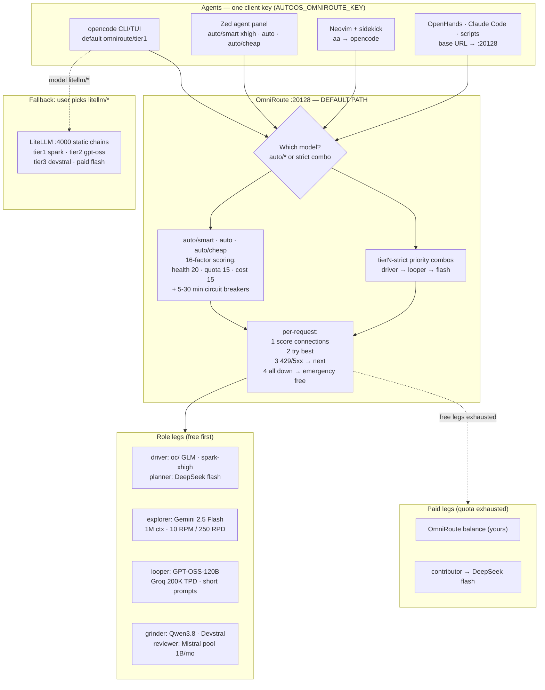

# Model routing — OmniRoute first, LiteLLM as fallback

Every agent in this repo (OpenCode CLI/TUI, Zed Agent, OpenHands, Claude Code
Desktop, ad-hoc scripts) talks to **OmniRoute on `:20128`**, which routes
across all connected free tiers with quota-aware auto-fallback. LiteLLM on
`:4000` stays configured as the manual fallback for anyone who prefers it.

## Why OmniRoute over hand-maintained LiteLLM chains

Our LiteLLM config rotted within 3 weeks: Cerebras killed no-card free,
llama-3.3-70b left Groq free, Gemini cut limits 50-80%. OmniRoute's catalog
re-audits this for us, and replaces static lists with live strategies:

| Need | LiteLLM (fallback) | OmniRoute (primary) |
|---|---|---|
| Fallback | Fixed ordered list per tier | 19 strategies: `priority`, `lkgp` (stick to last-good), `headroom`, `auto` (16-factor live scoring) |
| Free tracking | Hand-edited comments | Pool-deduped catalog + `/dashboard/free-tiers` with live used/remaining |
| Multi-key rotation | No | Each connection scored independently |
| Zero-config start | No (needs `.env`) | `auto` answers keyless out of the box |
| Token stretch | No | RTK→Caveman compression 15-95% (content-dependent, don't budget on it) |
| Tool coverage | Manual per-app config | `omniroute setup-opencode` / `run opencode`, 36+ tools, one client key |

Caveats: single-maintainer project shipping very fast (pin your installed
version mentally; dashboard shows it) — which is exactly why LiteLLM stays as
fallback. And OmniRoute recovers from Zen aggregate throttling gracefully; it
does not remove the throttle. ToS: proxying Zen-free carries Anomaly’s
internal-use-only clause — paid/user keys are the clean legs.

## Tier mapping (repo defaults in `opencode.jsonc`)

Free models are rarely autonomous-grade, so tiers map to **roles**, not just
models — one smart driver + one fast looper + provider-of-last-resort:

| Tier | Default model | Roles it covers (what `auto/*` picks among connected) |
|---|---|---|
| `tier1` orchestrator | `auto/smart` | **Driver**: GLM-4.7/5.x-class or spark-xhigh (`oc/…`, contributor) · **Planner**: DeepSeek V4-Flash · paid: contributor → flash → your balance |
| `tier2` smart | `auto` | **Explorer**: Gemini 2.5 Flash (1M ctx, grounding) · **Looper**: GPT-OSS-120B (Groq speed) · overflow: Mistral pool |
| `tier3` driver | `auto/cheap` | **Grinder**: Qwen3.8-27B chunks · **Reviewer**: Mistral small / Devstral · **Judge**: cheap summarizer · paid: flash |

Guardrails for weak autonomy: slice tasks small, verify after each loop,
keep a human checkpoint on unattended tier1 runs, and prefer deterministic
priority combos over exploratory `auto/smart` (5-10% bandit exploration) for
long runs. Respect quota shapes: GPT-OSS legs want short prompts (TPM caps),
SambaNova-class legs get summary duty only (20 RPD).

Exact-control combos (dashboard → combos, or `omniroute combo create`; send
the exact name as the model):

- `tier1-strict`: `oc/` spark/GLM free → OpenRouter contributor ($0.10) →
  Meta-direct contributor (own credits) → paid `deepseek-v4.1-flash`.
- `tier2-strict`: Gemini Flash → Groq GPT-OSS → Mistral pool.
- `tier3-strict`: Mistral Devstral → Groq/Qwen → Gemini → paid flash.

Your OmniRoute balance (already topped up) is the final paid leg behind these.

## Run it

```bash
npm install -g omniroute
omniroute                       # dashboard http://localhost:20128
omniroute doctor                # config, ports, runtime, liveness
omniroute providers test-all    # every connection, at once
omniroute setup-opencode        # writes opencode's own config (global;
                                # repo opencode.jsonc still wins by precedence)
omniroute run opencode --model auto/smart   # zero-config launch, nothing written
```

Keys: dashboard → Providers → + Add Provider ([guide](api-keys.md)).
Client key: dashboard → api-manager → Create API Key → env
`AUTOOS_OMNIROUTE_KEY`. Fallback router: `configuration/litellm/` +
`LITELLM_MASTER_KEY` (`litellm --test` after first start).

## Verified provider IDs (live `omniroute providers available`, v3.8.50)

Use these IDs when registering keys or building priority combos. `free`
flag = free tier tracked in-catalog (verify current terms in-dashboard):

| ID | Alias | Free | Notes for our tiers |
|---|---|---|---|
| `gemini` | `gemini` | yes | Explorer: Flash pooled |
| `groq` | `groq` | yes | Looper: per-model 200K TPD caps |
| `mistral` | `mistral` | yes | Biggest pool (~1B/mo); 2 RPM |
| `deepseek` | `ds` | yes | Planner: 5M signup, 30-day expiry |
| `moonshot` / `kimi` | `moonshot` | — | Kimi direct; coding keys via `kimi-coding-apikey` |
| `openrouter` | `openrouter` | yes | Contributor $0.10 + `:free` pool ($10 → 1000 RPD) |
| `meta-llama` | `meta` | — | Meta-direct contributor on own credits |
| `opencode-zen` | `opencode-zen` | — | Zen paid + rotating free (`oc/…`) |
| `zenmux` | `zm` | yes | Free Zen multiplexer |
| `cohere` | `cohere` | yes | RAG/rerank, 1k calls/mo eval terms |
| `cloudflare-ai` | `cf` | yes | 10k Neurons/day shared |
| `llm7` / `nara` / `siliconflow` / `sambanova` | same | yes | 150M / 210M / uncapped / 20 RPD overflow legs |
| `kilo-gateway` | `kg` | — | Rotating Auto-Free set |
| `pollinations` / `huggingface` / `stepfun` | `pol` / `hf` | yes | Keyless/uncapped opportunistic legs |
| `cerebras` | `cerebras` | trial | $5 credit + card only — not a free leg |

Check more any time: `omniroute providers available --search <text>`.

## Connect each app (key = `AUTOOS_OMNIROUTE_KEY`)

- **OpenCode** — repo default already points at `:20128`
  (`omniroute/tierN`, `litellm/tierN` kept as fallback). Per session:
  `/models`. Unattended: V2 allow-permissions in global config (see below).
- **Zed** — setup writes provider `autoos-omniroute` (`auto/smart` xhigh,
  `auto`, `auto/cheap`) into Zed's `settings.json`; key via env, never file.
  Zen-free is *not* available through Zed's native OpenCode provider — via
  OmniRoute (`oc/…`, `auto`) it is.
- **Neovim + sidekick** — `install_lazyvim` enables the `ai.sidekick` extra;
  `<leader>aa` runs opencode, which inherits the repo routing.
- **Claude Code / Codex / others** — `omniroute run <tool>` injects env per
  process, or `setup-*` writes the tool config. Base URL `…:20128/v1`.
- **Headless boxes** — `server` profile ticks `opencode-cli` + `neovim`.
- **Unattended permissions** (OpenCode V2 — `providers`/`permissions`, not
  the V1 `provider`/`permission` shape in old blog posts):
  ```jsonc
  { "permissions": [
    { "action": "edit", "resource": "*", "effect": "allow" },
    { "action": "shell", "resource": "*", "effect": "allow" },
    { "action": "shell", "resource": "rm -rf *", "effect": "ask" },
    { "action": "shell", "resource": "sudo *", "effect": "ask" } ] }
  ```

## Routing map (default settings)



## Change the defaults

Tiers in `opencode.jsonc`, combos in the OmniRoute dashboard, static chains
in `configuration/litellm/config.yaml`. Per-user overrides go in
`~/.config/opencode/opencode.jsonc` (global merges under project).
