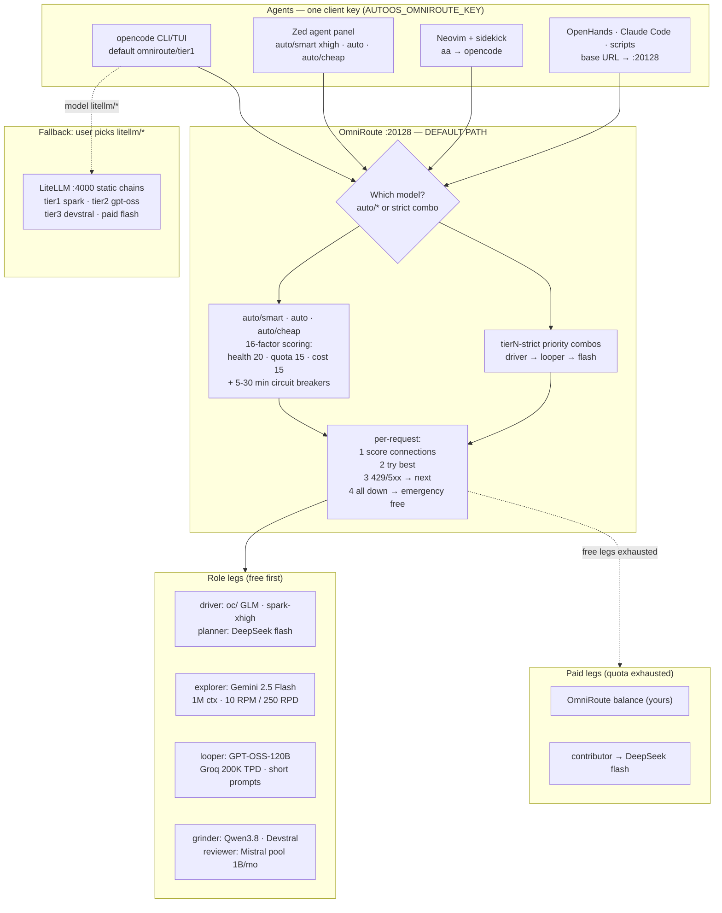

# Model routing — OmniRoute first, LiteLLM as fallback

Every agent in this repo (OpenCode CLI/TUI, Zed Agent, OpenHands, Claude Code
Desktop, ad-hoc scripts) talks to **OmniRoute on `:20128`**, which routes
across all connected free tiers with quota-aware auto-fallback. LiteLLM on
`:4000` stays configured as the manual fallback for anyone who prefers it.

## Why OmniRoute over hand-maintained LiteLLM chains

Our LiteLLM config rotted within 3 weeks: Cerebras killed no-card free,
llama-3.3-70b left Groq free, Gemini cut limits 50-80%. OmniRoute's catalog
re-audits this for us, and replaces static lists with live strategies:

| Need | LiteLLM (fallback) | OmniRoute (primary) |
|---|---|---|
| Fallback | Fixed ordered list per tier | 19 strategies: `priority`, `lkgp` (stick to last-good), `headroom`, `auto` (16-factor live scoring) |
| Free tracking | Hand-edited comments | Pool-deduped catalog + `/dashboard/free-tiers` with live used/remaining |
| Multi-key rotation | No | Each connection scored independently |
| Zero-config start | No (needs `.env`) | `auto` answers keyless out of the box |
| Token stretch | No | RTK→Caveman compression 15-95% (content-dependent, don't budget on it) |
| Tool coverage | Manual per-app config | `omniroute setup-opencode` / `run opencode`, 36+ tools, one client key |

Caveats: single-maintainer project shipping very fast (pin your installed
version mentally; dashboard shows it) — which is exactly why LiteLLM stays as
fallback. And OmniRoute recovers from Zen aggregate throttling gracefully; it
does not remove the throttle. ToS: proxying Zen-free carries Anomaly’s
internal-use-only clause — paid/user keys are the clean legs.

## Tier mapping (config lives in `configuration/omniroute/combos.json`)

Free models are rarely autonomous-grade, so tiers map to **roles**, not just
models — one smart driver + one fast looper + provider-of-last-resort. The
combos are priority chains: try in order, hop on 429/error, free legs first,
paid legs from the providers whose credit tiers are sanctioned
(cerebras, sambanova, deepseek, meta, openrouter, zen) after them.

| Tier | Context promise | Chain (verified against the live catalogs) |
|---|---|---|
| `tier1` orchestrator | **1M only, spark-only** | zen `muse-spark-1.3-contributor-free` → openrouter `meta/muse-spark-1.3-contributor` → zen `muse-spark-1.3`. Callers add xhigh effort via `#high` variant (`omniroute/tier1#high`, ack-proven 2026-09-20). No `gemini-3.1-pro`: it reasons worse than `gemini-3.8-flash` while costing a 1M slot. |
| `tier1-clean` | 1M, no training, **paid legs only** | openrouter `meta/muse-spark-1.3` (paid, trains nothing) → zen `muse-spark-1.3` (paid). No free legs: any big free model may train on prompts. |
| `tier2` smart | ≤128k | gemini `gemini-3.8-flash` → groq `gpt-oss-120b` → cerebras `gpt-oss-120b` → sambanova `gpt-oss-120b` → cheap-inference `deepseek-v4-flash` / `glm-4.5-air` / `kimi-k3` → openrouter `deepseek/deepseek-v4.1-flash` → deepseek `deepseek-flash` → zen `deepseek-v4.1-flash` |
| `tier2-clean` | ≤128k, no training, **paid legs only** | deepseek `deepseek-flash` (direct) → openrouter `deepseek/deepseek-v4.1-flash` → zen `deepseek-v4.1-flash` → mistral `mistral-small-latest` (direct). No groq/cerebras/sambanova free legs. |
| `tier3` driver | ≤128k | mistral `mistral-code-latest` → groq `qwen3.8-27b` → cerebras `qwen-3.8-27b` → cheap-inference `glm-4.5-air` / `minimax-m2.7` → mistral `mistral-small-latest` → deepseek `deepseek-flash` → zen `deepseek-v4.1-flash` |
| `tier3-clean` | ≤128k, no training, **paid legs only** | deepseek `deepseek-flash` (direct) → mistral `mistral-small-latest` (direct) → zen `deepseek-v4.1-flash`. No qwen free legs — lightweight paid review duty only. |

## Role labels (display names — the `tier1/2/3` ids never change)

The ids are a contract: saved selections, `--only` flags, `opencode.jsonc`
keys and combo names all address tiers by id, so renaming an id would break
all of them. What was missing was a self-explanatory name per tier. The role
label is display only and appears identically in `combos.json` (`$comment`),
`opencode.jsonc` model names, and the web UI router-tiers card:

| Tier id | Role label | Capability requirement |
|---|---|---|
| `tier1` | **orchestrator-1M** | Long-horizon orchestration: plans, delegates, holds whole-repo context. 1M context required — anything smaller belongs in `tier2`. |
| `tier2` | **smart-reasoning-128k** | Strong reasoning at mid context: review, second-level planning, hard debugging. Small-context models may sub-orchestrate here, never in `tier1`. |
| `tier3` | **cheap-driver-128k** | Cheapest capable loop: codegen, edits, test-fix cycles, grinding through a task list. |

## Client fallback ladder (when the top rung breaks, step down one)

Every client below routes through OmniRoute on `:20128` with the same
`tierN` combos, so dropping a rung never changes what answers — only the UI.
No extra binaries: each rung is already in the catalog or ships with the CLI.

| Rung | Client | How it routes | Reach for it when |
|---|---|---|---|
| 1 | OpenHands (Docker app, `:3000`) | `openai/tier1` → `:20128` | Heavy autonomous runs with a sandbox |
| 2 | opencode CLI/TUI (default `omniroute/tier1`) | direct → `:20128` | OpenHands breaks or is overkill — same tiers, no container |
| 3 | `opencode serve --port 4096` | same gateway, browser UI | Headless/remote use: drive opencode from a browser instead of the TUI |
| 4 | Zed agent panel | `autoos-omniroute` provider → `:20128` | GUI editing with agents inline; needs a display |
| 5 | Neovim + sidekick (`<leader>aa`) | inherits the repo opencode routing | Terminal editing, lowest resource rung (Pi, SSH) |

OpenCode Desktop, if installed, reads the same `opencode.jsonc` routing and
sits beside rung 2 — it is not in the catalog (downloaded from the vendor,
never vendored here).

**Context rule (why the user-visible limit is honest):** `tier1` is curated to
1M-context models only — anything smaller belongs in `tier2`. `opencode.jsonc`
declares the matching `limit.context` (1M for tier1, 128k for tier2/tier3,
which is what OmniRoute computes as the minimum across each chain), so
OpenCode's compaction and the picker's context display agree with what
actually answers. `auto/*` remains as a zero-setup bootstrap with the same
conservative limit.

**Sensitive data work:** `*-clean` never routes a model or plan with a
published prompt-training policy — no Zen promo `-free` models, no Gemini free
tier, no Meta/openrouter *contributor* tiers, no Kilo Free. Assumption:
**any big free model may train on prompts**, so `*-clean` chains use **paid
legs only** (deepseek/openrouter/zen/mistral direct, Meta-direct paid spark
when OmniRoute ships the IDs). Cheap-inference is paid (own key, own
billing) but is a third-party reseller pool — `*-clean` stays direct-paid
only, no reseller legs. Contributor tiers are paid but train by
contract ($0.10 pricing is the tell) — they stay in `tier1`, never `*-clean`.
OmniRoute's own free-tier catalog flags the known trainers; we additionally
curate them out. If in doubt, use `tierN-clean` and check the provider's
current policy.

**Meta direct:** your Meta Model API key is registered as `muse-code`. The
installed OmniRoute's `muse-code` catalog ships Llama models only and rejects
`muse-spark-*` ("not available in the active live catalog"), so Meta-direct
spark is not in the tiers yet; Zen's paid `muse-spark-1.3` covers that need
until OmniRoute ships the spark ids. Cloudflare Workers AI needs its Account
ID in the dashboard before it can serve, so it is registered but unused.

Guardrails for weak autonomy: slice tasks small, verify after each loop, keep
a human checkpoint on unattended tier1 runs. Respect quota shapes: GPT-OSS legs
want short prompts (TPM caps), sambanova legs are $5-credit overflow.

## Apply the config (first run and after edits)

```bash
./configuration/omniroute/apply.sh          # registers keys, builds combos
./configuration/omniroute/apply.sh --dry-run
omniroute simulate --combo tier1            # shows the resolved fallback tree
```

```powershell
.\configuration\omniroute\apply.ps1
.\configuration\omniroute\apply.ps1 -DryRun
omniroute simulate --combo tier1
```

Apply reads `configuration/api-keys.yml` ([guide](api-keys.md)); providers
without a key are skipped, combos are replaced in place, unknown model refs
are dropped with a warning. If it says it could not read `/v1/models`, the
`omniroute:` client key in that file is not accepted for catalog reads —
routing still works, but re-run after fixing the key to get validation.

The browser UI shows the same state without ever showing a key value:


## Known quirks on this machine (verified 2026-09-20)

- **Groq and Cerebras sit behind Cloudflare** and answer `error 1010` to
  Node's default User-Agent. The fix is a per-connection
  `providerSpecificData.customUserAgent` (`curl/8.7.1`); `apply` sets it.
  Without it, both providers fail with a 403 that looks like a network block.
- **Muse Spark needs a real output budget.** It spends tokens on hidden
  reasoning first; `max_tokens` under ~100 produces an empty response
  (`upstream_empty_response`). OpenCode always sends a real budget, so this
  only bites hand-rolled curl probes.
- **Zen paid legs return 402** ("requires an opencode API key"): top up the
  Zen balance / finish key setup in the Zen console. The free promo leg
  (`muse-spark-1.3-contributor-free`) currently answers 500 at peak — the
  priority chain hops past both to OpenRouter, which is why `tier1` still
  works today.
- **Meta direct (`muse-code`) 502s** in OmniRoute 3.8.50
  (`Cannot read properties of undefined`), even for its own Llama models. The
  key is registered and ready; Meta-direct spark enters the tiers when
  OmniRoute fixes the provider. Use OpenRouter's `meta/muse-spark-*` (plain
  ID = no training, `-contributor` = trains) meanwhile.
- **Cloudflare Workers AI needs the Account ID** in the dashboard before it
  can serve, so it is registered but not routed.
- `/v1/models` returns 401 for a normal client key in this build; `apply`
  warns instead of silently skipping validation, and `omniroute simulate
  --combo <name>` shows the resolved chain without spending tokens.

## Run it

```bash
npm install -g omniroute
omniroute                       # dashboard http://localhost:20128
omniroute doctor                # config, ports, runtime, liveness
omniroute providers test-all    # every connection, at once
omniroute setup-opencode        # writes opencode's own config (global;
                                # repo opencode.jsonc still wins by precedence)
omniroute run opencode --model auto/smart   # zero-config launch, nothing written
```

Keys: dashboard → Providers → + Add Provider ([guide](api-keys.md)).
Client key: dashboard → api-manager → Create API Key → env
`AUTOOS_OMNIROUTE_KEY`. Fallback router: `configuration/litellm/` +
`LITELLM_MASTER_KEY` (`litellm --test` after first start).

## Verify it (probe every combo)

`apply` can prove the result end to end: it sends one tiny request to every
combo and reports what answered. Cheap (a few hundred tokens per combo),
idempotent, and the right way to check after provider or key changes:

```bash
./configuration/omniroute/apply.sh --probe
```

```powershell
.\configuration\omniroute\apply.ps1 -Probe
```

A failing combo prints the full upstream error. The dated results of the last
run are in [verification](verification.md).

## Verified provider IDs (live `omniroute providers available`, v3.8.50)

Use these IDs when registering keys or building priority combos. `free`
flag = free tier tracked in-catalog (verify current terms in-dashboard):

| ID | Alias | Free | Notes for our tiers |
|---|---|---|---|
| `gemini` | `gemini` | yes | Explorer: Flash pooled |
| `groq` | `groq` | yes | Looper: per-model 200K TPD caps |
| `mistral` | `mistral` | yes | Biggest pool (~1B/mo); 2 RPM |
| `deepseek` | `ds` | yes | Planner: 5M signup, 30-day expiry |
| `moonshot` / `kimi` | `moonshot` | — | Kimi direct; coding keys via `kimi-coding-apikey` |
| `openrouter` | `openrouter` | yes | Contributor $0.10 + `:free` pool ($10 → 1000 RPD) |
| `meta-llama` | `meta` | — | Meta-direct contributor on own credits |
| `opencode-zen` | `opencode-zen` | — | Zen paid + rotating free (`oc/…`) |
| `zenmux` | `zm` | yes | Free Zen multiplexer |
| `cohere` | `cohere` | yes | RAG/rerank, 1k calls/mo eval terms |
| `cloudflare-ai` | `cf` | yes | 10k Neurons/day shared |
| `llm7` / `nara` / `siliconflow` / `sambanova` | same | yes | 150M / 210M / uncapped / 20 RPD overflow legs |
| `kilo-gateway` | `kg` | — | Rotating Auto-Free set |
| `pollinations` / `huggingface` / `stepfun` | `pol` / `hf` | yes | Keyless/uncapped opportunistic legs |
| `cerebras` | `cerebras` | trial | $5 credit + card only — not a free leg |

Check more any time: `omniroute providers available --search <text>`.

## Connect each app (key = `AUTOOS_OMNIROUTE_KEY`)

- **OpenCode** — repo default already points at `:20128`
  (`omniroute/tierN`, `litellm/tierN` kept as fallback). Per session:
  `/models`. Unattended: V2 allow-permissions in global config (see below).
- **Zed** — setup writes provider `autoos-omniroute` (`auto/smart` xhigh,
  `auto`, `auto/cheap`) into Zed's `settings.json`; key via env, never file.
  Zen-free is *not* available through Zed's native OpenCode provider — via
  OmniRoute (`oc/…`, `auto`) it is.
- **Neovim + sidekick** — `install_lazyvim` enables the `ai.sidekick` extra;
  `<leader>aa` runs opencode, which inherits the repo routing.
- **Claude Code / Codex / others** — `omniroute run <tool>` injects env per
  process, or `setup-*` writes the tool config. Base URL `…:20128/v1`.
- **Headless boxes** — `server` profile ticks `opencode-cli` + `neovim`.
- **Unattended permissions** (OpenCode V2 — `providers`/`permissions`, not
  the V1 `provider`/`permission` shape in old blog posts):
  ```jsonc
  { "permissions": [
    { "action": "edit", "resource": "*", "effect": "allow" },
    { "action": "shell", "resource": "*", "effect": "allow" },
    { "action": "shell", "resource": "rm -rf *", "effect": "ask" },
    { "action": "shell", "resource": "sudo *", "effect": "ask" } ] }
  ```

## Routing map (default settings)



## Change the defaults

Tiers in `opencode.jsonc`, combos in the OmniRoute dashboard, static chains
in `configuration/litellm/config.yaml`. Per-user overrides go in
`~/.config/opencode/opencode.jsonc` (global merges under project).
