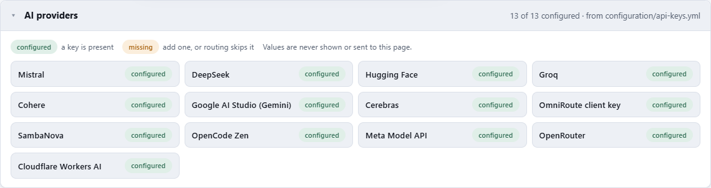

# Model routing — OmniRoute first, LiteLLM as fallback

Every agent in this repo (OpenCode CLI/TUI, Zed Agent, OpenHands, Claude Code
Desktop, ad-hoc scripts) talks to **OmniRoute on `:20128`**, which routes
across all connected free tiers with quota-aware auto-fallback. LiteLLM on
`:4000` stays configured as the manual fallback for anyone who prefers it.

## Why OmniRoute over hand-maintained LiteLLM chains

Our LiteLLM config rotted within 3 weeks: Cerebras killed no-card free,
llama-3.3-70b left Groq free, Gemini cut limits 50-80%. OmniRoute's catalog
re-audits this for us, and replaces static lists with live strategies:

| Need | LiteLLM (fallback) | OmniRoute (primary) |
|---|---|---|
| Fallback | Fixed ordered list per tier | 19 strategies: `priority`, `lkgp` (stick to last-good), `headroom`, `auto` (16-factor live scoring) |
| Free tracking | Hand-edited comments | Pool-deduped catalog + `/dashboard/free-tiers` with live used/remaining |
| Multi-key rotation | No | Each connection scored independently |
| Zero-config start | No (needs `.env`) | `auto` answers keyless out of the box |
| Token stretch | No | RTK→Caveman compression 15-95% (content-dependent, don't budget on it) |
| Tool coverage | Manual per-app config | `omniroute setup-opencode` / `run opencode`, 36+ tools, one client key |

Caveats: single-maintainer project shipping very fast (pin your installed
version mentally; dashboard shows it) — which is exactly why LiteLLM stays as
fallback. And OmniRoute recovers from Zen aggregate throttling gracefully; it
does not remove the throttle. ToS: proxying Zen-free carries Anomaly’s
internal-use-only clause — paid/user keys are the clean legs.

## Tier mapping (config lives in `configuration/omniroute/combos.json`)

Free models are rarely autonomous-grade, so tiers map to **roles**, not just
models — one smart driver + one fast looper + provider-of-last-resort. The
combos are priority chains: try in order, hop on 429/error, free legs first,
paid legs from the providers whose credit tiers are sanctioned
(cerebras, sambanova, deepseek, openrouter, zen) after them. MUSEAPI
2026-09-27 changed Meta: its contributor model now bills through the gateway
as the `meta_api` provider (`meta-api/muse-spark-1.3-contributor`) and heads t1;
the direct opencode `meta` provider is still how the plain `muse-spark` model
answers. `meta_api` trains on prompts, so it is never a `*-clean` leg.

<!-- AUTOOS-MANAGED-START models-doc -->
_Generated from `catalog/ai-registry.json` — do not edit by hand. Run `python3 tools/registry.py render models-doc --check` after a registry change; if it fails, run `python3 tools/registry.py render models-doc` and replace the text between the two `AUTOOS-MANAGED-START/END models-doc` markers below with its output._

| Route | Class | Context | Legs |
|---|---|---|---|
| `auto` | mid | 131,072 | (none) |
| `auto/cheap` | cheap | 131,072 | (none) |
| `auto/smart` | mid | 131,072 | (none) |
| `cheaperinference/glm-5.2` | cheap | 128k | ~~cheaperinference `glm-5.2`~~ (unavailable) |
| `cheaperinference/kimi-k3` | cheap | 128k | ~~cheaperinference `kimi-k3`~~ (unavailable) |
| `deepseek-v4.1-flash` | cheap | 1M | deepseek `deepseek-flash` → ~~opencode-zen `deepseek-v4.1-flash`~~ (unavailable) |
| `gemini-3.8-flash` | cheap | 1M | gemini `gemini-3.8-flash` → vertex `gemini-3.8-flash` → ~~deepinfra `google/gemini-3.5-flash`~~ (unavailable) |
| `groq-qwen3.8-27b` | free | 128k | groq `qwen/qwen3.8-27b` |
| `hf-glm-5.2` | free | 128k | ~~huggingface `zai-org/GLM-5.2`~~ (unavailable) |
| `hf-qwen3.8-27b` | free | 128k | ~~huggingface `Qwen/Qwen3.8-27B`~~ (unavailable) |
| `opus-4-6` | frontier | 1M | ~~cc `claude-opus-4-6`~~ (unavailable) |
| `or-laguna-s-2.1-free` | free | 256k | openrouter `poolside/laguna-s-2.1:free` |
| `or-nemotron-3-super-free` | free | 256k | openrouter `nvidia/nemotron-3-super-120b-a12b:free` |
| `or-north-mini-code-free` | free | 256k | openrouter `cohere/north-mini-code:free` |
| `or-qwen3.8-27b-free` | free | 256k | openrouter `qwen/qwen3.8-27b:free` |
| `ovh-gpt-oss-120b` | credit | 128k | ovhcloud `gpt-oss-120b` |
| `ovh-qwen3-coder-30b` | credit | 128k | ovhcloud `Qwen3-Coder-30B-A3B-Instruct` |
| `ovh-qwen3.8-27b` | credit | 128k | ovhcloud `Qwen3.8-27B` |
| `samba/MiniMax-M3` | cheap | 128k | ~~samba `MiniMax-M3`~~ (unavailable) |
| `samba/gpt-oss-120b` | cheap | 128k | ~~samba `gpt-oss-120b`~~ (unavailable) |
| `spark-1.3-contributor` | cheap | 1M | meta_api `muse-spark-1.3-contributor` → ~~opencode-zen `muse-spark-1.3-contributor-free`~~ (unavailable) |
| `t1-orchestrator` | cheap | 1M | gemini `gemini-3.8-flash` → free_ai `google/gemini-3.8-flash` → vertex `gemini-3.8-flash` → meta_api `muse-spark-1.3-contributor` → deepseek `deepseek-flash` |
| `t1-orchestrator-clean` | cheap | 1M | ~~openrouter `meta/muse-spark-1.3-contributor`~~ (unavailable) |
| `t1-orchestrator-free-only` | free | 1M | gemini `gemini-3.8-flash` |
| `t1-orchestrator-paid` | cheap | 1M | meta_api `muse-spark-1.3-contributor` → deepseek `deepseek-flash` |
| `t2-orchestrator` | frontier | 128k | ovhcloud `gpt-oss-120b` → ovhcloud `Qwen3.8-27B` → vertex `gemini-3.8-flash` → deepseek `deepseek-flash` |
| `t2-worker` | mid | 128k | gemini `gemini-3.8-flash` → groq `qwen/qwen3.8-27b` → openrouter `nvidia/nemotron-3-super-120b-a12b:free` → groq `openai/gpt-oss-20b` → openrouter `cohere/north-mini-code:free` → groq `openai/gpt-oss-120b` → openrouter `qwen/qwen3.8-27b:free` → openrouter `poolside/laguna-s-2.1:free` → free_ai `qwen7b` → scaleway `qwen3-235b-a22b-instruct-2507` → scaleway `mistral-small-3.2-24b-instruct-2506` → ovhcloud `gpt-oss-120b` → ~~ovhcloud `Qwen3-Coder-30B-A3B-Instruct`~~ (unavailable) → ovhcloud `Qwen3.8-27B` → vertex `gemini-3.8-flash` → meta_api `muse-spark-1.3-contributor` → deepseek `deepseek-flash` → ~~cerebras `gpt-oss-120b`~~ (unavailable) → ~~sambanova `gpt-oss-120b`~~ (unavailable) → ~~cheaperinference `deepseek-v4-flash`~~ (unavailable) → ~~cheaperinference `glm-4.5-air`~~ (unavailable) → ~~cheaperinference `kimi-k3`~~ (unavailable) → ~~opencode-zen `deepseek-v4.1-flash`~~ (unavailable) → ~~morph `morph-dsv4flash`~~ (unavailable) → ~~deepinfra `google/gemini-3.1-flash-lite`~~ (unavailable) |
| `t2-worker-clean` | mid | 128k | ovhcloud `gpt-oss-120b` → ovhcloud `Qwen3.8-27B` → vertex `gemini-3.8-flash` → deepseek `deepseek-flash` |
| `t2-worker-free-only` | free | 128k | gemini `gemini-3.8-flash` → groq `qwen/qwen3.8-27b` → openrouter `nvidia/nemotron-3-super-120b-a12b:free` → groq `openai/gpt-oss-20b` → openrouter `cohere/north-mini-code:free` → groq `openai/gpt-oss-120b` → openrouter `qwen/qwen3.8-27b:free` → openrouter `poolside/laguna-s-2.1:free` → free_ai `qwen7b` → scaleway `qwen3-235b-a22b-instruct-2507` → scaleway `mistral-small-3.2-24b-instruct-2506` → ~~cerebras `gpt-oss-120b`~~ (unavailable) → ~~sambanova `gpt-oss-120b`~~ (unavailable) |
| `t2-worker-paid` | mid | 131,072 | (none) |
| `t3-driver` | cheap | 128k | gemini `gemini-3.8-flash` → groq `qwen/qwen3.8-27b` → openrouter `nvidia/nemotron-3-super-120b-a12b:free` → groq `openai/gpt-oss-20b` → openrouter `cohere/north-mini-code:free` → groq `openai/gpt-oss-120b` → openrouter `qwen/qwen3.8-27b:free` → openrouter `poolside/laguna-s-2.1:free` → free_ai `qwen7b` → scaleway `mistral-small-3.2-24b-instruct-2506` → scaleway `qwen3-235b-a22b-instruct-2507` → ovhcloud `gpt-oss-120b` → ~~ovhcloud `Qwen3-Coder-30B-A3B-Instruct`~~ (unavailable) → ovhcloud `Qwen3.8-27B` → vertex `gemini-3.8-flash` → mistral `mistral-code-latest` → meta_api `muse-spark-1.3-contributor` → deepseek `deepseek-flash` → ~~samba `gpt-oss-120b`~~ (unavailable) → ~~cheaperinference `glm-5.2`~~ (unavailable) → ~~cheaperinference `kimi-k3`~~ (unavailable) → ~~samba `MiniMax-M3`~~ (unavailable) → ~~cerebras `qwen-3.8-27b`~~ (unavailable) → ~~cheaperinference `glm-4.5-air`~~ (unavailable) → ~~cheaperinference `minimax-m2.7`~~ (unavailable) → ~~opencode-zen `deepseek-v4.1-flash`~~ (unavailable) → ~~morph `morph-glm52-744b`~~ (unavailable) → ~~deepinfra `google/gemini-3.7-flash`~~ (unavailable) |
| `t3-driver-clean` | cheap | 128k | ovhcloud `gpt-oss-120b` → ovhcloud `Qwen3.8-27B` → vertex `gemini-3.8-flash` → deepseek `deepseek-flash` |
| `t3-driver-free-only` | free | 128k | gemini `gemini-3.8-flash` → groq `qwen/qwen3.8-27b` → openrouter `nvidia/nemotron-3-super-120b-a12b:free` → openrouter `poolside/laguna-s-2.1:free` → groq `openai/gpt-oss-20b` → openrouter `cohere/north-mini-code:free` → groq `openai/gpt-oss-120b` → openrouter `qwen/qwen3.8-27b:free` → free_ai `qwen7b` → scaleway `mistral-small-3.2-24b-instruct-2506` → scaleway `qwen3-235b-a22b-instruct-2507` → ~~cerebras `qwen-3.8-27b`~~ (unavailable) |
| `t3-driver-paid` | cheap | 131,072 | (none) |
| `t4-rag` | cheap | 128k | cohere `command-a-03-2025` → cohere `command-r-plus-08-2024` |
| `t4-researcher` | free | 128k | gemini `gemini-3.8-flash` → scaleway `qwen3-235b-a22b-instruct-2507` → free_ai `qwen7b` |
| `vertex-gemini-3.8-flash` | credit | 1M | vertex `gemini-3.8-flash` |
<!-- AUTOOS-MANAGED-END models-doc -->

**t2-worker is not context-capped at 128k.** 128k is a display convention inherited
from `opencode.jsonc`, not a curation rule: cost and quality decide what enters
`t2-worker`, so a `gemini-3.8-flash`-class model is welcome whatever its window.
The 1M gate applies to `t1-orchestrator` only, because long-horizon orchestration is the
one role where window size is the requirement. `combos.json` carries
`"context": "128k"` on t1-orchestrator/t2-worker/t3-driver purely to keep the picker's
compaction threshold conservative — do not read it as "models above 128k are excluded".
On `t1-orchestrator` it is more than conservative since PROVFIX3: the render clamps a
route's declared window to the smallest leg it can actually fall to, and T1FREE put a
free `gemini-3.8-flash` fallback in that route (1048576 live; the registry's 131072 is
stale — the 128k clamp now comes from the scaleway/nebius legs, not this fallback; see
the context rule below).

### Notes per route

The dated, probe-verified prose the old hand-written "Chain" column used to carry —
spec 3.1 has no registry field for an ack time or a probe date — lives here now,
deduplicated to one mention per fact and corrected against the current registry
where something has since changed (an unavailable leg is not repeated here; the
generated table above already shows it):

- **`t1-orchestrator`**: plain `muse-spark-1.3` is blocked by operator policy
  2026-09-21 — no combo may reference it. Callers add xhigh effort via the `#high`
  variant (`omniroute/t1-orchestrator#high`, ack-proven 2026-09-20). No
  `gemini-3.1-pro` leg: it reasons worse than `gemini-3.8-flash` while costing a
  1M slot.
- **`t1-orchestrator-clean`**: contributor legs train by contract, so "clean" here
  means paid-only, not trains-nothing — the plain paid spark leg was removed with
  the contributor-only block (2026-09-21).
- **`t1-orchestrator-free-only`**: answers 429/402 when the promo is exhausted —
  step up to `t1-orchestrator` instead; it never degrades to paid by design. The
  agy Opus leg stays out on purpose: an effort/context mismatch is answered with a
  400, not a degradation, and this route declares 128k on its free gemini leg
  (PROVFIX3 clamped the 1M it used to promise — see the context rule below).
- **`t2-worker`**: the `antigravity/gemini-3.7-flash-high` leg is a separate OAuth
  pool with its own quota (ack 3.6s), not the throttled native 3.7 free tier.
  OVHLEGS 2026-09-30: three OVH credit-tier legs inserted between the free legs
  and the paid legs (operator order: trial → free → credits → paid):
  `ovh/gpt-oss-120b` (agentic), `ovh/Qwen3-Coder-30B-A3B-Instruct` (cheap code),
  `ovh/Qwen3.8-27B` (fast). All three probed ACK+TOOL+RT at max_tokens=512 through
  the gateway. `deepseek/deepseek-flash` remains the paid fallback leg.
- **`t2-worker-free-only`**: same OAuth pool as `t2-worker`, but the `-medium`
  variant (`antigravity/gemini-3.7-flash-medium`, ack 1.6s) — a different quota
  bucket, not a downgrade of the `-high` leg above.
- **`t2-orchestrator`**: for small-scope orchestration only; `t1-orchestrator`
  stays the long-horizon owner. CTXFIX 2026-09-30: context updated 200k→1M
  (gateway `computed_context_length` 1048576 for the single
  `antigravity/claude-opus-4-6-thinking` leg). The trailing
  `openrouter/deepseek/deepseek-v4.1-flash` tail leg is currently unavailable
  (OpenRouter credits exhausted — see the generated table above).
- **`t3-driver-clean`**: no qwen free legs by design — paid review duty only, not
  a downgrade path.
- **`t3-driver`**: OVHLEGS 2026-09-30: same three OVH credit-tier legs as `t2-worker`
  (`ovh/gpt-oss-120b`, `ovh/Qwen3-Coder-30B-A3B-Instruct`, `ovh/Qwen3.8-27B`)
  inserted after the free legs and before the paid legs. `deepseek/deepseek-flash`
  remains the paid fallback. Not added to `t3-driver-clean` or `t3-driver-free-only`.
- **`t3-driver-free-only`**: the only true-free qwen legs; `mistral-code-latest`
  is keyed (paid) and deliberately stays out.
- **`gemini-3.8-flash`**: probe-falsified 2026-09-22 — the bare
  `openrouter/gemini-3.8-flash` spelling 400s ("not available in the active live
  catalog"), so only the google-scoped twin (`openrouter/google/gemini-3.8-flash`)
  ever shipped; as of 2026-09-25 that twin is also unavailable (OpenRouter credits
  exhausted). VTXLEG 2026-09-30: `vertex/gemini-3.8-flash` added as the second
  leg — a Vertex AI free-tier leg (separate quota pool from the `gemini/` AI
  Studio free head) at 1048576 context, so the combo now declares 1M (was 128k,
  a stale registry clamp; the gateway already had this leg live before this
  combos.json update). No 3.7 legs in this pinned route or the native gemini
  head — version mixing is a defect here.
- **`deepseek-v4.1-flash`**: BACK ON since 2026-09-28T07:4xZ (DSBACK: the
  operator topped the balance up and the router's `GET /user/balance` measured
  `is_available=true` at 19.99 USD, so `providers.deepseek` is
  `available: true` and the managed combo is regenerated, not hand-restored).
  Before that it FAILS CLOSED 2026-09-27T16:4xZ (`providers.deepseek` 402
  Insufficient Balance, `available: false`) and the combo was omitted until the
  top-up. (`t1`/spark failed closed the same way on 2026-09-27 and came back the
  same day: MUSEAPI gave `meta_api` a paid contributor leg, which is a servable
  head again. DeepSeek has no such second leg — the `opencode-zen` leg keeps its
  own 402/429 gate and openrouter stays off at the provider level — so this
  route's servability is the direct leg alone.)
  History:
  the direct `deepseek/deepseek-flash` head was the operator-restored lead
  (L0 2026-09-27T12:55:16Z; measured 200 through the gateway
  2026-09-27T14:5xZ), withdrawing the 2026-09-22 "400 / unknown to the live
  catalog" note. Exact model only (no `v4-flash` suffix leg — different
  snapshot). The `opencode-zen` leg 402s until the Zen balance is topped up,
  and the OpenRouter leg is gone entirely (DSMAX 2026-09-27: no OpenRouter
  credit). The route carries the native
  `#low`/`#high`/`#max` effort aliases again (the served head leg's
  `deepseek-flash` ladder, `none` stripped); since DSBACK the spawner stamps
  the rung the resolver scored on the opencode model id itself, so the aliases
  are no longer only a caller-side choice.
- **`opus-4-6`**: pinned on purpose — `t1-orchestrator` never carries Opus, it is
  the meta_api contributor head with a free gemini fallback; Opus is addressable
  directly rather than smuggled into the orchestrator chain. CTXFIX 2026-09-30:
  context updated 200k→1M (the gateway's `computed_context_length` for
  `antigravity/claude-opus-4-6-thinking` is 1048576; the registry's
  `context_advertised` of 200000 is stale — L1-beta to update).
  `antigravity/claude-opus-4-6-thinking` acks in 3.4s (OAuth free);
  `cc/claude-opus-4-6` is the subscription overflow leg (429-quota-1h at probe
  time).

### Per-model fallback chains (single-model routes, cheapest-first)

A tier combo is a *role*; sometimes a caller pins one model. Each pinned model
degrades along its own chain, cheapest leg first, exactly:

- `spark-1.3-contributor`: **meta_api direct paid → zen (client-bound) →
  openrouter paid**, cheapest-first. MUSEAPI 2026-09-27 put the direct Meta
  Model API leg in front: it is the one leg the gateway can address, so the
  combo is back in `combos.json` and the route is servable again. The Zen
  contributor leg still answers only the opencode client (403 for the gateway)
  and the OpenRouter paid fallback stays off (DSMAX 2026-09-27). The effort
  rungs render on the surfaces that carry a ladder — opencode `variants`, IDE
  `effort_ladder` — while a gateway combo has no per-effort alias at all, and
  the direct Meta ladder has no `max` rung (the vendor rejects it; OpenRouter
  advertises `max` on its own twin). When it last ran it was ack-proven
  2026-09-22 incl. the `#low` / `#medium` / `#high` effort variants.
- `gemini-3.8-flash`: **gemini free (until throttled) → vertex free → openrouter
  paid twin**. The head rides the Google AI Studio free pool; VTXLEG 2026-09-30
  added `vertex/gemini-3.8-flash` as a second free leg (Vertex AI, separate quota
  pool, 1048576 context); the Google-scoped OpenRouter twin (the bare spelling
  400s — probe-falsified) is now off (DSMAX 2026-09-27). Ack-proven 2026-09-22;
  the vertex leg was already live on the gateway before this combos.json update.
- `deepseek-v4.1-flash`: **back on** — DSBACK 2026-09-28T07:4xZ (operator
  top-up, router balance 19.99 USD measured `is_available=true`). It failed
  closed 2026-09-27T16:4xZ (deepseek 402) and the combo stayed omitted until
  that top-up; the zen 402 and the OpenRouter leg (dropped by DSMAX
  2026-09-27) stay gated.
  Funded it runs **deepseek direct `#low`/`#high`/`#max` → zen paid**,
  cheapest-first (direct head restored L0 2026-09-27T12:55:16Z, measured 200
  through the gateway 2026-09-27T14:5xZ). Exact model only.
- Credit-burn chains (`t2-worker-credit` / `t3-driver-credit`) REMOVED
  2026-09-23 (operator call): breaker fast-skip + cooldowns already demote
  exhausted balances automatically, so deliberate burn chains are redundant.
  Delete the live combos after applying.

**LiteLLM-skip rule:** everything except `t2-worker`/`t3-driver` skips the
`:4000` proxy mirror and the global-litellm tiers entirely — pinned
single-model routes need no static fallback, and the proxy adds nothing for
gemini-free heads, zen-free legs, or the cheaperinference reseller pool.
`tools/sync-router-tiers.py` ignores them by design (it mirrors
`t2-worker`/`t3-driver` only), so `--check` stays green without any
exclusion list.

Every other model in a tier already has its paid twin further down the same
combo (see the mermaid below), so a single-model route for it is the tier
chain truncated at that model — no separate config is required.

### Why t2-worker listed deepseek three times (not three versions of worse)

`t2-worker` carried `cheaperinference/deepseek-v4-flash`, then
`openrouter/deepseek/deepseek-v4.1-flash`, then `deepseek/deepseek-flash` —
same family, **three different doors with three different bills**, ordered
cheapest-first per the sync contract. Two are still gated (the generated table
above shows them struck through): the first two by
`unavailable_legs`/provider-off, and the direct door was gated by the
2026-09-27T16:4xZ 402 until the DSBACK top-up of 2026-09-28T07:4xZ — so the
direct leg answers again and the tier serves gemini → antigravity → **deepseek
direct** → meta_api contributor → free-ai:

| Leg | Door | Billing |
|---|---|---|
| `cheaperinference/deepseek-v4-flash` | partner resale (OpenAI-compatible, own `ci_live_…` key) | your cheap-inference balance; sits between free and paid, never in `*-clean`. Currently gated unavailable. |
| `openrouter/deepseek/deepseek-v4.1-flash` | OpenRouter resale | your OpenRouter credits (last-resort pool). Off entirely — DSMAX 2026-09-27, no credit. |
| `deepseek/deepseek-flash` | DeepSeek API direct | your DeepSeek key (`$13` bulk). 402 since 2026-09-27T16:4xZ, topped up 2026-09-28T07:4xZ (DSBACK, router balance 19.99 USD) — answers again. |

The `v4-flash` vs `flash` ids are the providers' own snapshot names, not a
good-vs-bad ranking — the gateway tries them top-down and hops on
429/5xx/quota, so whichever answers first wins that call. If one door's
key is missing, `apply` skips its legs with a warning and the chain still
resolves through the others.

**The cheaperinference pool is a three-leg allow-list.** `policy.leg_rules`
allows exactly `cheaperinference/kimi-k3`, `cheaperinference/glm-5.2` and
`cheaperinference/minimax-m2.7`, then `deny-cheaperinference` blocks every
other `cheaperinference/*` leg. `deepseek-v4-flash`, `glm-4.5-air` and every
other resold id are denied, so they never serve a `t2`/`t3` leg; the allow
rules are matched against the leg's canonical `omniroute_id` spelling, so a
providers-key spelling such as `cheapinference/glm-4.5-air` cannot slip past
the deny.

### Effort levels (measured 2026-09-27, gateway 3.8.51, opencode v2.0.16)

Effort is a **caller-side suffix** (`omniroute/<route>#<rung>`), not a model id.
opencode v2.0.16 builds a custom provider's variant list from config: a
`variants` **array** of `{id, settings: {reasoningEffort}}`
(`packages/schema/src/config/provider.ts:76-79`); without one it offers only
`low/medium/high` (`packages/core/src/variant.ts:27`), and a declared array
replaces that default, so it lists every rung. The rung is sent as body
`reasoning_effort` (`packages/ai/src/protocols/openai-chat.ts:776-792`). The
2026-09-22 failure (v2.0.12) was the *object* form, which broke the provider.

`tools/sync-ide-models.py` renders the array into the repo `opencode.jsonc`
`providers` blocks from `catalog/ide-models.json`'s `effort_ladder`, which
`tools/registry.py render_ide()` takes from the model of the route's **served
head leg** (the leg that answers, not `legs[0]` — PROVFIX3 finding 8) minus
`none`. Later legs may lack a rung; what a fallback
leg does with it is unmeasured (spec 5.5: clamp to the leg's ladder).

DSBACK 2026-09-28 closed the last gap in that chain: the suffix is no longer
only a *caller-side* choice, the spawner applies it. `apply_effort_rung()`
(`tools/autoos-agent.py`) stamps the rung the resolver scored (`plan["effort"]`,
spec 5.5 — the bucket's, or the card's `override.effort` pinned over it, clamped
to that leg's ladder) onto the **opencode** model id, so a `S3` card routed to
`deepseek-v4.1-flash` reaches the gateway as `#high` instead of the bare combo.
`none` and None emit no suffix — the base model entry carries no reasoning
settings, so the request goes out with no `reasoning_effort` at all — and a rung
the model declares no variant for is dropped rather than invented. A gateway
client (`omniroute run qwen --model <combo>`, `tools/autoos_clients.py`) still
cannot carry it: a combo has no per-effort alias, so there the rung stays
record-only.

**That omission is not "off" on DeepSeek's own API** (DSAMEND, measured
2026-09-28T10:0xZ against `api.deepseek.com` as `deepseek-flash`): a call with
no `reasoning_effort` reasons (20 of 22 completion tokens were
`reasoning_tokens`), because thinking is enabled by default there. The off
switches are the literal `reasoning_effort: "none"` — the vendor's accepted set,
named by its own 422, is `none, minimal, low, medium, high, xhigh, ultra, max`,
so all four rungs of `models.'deepseek-flash'.effort_ladder` are real wire
values — or `thinking: {"type": "disabled"}`; both return no
`completion_tokens_details` and answer immediately. So `#low`/`#high`/`#max` are
faithful for this leg and `none` is the one rung the chain above cannot express:
a resolver that scores `none` for a DeepSeek card still pays for reasoning.
`tests/test_registry.py::DeepSeekNativeEffortLadderTests` pins the rung set
against the measured enum.

Measured 2026-09-27 via `tools/autoos-agent.py run --model
omniroute/t1-orchestrator#xhigh`: before the render `Variant unavailable for
omniroute/t1-orchestrator: xhigh`; after it the call answered, and
`#bogus` is still refused. `#minimal` and `#max` answered too.

**Where the direct surface lives** (full vendor ladder, no gateway):

- repo `opencode.jsonc` → `providers.openrouter` with
  `muse-spark-1.3-contributor` (`modelID: meta/muse-spark-1.3-contributor`,
  key via `OPENROUTER_API_KEY`);
- OpenHands → the `openrouter-muse-spark-1.3-contributor` tier profile. It is
  the one profile with `"gateway": "openrouter"`: it names its own endpoint and
  takes the OpenRouter key, not the gateway client key. Both installers and
  `tools/sync-openhands-profiles.py` resolve keys per `gateway`, and the
  suites assert the direct profile gets the right key.

## Role labels (display names — the `t*-*` ids are the contract)

The ids are a contract: saved selections, `--only` flags, `opencode.jsonc`
keys and combo names all address tiers by id. They were renamed once
(2026-09-23: `tier1/2/3` → `t1-orchestrator/t2-worker/t3-driver`,
`rag` → `t4-rag`, old ids retired — delete them from the gateway store).
What was missing was a self-explanatory name per tier. The role
label is display only and appears identically in `combos.json` (`$comment`),
`opencode.jsonc` model names, and the web UI router-tiers card:

| Tier id | Role label | Capability requirement |
|---|---|---|
| `t1-orchestrator` | **orchestrator-128k** | Long-horizon orchestration: plans, delegates, holds whole-repo context. Its 1M `meta_api` leg answers big requests, but D-141 (FREEKEYS-2/2c) heads the route with the free band — scaleway/nebius grants at 128k, then a free `gemini` fallback (1048576 live; registry stale at 131072) — a route may only promise what its smallest served leg keeps, so the declared window is 128k (the scaleway/nebius legs clamp it, not the gemini fallback). When the window itself is the requirement, pick `spark-1.3-contributor` or `t1-orchestrator-paid` (1M, paid). |
| `t2-worker` | **smart-reasoning-128k** | Strong reasoning, mid context: review, second-level planning, hard debugging. Context size is *not* a boundary here — cost/quality decide; small-context models may sub-orchestrate here, never in `t1-orchestrator`. |
| `t3-driver` | **cheap-driver-128k** | Cheapest capable loop: codegen, edits, test-fix cycles, grinding through a task list. |
| `t4-rag` | **rag-grounded-128k** | Retrieval-grounded QA over supplied documents (quotes/citations, not reasoning or codegen). |

## Proven effort ladders & costs (measured 2026-09-23 via provider catalogs)

Gateway combos now carry per-model `variants` blocks derived from the
registry's `effort_ladder` (A6a). Ladders are **non-contiguous** — never assume
`medium` exists. Never forward an unsupported effort (see the clamp rule in
`combos.json`).

| Model | Direct ref | Proven efforts | Marginal cost | Privacy |
|---|---|---|---|---|
| `muse-spark-1.3-contributor` | `openrouter/meta/muse-spark-1.3-contributor` | minimal, low, medium, high, xhigh, max (advertised; `max` = heaviest) | $0.10/$0.20 per 1M | **Trains** (contributor contract) |
| `gemini-3.8-flash` | `openrouter/google/gemini-3.8-flash` | low, medium, high only | paid twin per OpenRouter list | free head **trains** (AI Studio); paid twin per terms |
| `deepseek-v4.1-flash` | `openrouter/deepseek/deepseek-v4.1-flash` | none, low, high, max only | cheapest paid flash | per terms |
| Claude family | CLI subscription only | n/a (no API legs anywhere — audit-enforced) | $0 marginal (seat-metered) | subscription terms, never API-logged |

Claude models deliberately have no direct/API row: the subscription session
must never be exported as an API key, and `audit-router.py` fails any
anthropic/claude model ref in routing surfaces. ChatGPT/Grok legs ship only
where funded — none are funded today, so no rows.

## Client fallback ladder (when the top rung breaks, step down one)

Every client below routes through OmniRoute on `:20128` with the same
`t*-*` combos, so dropping a rung never changes what answers — only the UI.
No extra binaries: each rung is already in the catalog or ships with the CLI.

| Rung | Client | How it routes | Reach for it when |
|---|---|---|---|
| 1 | OpenHands (Docker app, `:3000`) | `openai/t1-orchestrator` → `:20128` | Heavy autonomous runs with a sandbox |
| 2 | opencode CLI/TUI (default `omniroute/t1-orchestrator`) | direct → `:20128` | OpenHands breaks or is overkill — same tiers, no container |
| 3 | `opencode serve --port 4096` | same gateway, browser UI | Headless/remote use: drive opencode from a browser instead of the TUI |
| 4 | Zed agent panel | `autoos-omniroute` provider → `:20128` | GUI editing with agents inline; needs a display |
| 5 | Neovim + sidekick (`<leader>aa`) | inherits the repo opencode routing | Terminal editing, lowest resource rung (Pi, SSH) |

OpenCode Desktop, if installed, reads the same `opencode.jsonc` routing and
sits beside rung 2 — it is not in the catalog (downloaded from the vendor,
never vendored here).

**Qoder (`qodercli`, `qoder-desktop`) is in the catalog but is NOT on this
ladder, and cannot be.** Its Custom Models accept a curated provider list only
(Alibaba Cloud Model Studio, DeepSeek, Z.ai, Kimi, MiniMax, Xiaomi MIMO) — there
is no arbitrary OpenAI-compatible base URL, so `:20128` is not addressable, and
the store it would be written to (`~/.qoder/.models/<uid>/customs`) is encrypted.
Qoder runs on its own subscription auth. AutoOS wires its **MCP servers** (the
four repo-agnostic ones; `omnigraph` stays project-scoped) and stops there. If
you want Qoder's own models available to the *gateway* rather than the other way
round, that is the separate `qoder` oauth provider (`omniroute providers
available --search qoder`: free, alias `if`) — it needs an interactive
`omniroute oauth` login and is not registered by `apply.*`.

**Context rule (why the user-visible limit is honest):** a route's declared window is a
promise every leg it can fall to has to keep, so the render clamps it to the smallest
advertised window among the route's servable legs (`clamp_route_context()` in
`tools/registry.py` — PROVFIX3). `t1-orchestrator` was curated to 1M-context models only,
which is why it declared 1M; T1FREE added a free `gemini-3.8-flash` leg (1048576 live;
the registry's 131072 is stale) to keep the default tier answering while credit is out.
The route also carries scaleway/nebius legs at 128000, so its honest promise is 128k
regardless of the gemini leg's real window. Pick
`spark-1.3-contributor` or `t1-orchestrator-paid` (1M, meta_api direct) when the window
itself is the requirement. `t2-worker` has **no
context gate**: 128k is a conservative display/compaction default, not a
curation rule, so cost and quality decide which models sit there and
`gemini-3.8-flash`-class models are welcome regardless of window.
`catalog/ide-models.json` declares the clamped window (`128000` for `t1-orchestrator`,
`128000` for t2-worker/t3-driver as the conservative minimum across each chain — since
D-141 the free band is part of what those routes can fall to, and it advertises 128k) and
every client surface projects it — `opencode.jsonc` `limit.context`, Zed
`max_tokens`, OpenHands `max_input_tokens` — so compaction and the picker's context
display agree with what actually answers, in every client alike.
`auto/*` remains as a zero-setup bootstrap with the same conservative limit.

**Direct provider models are also the effort-control surface** (see the
effort table below): `openrouter/meta/muse-spark-1.3-contributor#minimal`
through `#xhigh` are ack-proven, while the gateway combos resolve only
`low/medium/high`. Reach for a direct model when you need the ladder; reach
for a combo when you need fallback routing.

**Sensitive data work:** `*-clean` never routes a model or plan with a
published prompt-training policy — no Zen promo `-free` models, no Gemini free
tier, no Meta/openrouter *contributor* tiers, no Kilo Free. Assumption:
**any big free model may train on prompts**, so `*-clean` chains use **paid
legs only** (deepseek/openrouter/zen direct; mistral direct left the
`*-clean` chains 2026-09-28 — see the plan-limits note below). Cheap-inference is paid (own key, own
billing) but is a third-party reseller pool — `*-clean` stays direct-paid
only, no reseller legs. Contributor tiers are paid but train by
contract ($0.10 pricing is the tell) — they stay in `t1-orchestrator`, never `*-clean`.
OmniRoute's own free-tier catalog flags the known trainers; we additionally
curate them out. If in doubt, use `tierN-clean` and check the provider's
current policy.

**Meta direct:** unregistered since 2026-09-23 (openrouter-first decision):
`apply.*` no longer maps the Meta key to `muse-code` — the installed
OmniRoute's `muse-code` catalog ships Llama models only with an empty outbound
URL (`providers test-all`: `muse-code: Invalid outbound URL`, OmniRoute 3.8.50
defect open upstream), and no combo leg references it. Spark routes via
OpenRouter/Zen contributor legs only; the direct Meta API stays available via
the opencode `meta` provider (own key, own billing). Re-check after an
OmniRoute upgrade: if `providers test muse-code` passes, a `meta-direct` paid
leg may rejoin (re-add the mapping + legs + tests together).
Cloudflare Workers AI needs its Account ID in the dashboard before it can
serve, so it is registered but unused.

Guardrails for weak autonomy: slice tasks small, verify after each loop, keep
a human checkpoint on unattended t1-orchestrator runs. Respect quota shapes: GPT-OSS legs
want short prompts (TPM caps), sambanova legs are $5-credit overflow.

## Apply the config (first run and after edits)

```bash
./configuration/omniroute/apply.sh          # registers keys, builds combos
./configuration/omniroute/apply.sh --dry-run
omniroute simulate --combo t1-orchestrator            # shows the resolved fallback tree
```

```powershell
.\configuration\omniroute\apply.ps1
.\configuration\omniroute\apply.ps1 -DryRun
omniroute simulate --combo t1-orchestrator
```

Apply reads `configuration/api-keys.yml` ([guide](api-keys.md)); providers
without a key are skipped, combos are replaced in place, unknown model refs
are dropped with a warning. If it says it could not read `/v1/models`, the
`omniroute:` client key in that file is not accepted for catalog reads —
routing still works, but re-run after fixing the key to get validation.

The browser UI shows the same state without ever showing a key value:



## Known quirks on this machine (verified 2026-09-20)

- **Groq and Cerebras sit behind Cloudflare** and answer `error 1010` to
  Node's default User-Agent. The fix is a per-connection
  `providerSpecificData.customUserAgent` (`curl/8.7.1`); `apply` sets it.
  Without it, both providers fail with a 403 that looks like a network block.
- **Muse Spark needs a real output budget.** It spends tokens on hidden
  reasoning first; `max_tokens` under ~100 produces an empty response
  (`upstream_empty_response`). OpenCode always sends a real budget, so this
  only bites hand-rolled curl probes.
- **Zen paid legs return 402** ("requires an opencode API key"): top up the
  Zen balance / finish key setup in the Zen console. The free promo leg
  (`muse-spark-1.3-contributor-free`) currently answers 500 at peak and the
  OpenRouter twin is off, so as of MUSEAPI 2026-09-27 `t1-orchestrator` works
  because its head leg is `meta_api` — direct Meta, which answers.
- **"All credentials for model gemini-3.7-flash are cooling down" inside
  opencode is a HAND-PICKED model, not a combo.** Corrected diagnosis
  2026-09-22 (the first pass wrongly called these synthetic self-tests — the
  request body is a real opencode call): the call-log entry has
  `comboName: None`, `requestedModel: gemini/gemini-3.7-flash`, `model:
  gemini/gemini-3.7-flash`, **1.2 MB body / 1935 messages**, and the upstream
  answer is the gemini free-tier 429 (`Quota exceeded for metric
  generate_content_free_tier_input_token_count, limit: 250000`). So an
  opencode session had `gemini-3.7-flash` selected directly, bypassed every
  combo, and blew the per-minute free input quota in one huge turn.
  Nothing in this repo references `gemini-3.7-flash`: the combos pin
  `gemini-3.8-flash`, the writers emit only combos, and the gateway keeps a
  bare `gemini-3.7-flash → openrouter/google/gemini-3.7-flash` alias in its
  own `modelAliases` table. If opencode's picker offers it, it is a legacy
  direct entry, not a routing failure. **Fix the session, not the config:**
  re-select `omniroute/t2-worker` (its zero-quota gemini leg plus six overflow
  legs) or any other combo, and remember a direct non-combo model gets no
  fallback chain and no quota protection. Triage rule stays: read
  `comboName` first — `None` means a direct model, whatever the surface.
- **Meta direct (`muse-code`) is unregistered** since 2026-09-23
  (openrouter-first): it shipped an empty outbound URL in OmniRoute 3.8.50
  (`Invalid outbound URL`, red on the dashboard topology), even for its own
  Llama models, and no combo leg referenced it. Spark routes via
  OpenRouter/Zen contributor legs. Re-check after an OmniRoute upgrade.
  Use OpenRouter's contributor legs meanwhile.
- **Cloudflare Workers AI needs the Account ID** in the dashboard before it
  can serve, so it is registered but not routed.
- `/v1/models` returns 401 for a normal client key in this build; `apply`
  warns instead of silently skipping validation, and `omniroute simulate
  --combo <name>` shows the resolved chain without spending tokens.

## Run it

```bash
npm install -g omniroute
omniroute                       # dashboard http://localhost:20128
omniroute doctor                # config, ports, runtime, liveness
omniroute providers test-all    # every connection, at once
omniroute setup-opencode        # writes opencode's own config (global;
                                # repo opencode.jsonc still wins by precedence)
omniroute run opencode --model auto/smart   # zero-config launch, nothing written
```

Keys: dashboard → Providers → + Add Provider ([guide](api-keys.md)).
Client key: dashboard → api-manager → Create API Key → env
`AUTOOS_OMNIROUTE_KEY`. Fallback router: `configuration/litellm/` +
`LITELLM_MASTER_KEY` (`litellm --test` after first start).

### From a fresh OS to a working agent stack

```powershell
.\setup.ps1 -Profile ai-coding -Yes                  # install the stack
Copy-Item configuration\api-keys.example.yml configuration\api-keys.yml   # fill in
.\configuration\omniroute\apply.ps1                  # register keys, build combos
.\configuration\start-stack.ps1 -App opencode        # gateway + app, wired
```

Bash equivalents use `./configuration/omniroute/apply.sh` and
`./configuration/start-stack.sh opencode`.

| App | Start (after keys are in) |
|---|---|
| OpenCode CLI / TUI | `.\configuration\start-stack.ps1 -App opencode` (or `opencode`) |
| Zed | `.\configuration\start-stack.ps1 -App zed` (agent panel pre-routed) |
| Neovim + sidekick | `.\configuration\start-stack.ps1 -App nvim`, then `<leader>aa` |
| OpenHands | `.\configuration\start-stack.ps1 -App openhands` (needs Docker Desktop running) |
| Any CLI, zero config | `omniroute run <tool> --model t2-worker` (injects env, writes nothing) |

`omniroute run opencode --model t3-driver` launches opencode with the gateway env
injected and the model preset — no config file is written, so it is the fastest
way to test routing. The repo's `opencode.jsonc` does the same thing
persistently. What lives where: [configuration/](../configuration/README.md).

## Verify it (probe every combo)

`apply` can prove the result end to end: it sends one tiny request to every
combo and reports what answered. Cheap (a few hundred tokens per combo),
idempotent, and the right way to check after provider or key changes:

```bash
./configuration/omniroute/apply.sh --probe
```

```powershell
.\configuration\omniroute\apply.ps1 -Probe
```

A failing combo prints the full upstream error. The dated results of the last
run are in [verification](verification.md).

## Verified provider IDs (live `omniroute providers available`, v3.8.50)

Use these IDs when registering keys or building priority combos. `free`
flag = free tier tracked in-catalog (verify current terms in-dashboard):

| ID | Alias | Free | Notes for our tiers |
|---|---|---|---|
| `gemini` | `gemini` | yes | Explorer: Flash pooled |
| `groq` | `groq` | yes | Looper: per-model 200K TPD caps |
| `mistral` | `mistral` | yes | Keyed account — the **plan**, not the vendor page, sets the caps; see the measured row below |
| `deepseek` | `ds` | yes | Planner: 5M signup, 30-day expiry |
| `moonshot` / `kimi` | `moonshot` | — | Kimi direct; coding keys via `kimi-coding-apikey` |
| `openrouter` | `openrouter` | yes | Contributor $0.10 + `:free` pool ($10 → 1000 RPD) |
| `meta-llama` | `meta` | — | Meta-direct contributor on own credits |
| `opencode-zen` | `opencode-zen` | — | Zen paid + rotating free (`oc/…`) |
| `zenmux` | `zm` | yes | Free Zen multiplexer |
| `cohere` | `cohere` | yes | RAG/rerank, 1k calls/mo eval terms |
| `cloudflare-ai` | `cf` | yes | 10k Neurons/day shared |
| `llm7` / `nara` / `siliconflow` / `sambanova` | same | yes | 150M / 210M / uncapped / 20 RPD overflow legs |
| `kilo-gateway` | `kg` | — | Rotating Auto-Free set |
| `pollinations` / `huggingface` / `stepfun` | `pol` / `hf` | yes | Keyless/uncapped opportunistic legs |
| `cerebras` | `cerebras` | trial | $5 credit + card only — not a free leg |

Check more any time: `omniroute providers available --search <text>`.

**Mistral plan limits, measured 2026-09-28 (MISTRALFIX).** A direct request to
`api.mistral.ai` with our own key, reading the `x-ratelimit-*` headers per model,
shows what *this plan* answers — the vendor's published ladder does not:

| model | status | req/min | tokens/min |
|---|---|---|---|
| `mistral-small-latest` | 429 | 0 | — |
| `devstral-latest` | 429 | 0 | — |
| `mistral-medium-latest` | 429 | 0 | — |
| `magistral-medium-latest` | 429 | 0 | — |
| `mistral-large-latest` | 403 | — | — |
| `codestral-latest` / `mistral-code-latest` | 200 | 125 | 625000 |
| `open-mistral-nemo` / `ministral-8b-latest` | 200 | 188 | 625000 |

The gateway's own 7-day log agrees on the first row: `mistral/mistral-small-latest`
failed 51 of 51 calls. The two models this registry carries a record for are
recorded on `providers.mistral.limits` (that table is the one home for the
numbers); a leg at `rpm: 0` — or flagged `plan_available: false`, the 403 shape —
is skipped by `tools/registry.py plan_dead_reasons()` with the reason
`plan: 0 rpm`, so a fallback chain can no longer end on a model that cannot
answer. `mistral-small-latest` was consequently removed from every route that
listed it.

**The replacement, measured through the gateway 2026-09-28 (MISTRALFIX2).** The
operator's rule was: replace `mistral-small` with Mistral Codestral wherever it
was a leg, and where both codestral siblings answer, take `mistral-code-latest`.
Three calls each through the gateway (`max_tokens 4096`,
`work/L1-routing/MISTRALREPL.probe.jsonl`): `mistral/mistral-code-latest` 3/3
200 (p50 0.3 s), `mistral/codestral-latest` 3/3 200 (p50 0.3 s),
`mistral/mistral-small-latest` 0/3 (429) — the gateway agrees with the table
above. So `t3-driver` keeps `mistral/mistral-code-latest` as its head (it was
already L1, so nothing was added), `codestral-latest` is registered as the
tested alternative (`models.codestral-latest`, with its measured limits row) and
is deliberately **not** a leg of any route, and the freed slots in
`t2-worker-clean` / `t3-driver-clean` stayed empty: `mistral-code-latest`
trains on prompts (`models.mistral-code-latest.trains_on_prompts`), so spec 3.1
rule 3 rejects it in a `-clean` route and `registry.py validate` exits 1 if it is
listed there. Those twins are where a `privacy=sensitive` card lands, so one
live leg (`deepseek/deepseek-flash`, their head) beats a second leg that would
bill private prompts to a training pool.

## Connect each app (key = `AUTOOS_OMNIROUTE_KEY`)

- **OpenCode** — repo default already points at `:20128`
  (`omniroute/tierN`, `litellm/tierN` kept as fallback). Per session:
  `/models`. Unattended: V2 allow-permissions in global config (see below).
- **Zed** — setup writes provider `autoos-omniroute` (`auto/smart` xhigh,
  `auto`, `auto/cheap`) into Zed's `settings.json`; key via env, never file.
  Zen-free is *not* available through Zed's native OpenCode provider — via
  OmniRoute (`oc/…`, `auto`) it is.
- **Neovim + sidekick** — `install_lazyvim` enables the `ai.sidekick` extra;
  `<leader>aa` runs opencode, which inherits the repo routing.
- **Claude Code / Codex / others** — `omniroute run <tool>` injects env per
  process, or `setup-*` writes the tool config. Base URL `…:20128/v1`.
- **Headless boxes** — `server` profile ticks `opencode-cli` + `neovim`.
- **Unattended permissions** (OpenCode V2 — `providers`/`permissions`, not
  the V1 `provider`/`permission` shape in old blog posts):
  ```jsonc
  { "permissions": [
    { "action": "edit", "resource": "*", "effect": "allow" },
    { "action": "shell", "resource": "*", "effect": "allow" },
    { "action": "shell", "resource": "rm -rf *", "effect": "ask" },
    { "action": "shell", "resource": "sudo *", "effect": "ask" } ] }
  ```

## Routing map (default settings)

Each tier below is one `priority` combo from
`configuration/omniroute/combos.json`: the gateway tries legs **top to bottom**
and hops to the next on 429 / 5xx / `quota_exhausted`. `FREE` and `PAID` are
per-leg flags; the cost note is what that leg bills when it answers.


```mermaid
flowchart TB
    subgraph clients["Agents — one client key (AUTOOS_OMNIROUTE_KEY)"]
        OC["opencode CLI/TUI\ndefault omniroute/t1-orchestrator#high\npins t1-orchestrator / t2-worker / t3-reviewer agents"]
        LB["Zed · OpenHands · Neovim · scripts\nbase URL → :20128/v1"]
        AUTO["auto/smart · auto · auto/cheap\nzero-setup bootstrap, live 16-factor scoring"]
    end

    subgraph t1["t1-orchestrator · orchestrator-128k · meta_api contributor head, free gemini fallback — SERVICABLE (T1FREE + MUSEAPI 2026-09-27)"]
        direction TB
        T1Z["1 · meta_api muse-spark-1.3-contributor\nPAID Meta Model API direct · 1M · trains by contract"]
        T1A["2 · zen muse-spark-1.3-contributor-free\nFREE promo · 1M · trains by contract · UNAVAILABLE (client-bound)"]
        T1B["3 · openrouter meta/muse-spark-1.3-contributor\nPAID $0.10/$0.20 per 1M · 1M · trains · UNAVAILABLE (DSMAX)"]
        T1G["4 · gemini gemini-3.8-flash\nFREE AI Studio · 1M (1048576 live; registry stale 131072)\nscaleway/nebius at 128k now clamps the route, not this leg"]
        T1Z --> T1A --> T1B --> T1G
    end

    subgraph t1c["t1-orchestrator-clean · 1M · paid legs only (trains: contributor-only block) — unservable since 2026-09-27, omitted"]
        direction TB
        T1CA["1 · openrouter meta/muse-spark-1.3-contributor\nPAID · 1M · trains by contract · UNAVAILABLE (DSMAX)"]
    end

    subgraph t2["t2-worker · smart-reasoning · NO context gate (cost + quality decide)"]
        direction TB
        T2A["1 · gemini gemini-3.8-flash\nFREE pooled · any window welcome"]
        T2A2["2 · antigravity gemini-3.7-flash-high\nFREE OAuth · ack 3.6s"]
        T2B["3 · groq gpt-oss-120b\nFREE 200K TPD · short prompts only · UNAVAILABLE (deny-groq)"]
        T2C["4 · cerebras gpt-oss-120b\nPAID $10 credit · UNAVAILABLE"]
        T2D["5 · sambanova gpt-oss-120b\nPAID $10 credit · UNAVAILABLE"]
        T2E["6 · cheaperinference kimi-k3 (deepseek-v4-flash / glm-4.5-air DENIED)\nPAID $15 partner pool · own key"]
        T2F["7 · openrouter deepseek/deepseek-v4.1-flash\nPAID · UNAVAILABLE (DSMAX)"]
        T2G["8 · deepseek deepseek-flash\nPAID $13 bulk · direct · AVAILABLE again (DSBACK top-up 2026-09-28)"]
        T2H["9 · zen deepseek-v4.1-flash\nPAID · last resort · UNAVAILABLE"]
        T2A --> T2A2 --> T2B --> T2C --> T2D --> T2E --> T2F --> T2G --> T2H
    end

    subgraph t2c["t2-worker-clean · paid legs only, no training"]
        direction TB
        T2CA["1 · deepseek deepseek-flash\nPAID $13 bulk · direct · AVAILABLE again (DSBACK top-up 2026-09-28)"]
        T2CB["2 · openrouter deepseek/deepseek-v4.1-flash\nPAID · UNAVAILABLE (DSMAX)"]
        T2CC["3 · zen deepseek-v4.1-flash\nPAID · UNAVAILABLE"]
        T2CA --> T2CB --> T2CC
    end

    subgraph t3["t3-driver · cheap-driver · cheapest capable loop"]
        direction TB
        T3A["1 · mistral mistral-code-latest\nPAID direct · measured 125 rpm / 625k tpm on this plan (MISTRALFIX 2026-09-28)"]
        T3B["2 · groq qwen3.8-27b\nFREE 200K TPD · UNAVAILABLE (deny-groq)"]
        T3C["3 · cerebras qwen-3.8-27b\nPAID $10 credit overflow · UNAVAILABLE"]
        T3D["4 · cheaperinference glm-5.2 / minimax-m2.7 (glm-4.5-air DENIED)\nPAID $15 partner pool · own key"]
        T3F["5 · deepseek deepseek-flash\nPAID $13 bulk · direct · AVAILABLE again (DSBACK top-up 2026-09-28)"]
        T3G["6 · zen deepseek-v4.1-flash\nPAID · last resort · UNAVAILABLE"]
        T3A --> T3B --> T3C --> T3D --> T3F --> T3G
    end

    subgraph t3c["t3-driver-clean · paid legs only, no training"]
        direction TB
        T3CA["1 · deepseek deepseek-flash\nPAID $13 bulk · direct · AVAILABLE again (DSBACK top-up 2026-09-28)"]
        T3CC["2 · zen deepseek-v4.1-flash\nPAID · last resort · UNAVAILABLE"]
        T3CA --> T3CC
    end

    subgraph freeonly["*-free-only · zero spend, never degrade to paid"]
        direction TB
        F1["t1-orchestrator-free-only:\nzen spark-free (UNAVAILABLE, client-bound) → gemini gemini-3.8-flash (1M; registry stale 131072)"]
        F2["t2-worker-free-only:\ngemini → agy gemini → groq (UNAVAILABLE) → cerebras (UNAVAILABLE) → sambanova → free-ai qwen7b"]
        F3["t3-driver-free-only:\ngroq qwen (UNAVAILABLE) → cerebras qwen (UNAVAILABLE) → free-ai qwen7b"]
    end

    subgraph t2o["t2-orchestrator · small-scope orchestration · 1M (CTXFIX 2026-09-30)"]
        direction TB
        T2O["agy opus-4-6-thinking\nFREE OAuth · ack 3.4s"]
        T2O2["cc opus-4-6\nsubscription overflow"]
        T2O3["openrouter deepseek-v4.1-flash\ncheap smart tail · UNAVAILABLE (DSMAX)"]
        T2O --> T2O2 --> T2O3
    end

    subgraph t4["t4-rag · grounded QA, not reasoning"]
        direction TB
        R1["cohere command-a → command-r-plus\ntrial keys"]
    end

    subgraph single["Pinned single-model routes"]
        SP["spark-1.3-contributor:\nmeta_api paid direct → zen (client-bound)\n→ openrouter paid · SERVED since MUSEAPI"]
        OP["opus-4-6 (1M; CTXFIX 2026-09-30):\nagy opus-4-6-thinking → cc opus-4-6\nt1 is a separate route"]
    end

    subgraph fb["Fallback client path — user picks litellm/*"]
        LT["LiteLLM :4000 static chains\ntier1 spark · t2-worker gpt-oss\ntier3 devstral · paid flash"]
    end

    OC --> t1 & t1c & t2 & t2c & t3 & t3c & t2o & single
    LB --> t1 & t1c & t2 & t2c & t3 & t3c & t2o
    AUTO -. "bootstrap only" .-> t2
    OC -. "model litellm/*" .-> LT
```

Reading the diagram: each arrow is the fallback hop — top leg first, next on
429/5xx/quota, so a weaker leg *below* a stronger one is a defect, not a
fallback. `*-clean` means paid-only; since the 2026-09-21 contributor-only
block, t1-orchestrator-clean trains by contract (its legs are contributor). Leg order
in this diagram is the leg order `combos.json` must satisfy; see the sync
contract below.

### Paid-overflow coverage (funded providers and their current gates)

The routes still name every funded provider's legs, but several are gated
`unavailable` by a route-level `unavailable_legs` entry or a provider-level
`available: false`. Verify with `omniroute simulate --combo tierN --explain`:

| Funded provider | Legs it answers through |
|---|---|
| cerebras ($10 credit) | `t2-worker` gpt-oss-120b · `t3-driver` qwen-3.8-27b — both UNAVAILABLE (402/401 credits exhausted 2026-09-26) |
| sambanova ($10 credit) | `t2-worker` gpt-oss-120b (UNAVAILABLE — policy) |
| deepseek ($13 bulk) | `t2-worker`/`t3-driver`/`t3-driver-clean`/`t2-worker-clean` `deepseek-flash` direct — AVAILABLE again (DSBACK 2026-09-28T07:4xZ: operator top-up, router balance 19.99 USD, `providers.deepseek.available: true`, reversing the 402 Insufficient Balance of 2026-09-27T16:4xZ) · the pinned `deepseek-v4.1-flash` combo is back in every render |
| cheap-inference ($15 partner pool) | allows only `kimi-k3`, `glm-5.2`, `minimax-m2.7`: `t2-worker` kimi-k3 · `t3-driver` glm-5.2/minimax-m2.7. `deepseek-v4-flash`/`glm-4.5-air` are DENIED by `deny-cheaperinference` |
| meta ($10) | `meta_api` direct (OpenAI-compatible, `providers.meta_api`) at the `t1-orchestrator` / `t1-orchestrator-paid` / `spark-1.3-contributor` heads and the `t2-worker` / `t3-driver` tails (MUSEAPI 2026-09-27) · the openrouter contributor leg at `t1-orchestrator-clean` is UNAVAILABLE (openrouter off, DSMAX 2026-09-27) · also reachable outside the gateway, via the opencode `meta` provider |
| openrouter ($1, last resort) | OFF entirely (DSMAX 2026-09-27: 401 even for BYOK); every openrouter leg is gated by `providers.openrouter.available: false` |
| zen (promo + paid) | free contributor leg at the `t1-orchestrator` / `t1-orchestrator-free-only` heads — UNAVAILABLE *through the gateway* (client-bound: it answers the opencode client only) · paid `deepseek-v4.1-flash` at every tier tail — UNAVAILABLE (402) |

`providers test-all` 2026-09-22: 12/13 OK (muse-code SKIP inactive by
design at the time — unregistered since 2026-09-23, openrouter-first;
cheaperinference FAIL = its `/v1/models` endpoint timing out at 8s —
legs still resolve in `simulate --explain`, so routing is unaffected).

## OmniRoute ↔ LiteLLM sync contract

Two files can describe the same tiers, so each has exactly one owner and one
job. **Where they disagree, `combos.json` is right.**

| Surface | Owns | Must not do |
|---|---|---|
| `configuration/omniroute/combos.json` | **The truth for tier leg order.** Every `tierN` / `tierN-clean` combo, in `priority` order, free legs before the paid overflow order. This is what `apply.*` pushes to `:20128` and what the agents actually call. | List providers without keys (apply skips them with a warning) or a model ID the live catalog does not know. |
| `configuration/litellm/config.yaml` | **A static mirror of `t2-worker` and `t3-driver`** (plus `t1-orchestrator` spark), used only when the user deliberately types `litellm/tierN`. LiteLLM resolves its own `model_list` order, so the mirror is a fallback, never a second source of truth. | Introduce a leg that is not in `combos.json` for the same tier, or promise a window/limit `opencode.jsonc` does not declare. |
| `catalog/ide-models.json` | **The client-facing model list**: which gateway model ids every surface offers (opencode, Zed, OpenHands), their display names and token windows. The 1M tier is `1000000` everywhere. | Decide which model answers, or carry leg order. |
| `opencode.jsonc` | The agent→tier pinning with spawn fences. Its `providers.omniroute/litellm.models` are a **generated copy** of the catalog between `// AUTOOS-MANAGED` markers. | Hand-edit inside the markers, or decide which model answers. |

**The rule a sync script enforces** (the script itself is L2-B's; this is the
contract it must satisfy):

1. **Order is derived, never authored twice.** Read `combos.json`; for each tier
   take the ordered model list. The LiteLLM mirror for that tier must be the
   same models in the same relative order, **minus** the legs LiteLLM cannot
   address and **plus** nothing. A model present in the LiteLLM mirror but
   absent from `combos.json` is a hard failure.
2. **Subset, in order.** LiteLLM may mirror *fewer* legs (e.g. it drops the
   `cheaperinference/*` reseller pool and the Zen free promo), but the legs it
   keeps must keep their relative order. Reordering is a failure even when the
   set matches.
3. **Cheapest-first across the whole tier (curatorial, review-enforced).**
   Walk the merged order against the paid-overflow ranking (free pools →
   cerebras → sambanova → cheapinference → deepseek → openrouter, zen tail)
   and fail on any leg that bills more than a later leg in the same tier.
   Cheap-inference sits *before* deepseek-direct: resale is ~30% under list.
   `meta` is out (unregistered 2026-09-23). The script checks rules 1–2;
   this ranking is checked by review until a price feed exists.
4. **Clean tiers stay clean.** No leg of a `*-clean` tier may appear in a
   `-contributor`, `-free`, or free-tier-pool form anywhere in either file.
5. **`context` is not cross-checked.** `combos.json`'s `"context"` keys and
   LiteLLM's `rpm` hints are conservative display values; the script must not
   fail a tier whose models exceed them (t2-worker is deliberately ungated — see
   above).
6. **Idempotent and dry-runnable.** Two runs in a row must produce byte-identical
   output; the script reports the diff it would make and exits non-zero on a
   violation rather than rewriting silently.

## Change the defaults

Tier ids, display names and windows in `catalog/ide-models.json`, combos in
the OmniRoute dashboard, static chains in `configuration/litellm/config.yaml`.
Per-user overrides go in `~/.config/opencode/opencode.jsonc` (global merges
under project).

Add, rename or resize a client-facing model by editing the hand-curated
source `catalog/ai-registry.json`, then regenerate the generated catalog
with `python3 tools/registry.py render ide --out catalog/ide-models.json`,
then run `python3 tools/sync-ide-models.py`: it regenerates the
`opencode.jsonc` model blocks and the token windows in
`configuration/openhands/tier-profiles.json` and `config.toml`
(`--check` shows drift, exit 1). The Zed writers and the OpenCode user-config
writers read the catalog at install time. The OpenHands spec keeps its own
profile **order** — the app holds at most 10 profiles, pushed in that order.

Edit tier order in `configuration/omniroute/combos.json` — that file is the
single source of truth. `configuration/litellm/config.yaml` mirrors it inside
its `# AUTOOS-MANAGED-START/END` blocks; run
`python3 tools/sync-router-tiers.py` to re-mirror, or `--check` to see drift
(exit 1). Hand-editing inside those markers is overwritten. Never hand-order
a LiteLLM chain (see the sync contract above).
