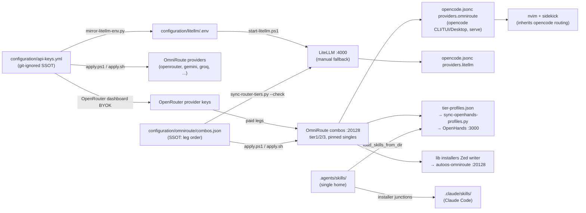

# Routing map (who creates what)

Keys → providers → combos → routers → IDEs. Every edge names the script or
file that creates it; prose lives where the thing is defined
(`models.md` for chains, `api-keys.md` for keys).

Drift gates (run after any combo/client edit): `audit-router.py` (live) /
`--offline` (CI), `sync-router-tiers.py --check`, `check-links.py`.

A live probe that gets HTTP 503 is retried with a backoff (5 s, 15 s, 45 s) before it is
reported: OmniRoute answers 503 "resource pressure" when the host is short of memory, which
is load shedding, not a dead leg. 400, 404 and transport errors are drift and are never
retried, so the audit stays quick when a leg is really gone. A leg that still answers 503
after the last retry is reported as `503` (state, not drift) and the audit does not fail.
