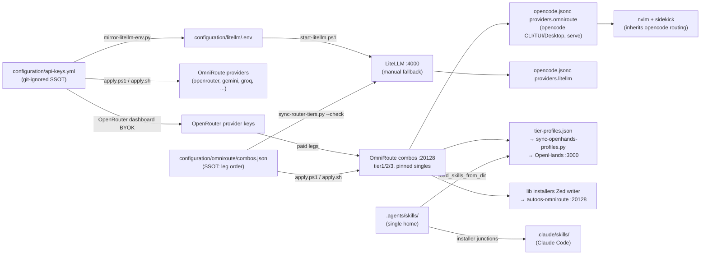

# Routing map (who creates what)

Keys → providers → combos → routers → IDEs. Every edge names the script or
file that creates it; prose lives where the thing is defined
(`models.md` for chains, `api-keys.md` for keys).

```mermaid
flowchart LR
    K["configuration/api-keys.yml\n(git-ignored SSOT)"]
    K -->|mirror-litellm-env.py| LENV["configuration/litellm/.env"]
    K -->|apply.ps1 / apply.sh| OMPROV["OmniRoute providers\n(openrouter, gemini, groq, ...)"]
    K -->|OpenRouter dashboard BYOK| ORK["OpenRouter provider keys"]
    ORK -->|paid legs| COMBO
    LENV -->|start-litellm.ps1| LITE["LiteLLM :4000\n(manual fallback)"]
    C["configuration/omniroute/combos.json\n(SSOT: leg order)"] -->|apply.ps1 / apply.sh| COMBO["OmniRoute combos :20128\ntier1/2/3, pinned singles"]
    C -->|sync-router-tiers.py --check| LITE
    COMBO --> OC["opencode.jsonc providers.omniroute\n(opencode CLI/TUI/Desktop, serve)"]
    LITE --> OCLITE["opencode.jsonc providers.litellm"]
    COMBO --> OH["tier-profiles.json\n→ sync-openhands-profiles.py\n→ OpenHands :3000"]
    COMBO --> ZED["lib installers Zed writer\n→ autoos-omniroute :20128"]
    OC --> NVIM["nvim + sidekick\n(inherits opencode routing)"]
    SK[".agents/skills/\n(single home)"] -->|installer junctions| CL[".claude/skills/\n(Claude Code)"]
    SK -->|load_skills_from_dir| OH
```

Drift gates (run after any combo/client edit): `audit-router.py` (live) /
`--offline` (CI), `sync-router-tiers.py --check`, `check-links.py`.
`apply.sh --drift` compares the live combos against `combos.json` (`omniroute --output json combo list`: name + ordered legs, `retired` ids ignored) and writes nothing.
Exit 0 in sync, 1 on any `drift`/`missing`/`extra` line, 3 when the store cannot be read (CLI absent or gateway refuses — one reason line, never a key).
`apply.sh` and `apply.ps1` also prune the two managed-orphan lists in `combos.json` from the live store: `retired` (dead ids a rename left) and `omitted` (OR1g: only the orphaned routes — a route that declared legs but the render serves none for) — never a combo in `combos.json`, and never one the user made. A deliberately legless route (`legs: []`: the LiteLLM-only `*-paid` and the dynamic `auto*`) is in neither list, so a live combo with one of its ids is never pruned.
`--drift` reports an omitted live combo as `extra <id> (omitted: no servable leg)`, and a non-object `combo list` answer as an unreadable store (exit 3), not a crash.

## Standby router (LiteLLM :4000)

LiteLLM is the manual fallback when you want the same tier names served
locally instead of through OmniRoute (`docs/models.md`). Every route the
registry can serve through LiteLLM is an `AUTOOS-MANAGED` block regenerated by
`sync-router-tiers.py --check` from `registry.gateway_legs(route)` minus the
gateway-only legs (`GATEWAY_ONLY`: antigravity, its catalog prefix agy, cc), so a tier is rendered only
when its final servable set is non-empty — a route whose every leg is
unavailable, gateway-only or policy-denied simply gets no group (no error). The
deliberately legless `*-paid` escalations stay hand-curated. The registry order
drives the block order; `combos.json` names the same set minus `opus-4-6`.

`start-litellm.sh` / `start-litellm.ps1` read three env overrides:
`AUTOOS_LITELLM_HOST` (bind address, default `127.0.0.1`),
`AUTOOS_LITELLM_STATE_DIR` (where `litellm.log` lives) and
`AUTOOS_LITELLM_MASTER_KEY_FILE` (a private file whose single line overrides any
`LITELLM_MASTER_KEY` from `.env`; unreadable or empty is a hard error). Values
are never printed, only key names.

Usage report: `autoos-agent.py usage --since 1h --by provider,combo,lane` (`--json` for machine-readable).
It reads the OmniRoute gateway's `/api/usage/call-logs` with the manage-scoped key from the ai-stack
config dir. Heartbeats print `usage --since 1h --by provider,lane`.
`--cost` adds estimated `cost_in`/`cost_out` (USD) per group, priced from the
registry's per-token `price_in`/`price_out`; the JSON names its source and how
many models it had no price for, so a 0 row reads as free or unknown. Off by
default — `--json` readers get the same shape as before.
`--spend-since [DATE]` (bare: the 1st of the current month UTC) and
`--balance-usd N` add a `paid_spend` block for the one provider the operator
budgets in dollars — DeepSeek. It costs each of that provider's rows at the
registry's per-token price times the factor in `providers.deepseek.windows` at
the row's own timestamp (`autoos_resolver.price_factor`, the same function the
router uses to pick a cheap hour), reaches the row fetch back as far as that
date even when `--since` is an hour, and prints `WARN` at 20 USD of spend
(the monthly cap) or when `--balance-usd` — a balance the caller measured at
the gateway — is below 5 USD. A window that hit the paging cap says
`incomplete`: the figure is a floor, not a total.

Tool-calling overlay: the probes write their verdicts (`measured.json`) to one
file per machine — `$AUTOOS_MEASURED_OVERLAY`, else
`${XDG_STATE_HOME:-~/.local/state}/autoos/measured.json` (Windows
`%LOCALAPPDATA%\autoos\measured.json`) — and `route`/`run`/the MCP tool read it
from there, falling back to an old `<checkout>/logs/routing/measured.json` with
a note; with neither, `route` says `no tool_calls overlay found at <path>`
instead of calling every agentic leg unproven, and `heartbeat --json` reports it
under `overlay`.

Inbox read: `autoos-agent.py inbox <name> --since-card <card>` (or `--since
<position|UTC>`, `--all`, `--max-records N`, default 30 — RESTART spec §0/§2).
It prints the records after a position, oldest first, each headed by its
`<timestamp>#<ordinal>` position, so a relaunched orchestrator resumes at its
card's `last-event` instead of opening a 50k-token inbox. The RUN dir is
`$AUTOOS_RUN_DIR` only (`<RUN>/inbox/<name>.md`, or `--file PATH`); a bare UTC
stamp re-reads its whole second and a late append (an older timestamp written
after a newer one) is returned and flagged `(late)`, because reading is
at-least-once. An inbox with no timestamped record exits 1 — never "no events".
A line that looks like a stamp but does not parse (a minute-precision one, say
`2026-09-27T03:55Z → done: …`) is still an acknowledgement, so it prints on
stdout too, in file order, tagged `(malformed line N)` with the lines under it —
no position, because it is not a record — beside a stderr notice that counts
them. The notice is made only for an entry the window actually printed: one
behind `--since` says nothing, and one dropped with the record it rode on by
`--max-records` is named in the cut line instead ("cut N earlier records and M
malformed entries").

Attribution: every spawned opencode run whose model sits on the omniroute provider sends the request
header `x-omniroute-session-id: <tag>` (provider `headers` in the `OPENCODE_CONFIG_CONTENT` overlay;
tag = env `AUTOOS_SESSION_TAG` when valid, else `<lane worktree basename>/<slugified title>`).
OmniRoute copies that header into the `session_tag` field of each `call_logs` row, so a lane's calls
are the rows of `/api/usage/call-logs` whose `session_tag` equals the tag (the route has no
`session_tag` filter param yet — page and match client-side).

A live probe that gets HTTP 503 is retried with a backoff (5 s, 15 s, 45 s) before it is
reported: OmniRoute answers 503 "resource pressure" when the host is short of memory, which
is load shedding, not a dead leg. 400, 404 and transport errors are drift and are never
retried, so the audit stays quick when a leg is really gone. A leg that still answers 503
after the last retry is reported as `503` (state, not drift) and the audit does not fail.
